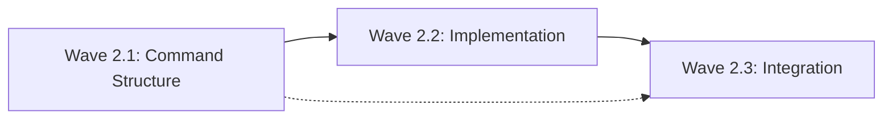

# Phase 2: CLI Integration - Detailed Implementation Plan

## Phase Overview
**Duration:** 7 days  
**Critical Path:** YES - Enables user access to build functionality  
**Base Branch:** `phase1-integration`  
**Target Integration Branch:** `phase2-integration`  
**Prerequisites:** Phase 1 complete with build service working

---

## Critical Libraries & Dependencies (MAINTAINER SPECIFIED)

### Required Libraries
```yaml
core_libraries:
  - name: "github.com/spf13/cobra"
    version: "v1.8.0"
    reason: "De facto standard for Go CLI applications. Mature, stable, excellent flag handling."
    usage: "CLI command structure, flag parsing, help generation"
    
  - name: "github.com/spf13/viper" 
    version: "v1.18.0"
    reason: "Configuration management companion to Cobra. Handle environment variables and config files."
    usage: "Configuration management for CLI options"
    
  - name: "github.com/fatih/color"
    version: "v1.16.0"
    reason: "Terminal color output for better UX. Lightweight and reliable."
    usage: "Colored output for build progress and status messages"
```

### Interfaces to Reuse (MANDATORY)
```yaml
reused_from_previous:
  phase1:
    - "pkg/build/api/types.go: BuildRequest, BuildResponse"
    - "pkg/build/api/builder.go: Builder interface"
    - "pkg/build/service.go: Service struct and methods"
    - "pkg/build/auth/gitea.go: Credentials handling"
    
forbidden_duplications:
  - "DO NOT create new build logic - use Phase 1 Service"
  - "DO NOT implement separate registry handling - use Phase 1 auth"
  - "DO NOT build parallel CLI framework - extend existing idpbuilder CLI"
  - "DO NOT duplicate error types - use Phase 1 error patterns"
```

---

## Wave 2.1: CLI Command Structure

### Overview
**Focus:** Define build command structure and integration points  
**Dependencies:** Phase 1 complete  
**Parallelizable:** NO - Must understand existing CLI first

### E2.1.1: Build Command Definition
**Branch:** `phase2/wave1/effort1-build-command`  
**Duration:** 8 hours  
**Estimated Lines:** 150 lines  
**Agent Assignment:** Single

#### Source Material
```markdown
# Extending existing CLI
- Primary: Analyze existing `pkg/cmd/` structure
- Reference: idpbuilder CLI patterns for consistency
- Pattern: Follow existing command integration approach
```

#### Requirements
1. **MUST** integrate with existing idpbuilder CLI structure
2. **MUST** reuse Phase 1 build.Service completely
3. **MUST** follow idpbuilder command patterns
4. **MUST NOT** create standalone CLI application

#### Implementation Guidance

##### Directory Structure
```
pkg/
├── cmd/
│   ├── build/
│   │   ├── root.go           # ~80 lines
│   │   ├── flags.go          # ~40 lines
│   │   └── root_test.go      # ~30 lines
```

##### Command Definition (Maintainer Specified)
```go
// pkg/cmd/build/root.go
package build

import (
    "context"
    "fmt"
    "os"
    "path/filepath"
    "strings"
    
    "github.com/spf13/cobra"
    "github.com/fatih/color"
    
    "idpbuilder/pkg/build"
    "idpbuilder/pkg/build/api"
)

var (
    // Command flags
    dockerfileFlag string
    tagFlag       string
    quietFlag     bool
    
    // Color output helpers
    successColor = color.New(color.FgGreen).SprintFunc()
    errorColor   = color.New(color.FgRed).SprintFunc()
    infoColor    = color.New(color.FgBlue).SprintFunc()
)

// BuildCmd represents the build command
var BuildCmd = &cobra.Command{
    Use:   "build [CONTEXT]",
    Short: "Build and push container image to Gitea registry",
    Long: `Build a container image from a Dockerfile and push it to the Gitea registry.

The CONTEXT should be a directory containing a Dockerfile. The image will be
built and automatically pushed to gitea.cnoe.localtest.me/giteaadmin/.

Examples:
  # Build current directory with tag myapp:latest
  idpbuilder build . -t myapp:latest
  
  # Build with custom Dockerfile
  idpbuilder build . -f docker/Dockerfile -t myapp:v1.0
  
  # Quiet output
  idpbuilder build . -t myapp:latest --quiet`,
    Args: cobra.ExactArgs(1),
    RunE: runBuild,
}

func init() {
    // Define flags
    BuildCmd.Flags().StringVarP(&dockerfileFlag, "file", "f", "Dockerfile", 
        "Path to Dockerfile relative to context")
    BuildCmd.Flags().StringVarP(&tagFlag, "tag", "t", "", 
        "Image name and optionally tag (format: name:tag)")
    BuildCmd.Flags().BoolVarP(&quietFlag, "quiet", "q", false,
        "Suppress build output")
    
    // Mark required flags
    BuildCmd.MarkFlagRequired("tag")
}
```

##### Flag Handling (Maintainer Specified)
```go
// pkg/cmd/build/flags.go
package build

import (
    "fmt"
    "path/filepath"
    "strings"
    
    "idpbuilder/pkg/build/api"
)

// buildOptionsFromFlags converts CLI flags to BuildRequest
func buildOptionsFromFlags(contextDir string) (*api.BuildRequest, error) {
    // Validate context directory
    if !filepath.IsAbs(contextDir) {
        abs, err := filepath.Abs(contextDir)
        if err != nil {
            return nil, fmt.Errorf("failed to resolve context path: %w", err)
        }
        contextDir = abs
    }
    
    // Parse image name and tag
    imageName, imageTag, err := parseImageTag(tagFlag)
    if err != nil {
        return nil, err
    }
    
    // Validate Dockerfile path
    dockerfilePath := dockerfileFlag
    if !filepath.IsAbs(dockerfilePath) {
        dockerfilePath = filepath.Join(contextDir, dockerfileFlag)
    }
    
    return &api.BuildRequest{
        DockerfilePath: dockerfileFlag, // Relative to context
        ContextDir:     contextDir,
        ImageName:      imageName,
        ImageTag:       imageTag,
    }, nil
}

// parseImageTag parses tag flag into name and tag components
func parseImageTag(tag string) (string, string, error) {
    if tag == "" {
        return "", "", fmt.Errorf("image tag is required")
    }
    
    parts := strings.Split(tag, ":")
    imageName := parts[0]
    imageTag := "latest"
    
    if imageName == "" {
        return "", "", fmt.Errorf("image name cannot be empty")
    }
    
    if len(parts) > 1 && parts[1] != "" {
        imageTag = parts[1]
    }
    
    return imageName, imageTag, nil
}
```

#### Test Requirements (TDD)
```go
// pkg/cmd/build/root_test.go
func TestParseImageTag(t *testing.T) {
    testCases := []struct {
        name      string
        input     string
        wantName  string
        wantTag   string
        wantErr   bool
    }{
        {
            name:     "name only",
            input:    "myapp",
            wantName: "myapp",
            wantTag:  "latest",
            wantErr:  false,
        },
        {
            name:     "name and tag",
            input:    "myapp:v1.0",
            wantName: "myapp",
            wantTag:  "v1.0",
            wantErr:  false,
        },
        {
            name:     "empty tag defaults to latest",
            input:    "myapp:",
            wantName: "myapp",
            wantTag:  "latest",
            wantErr:  false,
        },
        {
            name:     "empty name fails",
            input:    ":v1.0",
            wantErr:  true,
        },
    }
    
    for _, tc := range testCases {
        t.Run(tc.name, func(t *testing.T) {
            name, tag, err := parseImageTag(tc.input)
            
            if tc.wantErr {
                if err == nil {
                    t.Error("expected error but got none")
                }
                return
            }
            
            if err != nil {
                t.Errorf("unexpected error: %v", err)
            }
            
            if name != tc.wantName {
                t.Errorf("expected name %q, got %q", tc.wantName, name)
            }
            
            if tag != tc.wantTag {
                t.Errorf("expected tag %q, got %q", tc.wantTag, tag)
            }
        })
    }
}
```

#### Success Criteria
- [ ] Command structure follows idpbuilder patterns
- [ ] Flag parsing handles all required scenarios
- [ ] Help text is clear and includes examples
- [ ] Integration with existing CLI is seamless
- [ ] Under 150 lines per line-counter.sh

---

## Wave 2.2: CLI Implementation

### Overview
**Focus:** Implement build command execution logic  
**Dependencies:** Wave 2.1 complete  
**Parallelizable:** NO - Builds on command structure

### E2.2.1: Build Command Implementation
**Branch:** `phase2/wave2/effort1-build-execution`  
**Duration:** 12 hours  
**Estimated Lines:** 250 lines  
**Agent Assignment:** Single

#### Requirements
1. **MUST** reuse Phase 1 build.Service exactly as-is
2. **MUST** provide clear progress output
3. **MUST** handle errors gracefully with helpful messages
4. **MUST NOT** duplicate any build logic

#### Implementation Guidance

##### Command Execution (Maintainer Specified)
```go
// pkg/cmd/build/execute.go
package build

import (
    "context"
    "fmt"
    "os"
    "path/filepath"
    "time"
    
    "github.com/spf13/cobra"
    
    "idpbuilder/pkg/build"
)

// runBuild executes the build command
func runBuild(cmd *cobra.Command, args []string) error {
    contextDir := args[0]
    
    // Convert flags to build request
    request, err := buildOptionsFromFlags(contextDir)
    if err != nil {
        return fmt.Errorf("invalid options: %w", err)
    }
    
    // Validate context and Dockerfile exist
    if err := validateBuildContext(request); err != nil {
        return err
    }
    
    // Initialize build service (MUST reuse Phase 1)
    service, err := build.NewService()
    if err != nil {
        return fmt.Errorf("failed to initialize build service: %w", err)
    }
    
    // Show build start message
    printBuildStart(request)
    
    // Execute build with timeout context
    ctx, cancel := context.WithTimeout(context.Background(), 30*time.Minute)
    defer cancel()
    
    response, err := service.BuildAndPush(ctx, *request)
    if err != nil {
        return handleBuildError(err)
    }
    
    // Handle response
    if !response.Success {
        return fmt.Errorf("build failed: %s", response.Error)
    }
    
    // Show success message
    printBuildSuccess(response)
    return nil
}

// validateBuildContext checks that context and Dockerfile exist
func validateBuildContext(req *api.BuildRequest) error {
    // Check context directory
    if _, err := os.Stat(req.ContextDir); os.IsNotExist(err) {
        return fmt.Errorf("context directory does not exist: %s", req.ContextDir)
    }
    
    // Check Dockerfile
    dockerfilePath := filepath.Join(req.ContextDir, req.DockerfilePath)
    if _, err := os.Stat(dockerfilePath); os.IsNotExist(err) {
        return fmt.Errorf("Dockerfile does not exist: %s\nUse -f to specify a different Dockerfile path", dockerfilePath)
    }
    
    return nil
}

// printBuildStart shows build initiation message
func printBuildStart(req *api.BuildRequest) {
    if quietFlag {
        return
    }
    
    fmt.Printf("%s Building %s:%s\n", 
        infoColor("=>"), req.ImageName, req.ImageTag)
    fmt.Printf("   Context: %s\n", req.ContextDir)
    fmt.Printf("   Dockerfile: %s\n", req.DockerfilePath)
    fmt.Println()
}

// printBuildSuccess shows successful completion
func printBuildSuccess(resp *api.BuildResponse) {
    if quietFlag {
        fmt.Printf("%s\n", resp.FullTag)
        return
    }
    
    fmt.Printf("%s Successfully built and pushed!\n", successColor("✓"))
    fmt.Printf("   Image ID: %s\n", resp.ImageID[:12])
    fmt.Printf("   Registry: %s\n", resp.FullTag)
    fmt.Println()
    fmt.Printf("To use this image:\n")
    fmt.Printf("  kubectl run test --image=%s\n", resp.FullTag)
}
```

##### Error Handling (Maintainer Specified)
```go
// pkg/cmd/build/errors.go
package build

import (
    "fmt"
    "strings"
)

// handleBuildError provides user-friendly error messages
func handleBuildError(err error) error {
    errMsg := err.Error()
    
    // Common error patterns and user-friendly suggestions
    switch {
    case strings.Contains(errMsg, "authentication"):
        return fmt.Errorf("%s Authentication failed\n\n"+
            "Make sure your idpbuilder cluster is running:\n"+
            "  idpbuilder get\n\n"+
            "If the cluster is running, there may be a credential issue.\n"+
            "Original error: %v", errorColor("✗"), err)
            
    case strings.Contains(errMsg, "not found") && strings.Contains(errMsg, "Dockerfile"):
        return fmt.Errorf("%s Dockerfile not found\n\n"+
            "Make sure your Dockerfile exists in the build context.\n"+
            "Use -f to specify a different Dockerfile path.\n"+
            "Original error: %v", errorColor("✗"), err)
            
    case strings.Contains(errMsg, "connection refused"):
        return fmt.Errorf("%s Registry connection failed\n\n"+
            "Make sure your idpbuilder cluster is running:\n"+
            "  idpbuilder get\n\n"+
            "Original error: %v", errorColor("✗"), err)
            
    case strings.Contains(errMsg, "context deadline exceeded"):
        return fmt.Errorf("%s Build timeout\n\n"+
            "The build took longer than 30 minutes and was cancelled.\n"+
            "This might be due to:\n"+
            "- Large base image downloads\n"+
            "- Complex build steps\n"+
            "- Network issues\n\n"+
            "Try building again or simplify your Dockerfile.\n"+
            "Original error: %v", errorColor("✗"), err)
            
    default:
        return fmt.Errorf("%s Build failed: %v", errorColor("✗"), err)
    }
}
```

#### Test Requirements (TDD)
```go
// pkg/cmd/build/execute_test.go
func TestValidateBuildContext(t *testing.T) {
    // Create temporary test directory
    tmpDir := t.TempDir()
    
    // Test valid context
    dockerfilePath := filepath.Join(tmpDir, "Dockerfile")
    os.WriteFile(dockerfilePath, []byte("FROM alpine"), 0644)
    
    req := &api.BuildRequest{
        ContextDir:     tmpDir,
        DockerfilePath: "Dockerfile",
    }
    
    err := validateBuildContext(req)
    if err != nil {
        t.Errorf("expected valid context, got error: %v", err)
    }
    
    // Test missing Dockerfile
    req.DockerfilePath = "missing.dockerfile"
    err = validateBuildContext(req)
    if err == nil {
        t.Error("expected error for missing Dockerfile")
    }
}

func TestHandleBuildError(t *testing.T) {
    testCases := []struct {
        name     string
        inputErr error
        contains []string
    }{
        {
            name:     "authentication error",
            inputErr: fmt.Errorf("authentication failed: 401"),
            contains: []string{"Authentication failed", "idpbuilder get"},
        },
        {
            name:     "dockerfile not found",
            inputErr: fmt.Errorf("Dockerfile not found in context"),
            contains: []string{"Dockerfile not found", "Use -f"},
        },
    }
    
    for _, tc := range testCases {
        t.Run(tc.name, func(t *testing.T) {
            result := handleBuildError(tc.inputErr)
            
            for _, expected := range tc.contains {
                if !strings.Contains(result.Error(), expected) {
                    t.Errorf("expected error to contain %q, got: %v", expected, result)
                }
            }
        })
    }
}
```

#### Success Criteria
- [ ] Build command executes successfully with Phase 1 service
- [ ] Clear progress output during build process
- [ ] Helpful error messages for common failure scenarios
- [ ] Proper timeout handling for long builds
- [ ] Under 250 lines per line-counter.sh

### E2.2.2: Output and Progress Formatting
**Branch:** `phase2/wave2/effort2-output-formatting`  
**Duration:** 6 hours  
**Estimated Lines:** 100 lines  
**Agent Assignment:** Single

#### Requirements
1. **MUST** provide colored output for better UX
2. **MUST** support quiet mode for scripting
3. **MUST** show progress indicators
4. **MUST NOT** duplicate output handling

#### Implementation Guidance

##### Progress Output (Maintainer Specified)
```go
// pkg/cmd/build/output.go
package build

import (
    "fmt"
    "strings"
    "time"
)

// ProgressIndicator manages build progress display
type ProgressIndicator struct {
    quiet bool
    start time.Time
}

// NewProgressIndicator creates a new progress indicator
func NewProgressIndicator(quiet bool) *ProgressIndicator {
    return &ProgressIndicator{
        quiet: quiet,
        start: time.Now(),
    }
}

// Step shows a build step
func (p *ProgressIndicator) Step(message string) {
    if p.quiet {
        return
    }
    
    elapsed := time.Since(p.start).Round(time.Second)
    fmt.Printf("%s %s (%v)\n", 
        infoColor("=>"), message, elapsed)
}

// Warning shows a warning message
func (p *ProgressIndicator) Warning(message string) {
    if p.quiet {
        return
    }
    
    fmt.Printf("%s %s\n", 
        color.New(color.FgYellow).Sprint("⚠"), message)
}

// formatImageInfo formats image information for display
func formatImageInfo(imageName, imageTag string) string {
    return fmt.Sprintf("%s:%s", imageName, imageTag)
}

// formatRegistryInfo formats registry information
func formatRegistryInfo(fullTag string) string {
    parts := strings.Split(fullTag, "/")
    if len(parts) >= 2 {
        return fmt.Sprintf("Registry: %s\nNamespace: %s", 
            parts[0], parts[1])
    }
    return fmt.Sprintf("Full tag: %s", fullTag)
}
```

---

## Wave 2.3: Integration with Main CLI

### Overview
**Focus:** Integrate build command into existing idpbuilder CLI  
**Dependencies:** Wave 2.2 complete  
**Parallelizable:** NO - Must integrate with existing structure

### E2.3.1: Add Build Command to Root
**Branch:** `phase2/wave3/effort1-cli-integration`  
**Duration:** 4 hours  
**Estimated Lines:** 50 lines  
**Agent Assignment:** Single

#### Source Material
```markdown
# Integrating with existing CLI
- Primary: Analyze `pkg/cmd/root.go` structure
- Pattern: Follow existing command addition patterns
- Reference: How other commands are integrated
```

#### Requirements
1. **MUST** integrate with existing idpbuilder root command
2. **MUST** follow established CLI patterns
3. **MUST** maintain backward compatibility
4. **MUST NOT** break existing functionality

#### Implementation Guidance

##### Root Command Integration (Maintainer Specified)
```go
// pkg/cmd/root.go (modification)
// Add import
import (
    "idpbuilder/pkg/cmd/build"
)

// In init() function, add:
func init() {
    // ... existing commands ...
    
    // Add build command
    rootCmd.AddCommand(build.BuildCmd)
}
```

##### Build Command Module Export (Maintainer Specified)
```go
// pkg/cmd/build/cmd.go
package build

// Export the build command for integration
var Cmd = BuildCmd
```

#### Test Requirements (TDD)
```go
// pkg/cmd/build/integration_test.go
func TestBuildCommandIntegration(t *testing.T) {
    // Test that build command is properly integrated
    rootCmd := &cobra.Command{Use: "idpbuilder"}
    rootCmd.AddCommand(BuildCmd)
    
    // Test command exists
    buildCmd, _, err := rootCmd.Find([]string{"build"})
    if err != nil {
        t.Fatalf("build command not found: %v", err)
    }
    
    if buildCmd.Name() != "build" {
        t.Errorf("expected command name 'build', got %q", buildCmd.Name())
    }
    
    // Test required flags
    tagFlag := buildCmd.Flag("tag")
    if tagFlag == nil {
        t.Error("tag flag not found")
    }
    
    // Test help text
    if !strings.Contains(buildCmd.Long, "Gitea registry") {
        t.Error("help text should mention Gitea registry")
    }
}

func TestEndToEndHelp(t *testing.T) {
    // Test that help command works end-to-end
    rootCmd := &cobra.Command{Use: "idpbuilder"}
    rootCmd.AddCommand(BuildCmd)
    
    // Capture help output
    var output strings.Builder
    rootCmd.SetOut(&output)
    rootCmd.SetArgs([]string{"build", "--help"})
    
    err := rootCmd.Execute()
    if err != nil {
        t.Fatalf("help command failed: %v", err)
    }
    
    helpText := output.String()
    expectedTexts := []string{
        "Build and push container image",
        "Examples:",
        "idpbuilder build",
        "--tag",
        "--file",
    }
    
    for _, expected := range expectedTexts {
        if !strings.Contains(helpText, expected) {
            t.Errorf("help text missing %q", expected)
        }
    }
}
```

#### Success Criteria
- [ ] Build command appears in idpbuilder help
- [ ] Build command works when invoked via idpbuilder CLI
- [ ] Help text is properly integrated
- [ ] No conflicts with existing commands
- [ ] Under 50 lines per line-counter.sh

---

## Phase-Wide Constraints

### Architecture Decisions (Maintainer Specified)
```markdown
1. **CLI Framework**
   - MUST use Cobra following idpbuilder patterns
   - MUST integrate with existing root command
   - NO standalone CLI binary - extend existing

2. **Output Handling**
   - Use color package for better UX
   - Support quiet mode for automation
   - Follow consistent output format patterns

3. **Error Handling**
   - Provide helpful error messages
   - Include resolution suggestions
   - Maintain error context from Phase 1
```

### Cross-Wave Dependencies


### Forbidden Duplications
- DO NOT reimplement build logic - use Phase 1 service
- DO NOT create new error handling patterns - extend existing
- DO NOT duplicate flag parsing patterns - use Cobra standards
- DO NOT create separate CLI binary - integrate with idpbuilder

---

## Testing Strategy

### Phase-Level Testing
1. **Unit Tests**: Each command component >80% coverage
2. **Integration Tests**: Full CLI workflow tests
3. **Manual Tests**: Real user workflow validation

### Test Scenarios
```bash
# Success cases
idpbuilder build . -t myapp:latest
idpbuilder build ./examples/go-app -t go-example:v1.0
idpbuilder build . -f docker/Dockerfile -t custom:latest

# Error cases
idpbuilder build nonexistent-dir -t test
idpbuilder build . -t test  # no Dockerfile
idpbuilder build .          # missing tag flag
```

---

## Branch Strategy

### Working Branches
```bash
# Wave 2.1 integration
git checkout -b phase2/wave1-integration
git merge --no-ff phase2/wave1/effort1-build-command

# Wave 2.2 integration
git checkout -b phase2/wave2-integration
git merge --no-ff phase2/wave2/effort1-build-execution
git merge --no-ff phase2/wave2/effort2-output-formatting

# Wave 2.3 integration
git checkout -b phase2/wave3-integration
git merge --no-ff phase2/wave3/effort1-cli-integration

# Phase integration
git checkout -b phase2-integration
git merge --no-ff phase2/wave1-integration
git merge --no-ff phase2/wave2-integration
git merge --no-ff phase2/wave3-integration
```

---

## Size Management

### Estimated Total: 550 lines
- Wave 2.1: ~150 lines
- Wave 2.2: ~350 lines
- Wave 2.3: ~50 lines

All waves are well under the 800 line limit and should not require splitting.

---

## Success Criteria

### Functional
- [ ] `idpbuilder build . -t name:tag` works end-to-end
- [ ] Clear progress output during build
- [ ] Helpful error messages for common issues
- [ ] Quiet mode works for automation
- [ ] Help text is comprehensive and accurate

### Quality
- [ ] All tests pass with >80% coverage
- [ ] Integration with existing CLI is seamless
- [ ] No regression in existing idpbuilder functionality
- [ ] Line count under 800 per effort

### Integration
- [ ] Reuses Phase 1 build service completely
- [ ] Follows idpbuilder CLI patterns
- [ ] Error handling consistent with existing commands
- [ ] Ready for Phase 3 production enhancements

---

## Risk Mitigation

### Technical Risks
| Risk | Mitigation | Owner |
|------|------------|-------|
| CLI integration conflicts | Follow existing patterns exactly | SW Engineer |
| Complex flag parsing | Use Cobra standard patterns | SW Engineer |
| Inconsistent UX | Study existing commands first | SW Engineer |
| Output formatting issues | Test with various terminals | SW Engineer |

---

## Handoff Instructions

### For Orchestrator
1. Ensure Phase 1 integration branch is ready
2. Create effort working directories under `/workspaces/efforts/phase2/`
3. Verify existing idpbuilder CLI structure before starting
4. Execute waves sequentially

### For SW Engineer
1. Study existing idpbuilder CLI commands before implementing
2. Reuse Phase 1 build.Service without modification
3. Follow Cobra and idpbuilder patterns exactly
4. Test CLI integration thoroughly

### For Code Reviewer
1. Verify complete reuse of Phase 1 interfaces
2. Check CLI integration follows existing patterns
3. Ensure no duplication of build logic
4. Validate user experience is consistent

This phase makes the build functionality accessible to users through a well-integrated CLI, setting the foundation for production-ready features in Phase 3.