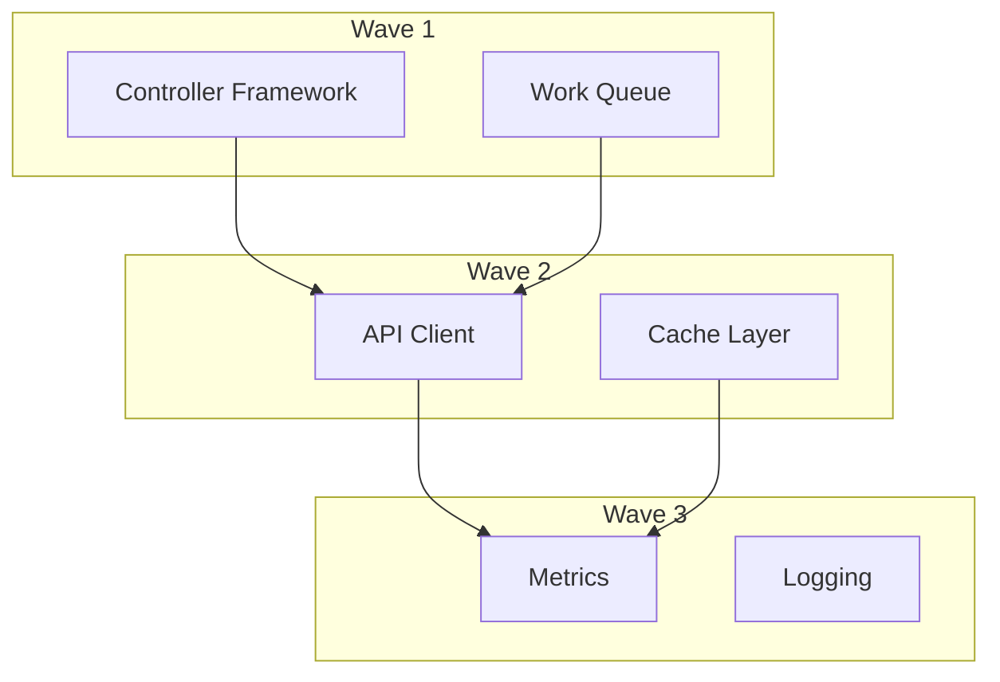

# Phase 2: Core Infrastructure - Detailed Implementation Plan

## Phase Overview
**Duration:** [X] days  
**Critical Path:** [YES/NO] - Core infrastructure needed for implementations  
**Base Branch:** `phase1-integration` (Phase 1 complete)  
**Target Integration Branch:** `phase2-integration`

---

## Wave 2.1: Base Controller Patterns

### E2.1.1: Controller Framework
**Branch:** `/phase2/wave1/effort1-controller-framework`  
**Duration:** [X] hours  
**Agent:** Single agent
**Dependencies:** Phase 1 APIs

#### Source Material:
```markdown
# Reuse controller patterns if available
- Primary: `origin/feature/[controller-patterns-branch]`
- Reference: Standard Kubernetes controller patterns
```

#### Requirements:
1. **MUST** implement controller pattern:
   - Work queue
   - Reconciliation loop
   - Event handlers
   - Rate limiting

2. **MUST** support:
   - Leader election
   - Graceful shutdown
   - Metrics collection

#### Test Requirements (TDD):
```go
// test/controller/base_controller_test.go
func TestControllerLifecycle(t *testing.T) {
    tests := []struct {
        name string
        test func(*testing.T)
    }{
        {"startup", testControllerStartup},
        {"shutdown", testControllerShutdown},
        {"leader_election", testLeaderElection},
        {"reconcile_loop", testReconcileLoop},
    }
    
    for _, tt := range tests {
        t.Run(tt.name, tt.test)
    }
}

func TestReconciliation(t *testing.T) {
    // Given: Object needing reconciliation
    obj := &TestObject{
        Spec: TestSpec{Desired: "state"},
        Status: TestStatus{Current: "different"},
    }
    
    // When: Reconcile is called
    result, err := controller.Reconcile(context.TODO(), obj)
    
    // Then: Object reaches desired state
    assert.NoError(t, err)
    assert.Equal(t, obj.Spec.Desired, obj.Status.Current)
}
```

#### Pseudo-Code Implementation:
```
FUNCTION implement_controller():
    // Step 1: Base controller structure
    CREATE base_controller:
        - workqueue
        - informer
        - reconciler
        - metrics
    
    // Step 2: Reconciliation logic
    IMPLEMENT reconcile_loop:
        WHILE running:
            item = DEQUEUE()
            result = RECONCILE(item)
            IF result.requeue:
                ENQUEUE(item, result.after)
    
    // Step 3: Event handling
    ADD event_handlers:
        - AddFunc
        - UpdateFunc
        - DeleteFunc
    
    // Step 4: Leader election
    IF multi_replica:
        IMPLEMENT leader_election
```

#### Validation Commands:
```bash
# Build check
go build ./pkg/controller/...

# Test with race detection
go test ./pkg/controller/... -race

# Benchmark reconciliation
go test -bench=. ./pkg/controller/...

# Check metrics
curl localhost:8080/metrics | grep controller_
```

---

### E2.1.2: Work Queue Implementation
**Branch:** `/phase2/wave1/effort2-workqueue`  
**Duration:** [X] hours  
**Dependencies:** Can run parallel with E2.1.1

#### Requirements:
1. **MUST** implement:
   - Rate limiting
   - Exponential backoff
   - Deduplication
   - Priority queues (if needed)

---

## Wave 2.2: Client Libraries

### E2.2.1: API Client
**Branch:** `/phase2/wave2/effort1-api-client`  
**Duration:** [X] hours  
**Dependencies:** E2.1.1, Phase 1 APIs

#### Requirements:
1. **MUST** provide typed clients for all APIs
2. **MUST** support:
   - CRUD operations
   - Watch capabilities
   - Pagination
   - Field selectors

#### Test Requirements (TDD):
```go
func TestClientOperations(t *testing.T) {
    client := NewTestClient()
    
    t.Run("Create", func(t *testing.T) {
        obj := &MyResource{...}
        created, err := client.Create(context.TODO(), obj)
        assert.NoError(t, err)
        assert.NotEmpty(t, created.UID)
    })
    
    t.Run("List_with_pagination", func(t *testing.T) {
        opts := ListOptions{Limit: 10}
        list, err := client.List(context.TODO(), opts)
        assert.NoError(t, err)
        assert.LessOrEqual(t, len(list.Items), 10)
    })
}
```

---

## Wave 2.3: Infrastructure Services

### E2.3.1: Metrics and Monitoring
**Branch:** `/phase2/wave3/effort1-metrics`  
**Duration:** [X] hours  
**Dependencies:** E2.1.1, E2.2.1

#### Requirements:
1. **MUST** expose Prometheus metrics:
   - Request latency
   - Error rates
   - Queue depth
   - Reconciliation duration

2. **MUST** include dashboards

---

## Wave Dependency Graph



## Testing Strategy

### Unit Testing (Per Effort):
```bash
# Run after each implementation
go test ./... -cover -coverprofile=coverage.out
go tool cover -html=coverage.out -o coverage.html
# Requirement: >85% coverage for Phase 2
```

### Integration Testing (Per Wave):
```bash
# After wave completion
make integration-test-wave2
```

### Performance Testing:
```bash
# Benchmark critical paths
go test -bench=. -benchmem ./pkg/controller/...
```

## Common Issues and Solutions

| Issue | Solution | Prevention |
|-------|----------|------------|
| Race conditions | Use mutex/channels properly | Run with -race flag |
| Memory leaks | Proper cleanup in defer | Use pprof profiling |
| Slow reconciliation | Implement caching | Benchmark regularly |
| Queue backup | Rate limiting | Monitor queue depth |

## Notes for Orchestrator

1. **Critical Path**: E2.1.1 blocks most of Phase 3
2. **Parallelization**: Wave 1 efforts can run simultaneously
3. **Performance Gates**: Each wave must pass benchmarks
4. **Resource Requirements**: Controller tests need Kubernetes cluster (kind/minikube)