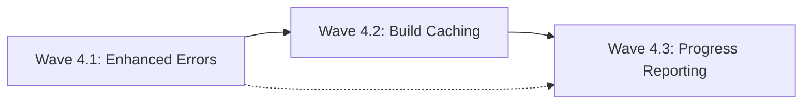

# Phase 4: Enhanced Features - Detailed Implementation Plan

## Phase Overview
**Duration:** 7 days  
**Critical Path:** NO - UX improvements and optimizations  
**Base Branch:** `phase3-integration`  
**Target Integration Branch:** `phase4-integration`  
**Prerequisites:** Phase 3 complete with production-ready build system

---

## Critical Libraries & Dependencies (MAINTAINER SPECIFIED)

### Required Libraries
```yaml
core_libraries:
  - name: "github.com/hashicorp/golang-lru/v2"
    version: "v2.0.7"
    reason: "High-performance LRU cache for build layer caching. Memory-efficient and thread-safe."
    usage: "Build layer caching, image metadata caching"
    
  - name: "github.com/schollz/progressbar/v3"
    version: "v3.14.1"
    reason: "Clean progress bars for terminal output. Excellent UX for long-running operations."
    usage: "Build progress indication, push progress"
    
  - name: "github.com/pkg/errors"
    version: "v0.9.1"
    reason: "Enhanced error handling with stack traces. Essential for debugging complex builds."
    usage: "Error wrapping, context preservation, debugging"
    
  - name: "github.com/fsnotify/fsnotify"
    version: "v1.7.0"
    reason: "File system notifications for watch functionality. Cross-platform support."
    usage: "File change detection, automatic rebuilds"
    
  - name: "go.uber.org/zap"
    version: "v1.26.0"
    reason: "Already used in Phase 3, extend for structured debug logging"
    usage: "Debug logging, performance metrics, error tracking"
```

### Interfaces to Reuse (MANDATORY)
```yaml
reused_from_previous:
  phase1:
    - "pkg/build/api/types.go: BuildRequest, BuildResponse - EXTEND with cache fields"
    - "pkg/build/api/builder.go: Builder interface - EXTEND with cache methods"
    - "pkg/build/service.go: Service struct - ENHANCE with caching"
  phase2:
    - "pkg/cmd/build/root.go: BuildCmd - ADD new flags for caching/progress"
    - "pkg/cmd/build/output.go: ProgressIndicator - ENHANCE with detailed progress"
  phase3:
    - "ALL test patterns and utilities - REUSE for enhanced features"
    
forbidden_duplications:
  - "DO NOT create new build service - enhance existing pkg/build/service.go"
  - "DO NOT implement new CLI framework - extend existing build command"
  - "DO NOT duplicate error handling - enhance existing patterns"
  - "DO NOT create separate progress systems - extend Phase 2 output"
```

---

## Wave 4.1: Enhanced Error Handling

### Overview
**Focus:** Improve error messages and debugging capabilities  
**Dependencies:** Phase 3 complete  
**Parallelizable:** YES - Error handling is independent feature

### E4.1.1: Detailed Error Messages and Context
**Branch:** `phase4/wave1/effort1-enhanced-errors`  
**Duration:** 12 hours  
**Estimated Lines:** 350 lines  
**Agent Assignment:** Single

#### Requirements
1. **MUST** enhance existing error handling without breaking compatibility
2. **MUST** provide actionable error messages with context
3. **MUST** add debug logging capabilities
4. **MUST** preserve error stack traces for debugging

#### Implementation Guidance

##### Directory Structure
```
pkg/
├── build/
│   ├── errors/
│   │   ├── types.go          # ~100 lines
│   │   ├── context.go        # ~80 lines
│   │   ├── messages.go       # ~100 lines
│   │   └── errors_test.go    # ~70 lines
```

##### Enhanced Error Types (Maintainer Specified)
```go
// pkg/build/errors/types.go
package errors

import (
    "fmt"
    "strings"
    
    "github.com/pkg/errors"
    "go.uber.org/zap"
)

// BuildError represents a categorized build error with context
type BuildError struct {
    Phase       string                 `json:"phase"`       // build, push, auth, etc.
    Category    string                 `json:"category"`    // validation, network, filesystem, etc.
    Message     string                 `json:"message"`     // User-friendly message
    Suggestion  string                 `json:"suggestion"`  // What user should do
    Context     map[string]interface{} `json:"context"`     // Additional context
    Underlying  error                  `json:"-"`           // Original error
    StackTrace  string                 `json:"stackTrace"`  // Stack trace for debugging
}

// Error implements the error interface
func (be *BuildError) Error() string {
    return be.Message
}

// Unwrap returns the underlying error for errors.Is/As
func (be *BuildError) Unwrap() error {
    return be.Underlying
}

// UserString returns a formatted error message for end users
func (be *BuildError) UserString() string {
    var builder strings.Builder
    
    builder.WriteString(fmt.Sprintf("❌ %s failed: %s\n", be.Phase, be.Message))
    
    if be.Suggestion != "" {
        builder.WriteString(fmt.Sprintf("\n💡 Suggestion: %s\n", be.Suggestion))
    }
    
    if len(be.Context) > 0 {
        builder.WriteString("\nContext:\n")
        for key, value := range be.Context {
            builder.WriteString(fmt.Sprintf("  %s: %v\n", key, value))
        }
    }
    
    return builder.String()
}

// BuildErrorType represents common error categories
type BuildErrorType string

const (
    ErrorTypeValidation   BuildErrorType = "validation"
    ErrorTypeFileSystem   BuildErrorType = "filesystem"
    ErrorTypeNetwork      BuildErrorType = "network"
    ErrorTypeAuth         BuildErrorType = "authentication"
    ErrorTypeRegistry     BuildErrorType = "registry"
    ErrorTypeBuildah      BuildErrorType = "buildah"
    ErrorTypeTimeout      BuildErrorType = "timeout"
    ErrorTypePermission   BuildErrorType = "permission"
)

// NewBuildError creates a new categorized build error
func NewBuildError(phase string, category BuildErrorType, message string, err error) *BuildError {
    buildErr := &BuildError{
        Phase:      phase,
        Category:   string(category),
        Message:    message,
        Context:    make(map[string]interface{}),
        Underlying: err,
    }
    
    // Capture stack trace if available
    if stackErr, ok := err.(interface{ StackTrace() []byte }); ok {
        buildErr.StackTrace = string(stackErr.StackTrace())
    }
    
    // Generate appropriate suggestion
    buildErr.Suggestion = generateSuggestion(category, err)
    
    return buildErr
}

// WithContext adds context information to the error
func (be *BuildError) WithContext(key string, value interface{}) *BuildError {
    be.Context[key] = value
    return be
}

// generateSuggestion provides helpful suggestions based on error type
func generateSuggestion(category BuildErrorType, err error) string {
    errMsg := ""
    if err != nil {
        errMsg = strings.ToLower(err.Error())
    }
    
    switch category {
    case ErrorTypeValidation:
        return "Check your build request parameters and Dockerfile syntax"
        
    case ErrorTypeFileSystem:
        if strings.Contains(errMsg, "no such file") {
            return "Verify the file path exists and is accessible"
        }
        if strings.Contains(errMsg, "permission denied") {
            return "Check file permissions and user access rights"
        }
        return "Verify file system paths and permissions"
        
    case ErrorTypeNetwork:
        return "Check network connectivity and firewall settings. Ensure cluster is reachable."
        
    case ErrorTypeAuth:
        return "Verify idpbuilder cluster is running with 'idpbuilder get'. Check credentials."
        
    case ErrorTypeRegistry:
        if strings.Contains(errMsg, "connection refused") {
            return "Ensure Gitea registry is running: kubectl get pods -n gitea"
        }
        return "Check registry connectivity and authentication"
        
    case ErrorTypeBuildah:
        if strings.Contains(errMsg, "no space left") {
            return "Free up disk space and try again"
        }
        return "Check Buildah configuration and system resources"
        
    case ErrorTypeTimeout:
        return "Increase timeout or optimize Dockerfile for faster builds"
        
    case ErrorTypePermission:
        return "Run with appropriate permissions or check file ownership"
        
    default:
        return "Check the documentation or contact support for assistance"
    }
}
```

##### Error Context Helper (Maintainer Specified)
```go
// pkg/build/errors/context.go
package errors

import (
    "context"
    "fmt"
    "path/filepath"
    "time"
    
    "go.uber.org/zap"
)

// ErrorLogger provides structured error logging
type ErrorLogger struct {
    logger *zap.Logger
}

// NewErrorLogger creates a new error logger
func NewErrorLogger() *ErrorLogger {
    logger, _ := zap.NewProduction()
    return &ErrorLogger{logger: logger}
}

// LogError logs a build error with full context
func (el *ErrorLogger) LogError(buildErr *BuildError) {
    fields := []zap.Field{
        zap.String("phase", buildErr.Phase),
        zap.String("category", buildErr.Category),
        zap.String("message", buildErr.Message),
    }
    
    // Add context fields
    for key, value := range buildErr.Context {
        fields = append(fields, zap.Any(key, value))
    }
    
    // Add underlying error if present
    if buildErr.Underlying != nil {
        fields = append(fields, zap.Error(buildErr.Underlying))
    }
    
    el.logger.Error("Build operation failed", fields...)
}

// WrapDockerfileError enhances Dockerfile-related errors with context
func WrapDockerfileError(err error, dockerfilePath string, lineNumber int) *BuildError {
    buildErr := NewBuildError("build", ErrorTypeValidation, 
        fmt.Sprintf("Dockerfile error at line %d", lineNumber), err)
    
    buildErr.WithContext("dockerfile_path", dockerfilePath)
    buildErr.WithContext("line_number", lineNumber)
    buildErr.WithContext("file_name", filepath.Base(dockerfilePath))
    
    return buildErr
}

// WrapNetworkError enhances network-related errors
func WrapNetworkError(err error, operation string, endpoint string) *BuildError {
    buildErr := NewBuildError("network", ErrorTypeNetwork,
        fmt.Sprintf("Network operation failed: %s", operation), err)
    
    buildErr.WithContext("operation", operation)
    buildErr.WithContext("endpoint", endpoint)
    buildErr.WithContext("timestamp", time.Now().Format(time.RFC3339))
    
    return buildErr
}

// WrapAuthError enhances authentication errors
func WrapAuthError(err error, registry string) *BuildError {
    buildErr := NewBuildError("authentication", ErrorTypeAuth,
        "Registry authentication failed", err)
    
    buildErr.WithContext("registry", registry)
    buildErr.WithContext("timestamp", time.Now().Format(time.RFC3339))
    
    return buildErr
}

// CheckClusterStatus provides cluster health context for errors
func CheckClusterStatus(ctx context.Context) map[string]interface{} {
    status := make(map[string]interface{})
    
    // This would integrate with k8s client to check cluster health
    // For Phase 4, we'll add basic checks
    status["checked_at"] = time.Now().Format(time.RFC3339)
    status["check_performed"] = true
    
    return status
}
```

##### Error Message Templates (Maintainer Specified)
```go
// pkg/build/errors/messages.go  
package errors

import (
    "fmt"
    "strings"
)

// ErrorMessageTemplate defines templates for common error scenarios
type ErrorMessageTemplate struct {
    Pattern     string
    UserMessage string
    Suggestion  string
}

// CommonErrorTemplates defines user-friendly messages for common errors
var CommonErrorTemplates = []ErrorMessageTemplate{
    {
        Pattern:     "connection refused",
        UserMessage: "Cannot connect to the registry",
        Suggestion:  "Ensure your idpbuilder cluster is running: idpbuilder get",
    },
    {
        Pattern:     "no such file or directory",
        UserMessage: "Required file not found",
        Suggestion:  "Check that all files referenced in your Dockerfile exist in the build context",
    },
    {
        Pattern:     "authentication required",
        UserMessage: "Registry authentication failed",
        Suggestion:  "Verify cluster credentials: kubectl get secret gitea-credential -n gitea",
    },
    {
        Pattern:     "context deadline exceeded",
        UserMessage: "Build operation timed out",
        Suggestion:  "Try optimizing your Dockerfile or increase the timeout",
    },
    {
        Pattern:     "no space left on device",
        UserMessage: "Insufficient disk space",
        Suggestion:  "Free up disk space and try again. Consider cleaning old images.",
    },
}

// EnhanceErrorMessage improves error messages using templates
func EnhanceErrorMessage(originalError error) (string, string) {
    if originalError == nil {
        return "", ""
    }
    
    errorText := strings.ToLower(originalError.Error())
    
    for _, template := range CommonErrorTemplates {
        if strings.Contains(errorText, template.Pattern) {
            return template.UserMessage, template.Suggestion
        }
    }
    
    // Default enhancement
    return originalError.Error(), "Check the logs for more details"
}

// FormatErrorForCLI formats an error for CLI output with colors
func FormatErrorForCLI(buildErr *BuildError, includeDebug bool) string {
    var builder strings.Builder
    
    // Main error message
    builder.WriteString(fmt.Sprintf("🚨 %s Error: %s\n", 
        strings.Title(buildErr.Phase), buildErr.Message))
    
    // Suggestion
    if buildErr.Suggestion != "" {
        builder.WriteString(fmt.Sprintf("\n💡 Try this: %s\n", buildErr.Suggestion))
    }
    
    // Context (selective)
    if len(buildErr.Context) > 0 {
        builder.WriteString("\nDetails:\n")
        for key, value := range buildErr.Context {
            // Only show user-relevant context
            if isUserRelevantContext(key) {
                builder.WriteString(fmt.Sprintf("  • %s: %v\n", key, value))
            }
        }
    }
    
    // Debug information (only if requested)
    if includeDebug && buildErr.Underlying != nil {
        builder.WriteString(fmt.Sprintf("\nOriginal error: %v\n", buildErr.Underlying))
    }
    
    return builder.String()
}

// isUserRelevantContext determines if context info is relevant for end users
func isUserRelevantContext(key string) bool {
    userRelevantKeys := []string{
        "dockerfile_path", "line_number", "file_name", 
        "operation", "endpoint", "registry",
    }
    
    for _, relevant := range userRelevantKeys {
        if key == relevant {
            return true
        }
    }
    
    return false
}
```

#### Test Requirements (TDD)
```go
// pkg/build/errors/errors_test.go
func TestBuildError(t *testing.T) {
    originalErr := fmt.Errorf("connection refused")
    
    buildErr := NewBuildError("push", ErrorTypeNetwork, 
        "Failed to push image", originalErr)
    buildErr.WithContext("registry", "gitea.cnoe.localtest.me")
    
    assert.Equal(t, "push", buildErr.Phase)
    assert.Equal(t, "network", buildErr.Category)
    assert.Contains(t, buildErr.Error(), "Failed to push image")
    assert.Equal(t, originalErr, buildErr.Unwrap())
    assert.Contains(t, buildErr.UserString(), "💡 Suggestion:")
}

func TestErrorEnhancement(t *testing.T) {
    testCases := []struct {
        name           string
        originalError  error
        expectedMsg    string
        expectedSugg   string
    }{
        {
            name:          "connection refused",
            originalError: fmt.Errorf("connection refused"),
            expectedMsg:   "Cannot connect to the registry",
            expectedSugg:  "Ensure your idpbuilder cluster is running",
        },
        {
            name:          "file not found", 
            originalError: fmt.Errorf("no such file or directory"),
            expectedMsg:   "Required file not found",
            expectedSugg:  "Check that all files referenced",
        },
    }
    
    for _, tc := range testCases {
        t.Run(tc.name, func(t *testing.T) {
            msg, sugg := EnhanceErrorMessage(tc.originalError)
            assert.Contains(t, msg, tc.expectedMsg)
            assert.Contains(t, sugg, tc.expectedSugg)
        })
    }
}
```

#### Success Criteria
- [ ] Error messages are clear and actionable
- [ ] Debug logging provides sufficient detail for troubleshooting
- [ ] Error context includes relevant information
- [ ] Compatible with existing error handling
- [ ] Under 350 lines per line-counter.sh

---

## Wave 4.2: Build Caching System

### Overview
**Focus:** Implement build layer caching for faster builds  
**Dependencies:** Wave 4.1 complete  
**Parallelizable:** NO - Builds on error handling foundation

### E4.2.1: Layer Cache Implementation
**Branch:** `phase4/wave2/effort1-layer-cache`  
**Duration:** 20 hours  
**Estimated Lines:** 500 lines  
**Agent Assignment:** Single

#### Requirements
1. **MUST** implement LRU cache for build layers
2. **MUST** integrate with existing Buildah client
3. **MUST** provide cache hit/miss metrics
4. **MUST** handle cache invalidation properly

#### Implementation Guidance

##### Directory Structure
```
pkg/
├── build/
│   ├── cache/
│   │   ├── manager.go        # ~200 lines
│   │   ├── storage.go        # ~150 lines
│   │   ├── metrics.go        # ~80 lines
│   │   └── cache_test.go     # ~70 lines
```

##### Cache Manager (Maintainer Specified)
```go
// pkg/build/cache/manager.go
package cache

import (
    "crypto/sha256"
    "fmt"
    "path/filepath"
    "strings"
    "sync"
    "time"
    
    lru "github.com/hashicorp/golang-lru/v2"
    "go.uber.org/zap"
    
    "idpbuilder/pkg/build/errors"
)

// LayerCache manages build layer caching
type LayerCache struct {
    cache      *lru.Cache[string, *CacheEntry]
    storage    *CacheStorage
    metrics    *CacheMetrics
    logger     *zap.Logger
    maxSize    int
    mu         sync.RWMutex
}

// CacheEntry represents a cached build layer
type CacheEntry struct {
    LayerID     string                 `json:"layer_id"`
    Instruction string                 `json:"instruction"`
    Context     string                 `json:"context"`     // Hash of relevant context
    CreatedAt   time.Time             `json:"created_at"`
    AccessedAt  time.Time             `json:"accessed_at"`
    Size        int64                 `json:"size"`
    Metadata    map[string]interface{} `json:"metadata"`
}

// NewLayerCache creates a new layer cache
func NewLayerCache(maxEntries int, cacheDir string) (*LayerCache, error) {
    cache, err := lru.New[string, *CacheEntry](maxEntries)
    if err != nil {
        return nil, errors.NewBuildError("cache", errors.ErrorTypeValidation,
            "Failed to create LRU cache", err)
    }
    
    storage, err := NewCacheStorage(cacheDir)
    if err != nil {
        return nil, err
    }
    
    logger, _ := zap.NewProduction()
    
    lc := &LayerCache{
        cache:   cache,
        storage: storage,
        metrics: NewCacheMetrics(),
        logger:  logger,
        maxSize: maxEntries,
    }
    
    // Load existing cache entries from disk
    if err := lc.loadFromDisk(); err != nil {
        lc.logger.Warn("Failed to load cache from disk", zap.Error(err))
    }
    
    return lc, nil
}

// GetCachedLayer retrieves a cached layer for the given instruction
func (lc *LayerCache) GetCachedLayer(instruction, contextHash string) (*CacheEntry, bool) {
    lc.mu.RLock()
    defer lc.mu.RUnlock()
    
    cacheKey := lc.generateCacheKey(instruction, contextHash)
    
    entry, exists := lc.cache.Get(cacheKey)
    if !exists {
        lc.metrics.RecordMiss()
        return nil, false
    }
    
    // Update access time
    entry.AccessedAt = time.Now()
    lc.cache.Add(cacheKey, entry)
    
    lc.metrics.RecordHit()
    lc.logger.Debug("Cache hit", 
        zap.String("instruction", instruction),
        zap.String("layer_id", entry.LayerID))
    
    return entry, true
}

// StoreCachedLayer stores a build layer in the cache
func (lc *LayerCache) StoreCachedLayer(instruction, contextHash, layerID string, metadata map[string]interface{}) error {
    lc.mu.Lock()
    defer lc.mu.Unlock()
    
    cacheKey := lc.generateCacheKey(instruction, contextHash)
    
    entry := &CacheEntry{
        LayerID:     layerID,
        Instruction: instruction,
        Context:     contextHash,
        CreatedAt:   time.Now(),
        AccessedAt:  time.Now(),
        Metadata:    metadata,
    }
    
    // Store in memory cache
    lc.cache.Add(cacheKey, entry)
    
    // Persist to disk
    if err := lc.storage.StoreEntry(cacheKey, entry); err != nil {
        lc.logger.Error("Failed to persist cache entry", zap.Error(err))
        // Don't fail the build for cache persistence issues
    }
    
    lc.logger.Debug("Stored cache entry",
        zap.String("instruction", instruction),
        zap.String("layer_id", layerID))
    
    return nil
}

// generateCacheKey creates a unique key for caching
func (lc *LayerCache) generateCacheKey(instruction, contextHash string) string {
    combined := fmt.Sprintf("%s:%s", instruction, contextHash)
    hash := sha256.Sum256([]byte(combined))
    return fmt.Sprintf("%x", hash)[:16] // Use first 16 chars
}

// InvalidateLayer removes a layer from cache
func (lc *LayerCache) InvalidateLayer(instruction, contextHash string) {
    lc.mu.Lock()
    defer lc.mu.Unlock()
    
    cacheKey := lc.generateCacheKey(instruction, contextHash)
    lc.cache.Remove(cacheKey)
    lc.storage.RemoveEntry(cacheKey)
}

// ComputeContextHash computes hash for build context
func (lc *LayerCache) ComputeContextHash(instruction string, files []string) string {
    hasher := sha256.New()
    hasher.Write([]byte(instruction))
    
    for _, file := range files {
        hasher.Write([]byte(file))
    }
    
    return fmt.Sprintf("%x", hasher.Sum(nil))[:16]
}

// GetCacheStats returns cache performance statistics
func (lc *LayerCache) GetCacheStats() CacheStats {
    lc.mu.RLock()
    defer lc.mu.RUnlock()
    
    return CacheStats{
        Entries:  lc.cache.Len(),
        MaxSize:  lc.maxSize,
        HitRate:  lc.metrics.HitRate(),
        Hits:     lc.metrics.Hits(),
        Misses:   lc.metrics.Misses(),
    }
}

// CacheStats represents cache performance metrics
type CacheStats struct {
    Entries int     `json:"entries"`
    MaxSize int     `json:"max_size"`
    HitRate float64 `json:"hit_rate"`
    Hits    int64   `json:"hits"`
    Misses  int64   `json:"misses"`
}

// loadFromDisk loads cache entries from persistent storage
func (lc *LayerCache) loadFromDisk() error {
    entries, err := lc.storage.LoadAllEntries()
    if err != nil {
        return err
    }
    
    for key, entry := range entries {
        lc.cache.Add(key, entry)
    }
    
    lc.logger.Info("Loaded cache entries from disk", 
        zap.Int("count", len(entries)))
    
    return nil
}

// Clear removes all entries from cache
func (lc *LayerCache) Clear() error {
    lc.mu.Lock()
    defer lc.mu.Unlock()
    
    lc.cache.Purge()
    return lc.storage.Clear()
}
```

##### Cache Integration with Buildah (Maintainer Specified)
```go
// Extend pkg/build/buildah/client.go to use caching

// Add to Client struct:
type Client struct {
    store         storage.Store
    systemContext *types.SystemContext
    config        api.BuilderConfig
    cache         *cache.LayerCache  // NEW: Add cache
}

// Modify build method to use cache:
func (c *Client) buildWithCache(ctx context.Context, req api.BuildRequest) (string, error) {
    // ... existing setup code ...
    
    var previousLayerID string
    
    for i, inst := range instructions {
        // Compute context hash for this instruction
        contextFiles := c.getRelevantFiles(req.ContextDir, inst)
        contextHash := c.cache.ComputeContextHash(inst.Command + " " + strings.Join(inst.Args, " "), contextFiles)
        
        // Check cache first
        if cachedEntry, hit := c.cache.GetCachedLayer(inst.Command, contextHash); hit {
            // Use cached layer
            previousLayerID = cachedEntry.LayerID
            fmt.Printf("=> Using cached layer for: %s %s\n", inst.Command, strings.Join(inst.Args, " "))
            continue
        }
        
        // Execute instruction normally
        layerID, err := c.executeInstruction(ctx, builder, inst, req.ContextDir)
        if err != nil {
            return "", err
        }
        
        // Store in cache
        metadata := map[string]interface{}{
            "instruction_index": i,
            "previous_layer":    previousLayerID,
        }
        c.cache.StoreCachedLayer(inst.Command, contextHash, layerID, metadata)
        
        previousLayerID = layerID
    }
    
    // ... rest of build logic ...
}
```

#### Test Requirements (TDD)
```go
// pkg/build/cache/cache_test.go
func TestLayerCache(t *testing.T) {
    cache, err := NewLayerCache(10, t.TempDir())
    require.NoError(t, err)
    
    // Test cache miss
    entry, hit := cache.GetCachedLayer("RUN echo test", "hash123")
    assert.False(t, hit)
    assert.Nil(t, entry)
    
    // Store entry
    err = cache.StoreCachedLayer("RUN echo test", "hash123", "layer123", nil)
    require.NoError(t, err)
    
    // Test cache hit
    entry, hit = cache.GetCachedLayer("RUN echo test", "hash123")
    assert.True(t, hit)
    assert.NotNil(t, entry)
    assert.Equal(t, "layer123", entry.LayerID)
    
    // Test stats
    stats := cache.GetCacheStats()
    assert.Equal(t, 1, stats.Entries)
    assert.Equal(t, int64(1), stats.Hits)
    assert.Equal(t, int64(1), stats.Misses)
}
```

---

## Wave 4.3: Progress Reporting and UX

### Overview
**Focus:** Enhanced user experience with progress bars and status  
**Dependencies:** Wave 4.2 complete  
**Parallelizable:** YES - UX improvements are independent

### E4.3.1: Build Progress Indicators
**Branch:** `phase4/wave3/effort1-progress-bars`  
**Duration:** 12 hours  
**Estimated Lines:** 300 lines  
**Agent Assignment:** Single

#### Requirements
1. **MUST** show detailed build progress with progress bars
2. **MUST** integrate with existing CLI output
3. **MUST** support quiet mode from Phase 2
4. **MUST** show cache hit/miss information

#### Implementation Guidance

##### Progress Reporter (Maintainer Specified)
```go
// pkg/cmd/build/progress.go
package build

import (
    "fmt"
    "strings"
    "time"
    
    "github.com/schollz/progressbar/v3"
    "github.com/fatih/color"
    
    "idpbuilder/pkg/build/cache"
)

// BuildProgressReporter manages build progress display
type BuildProgressReporter struct {
    progressBar    *progressbar.ProgressBar
    quiet         bool
    startTime     time.Time
    currentStep   int
    totalSteps    int
    cacheStats    *cache.CacheStats
}

// NewBuildProgressReporter creates a progress reporter
func NewBuildProgressReporter(totalSteps int, quiet bool) *BuildProgressReporter {
    var bar *progressbar.ProgressBar
    
    if !quiet {
        bar = progressbar.NewOptions(totalSteps,
            progressbar.OptionSetWriter(os.Stderr),
            progressbar.OptionEnableColorCodes(true),
            progressbar.OptionShowCount(),
            progressbar.OptionSetWidth(50),
            progressbar.OptionSetDescription("Building..."),
            progressbar.OptionSetTheme(progressbar.Theme{
                Saucer:        "█",
                SaucerHead:    "█", 
                SaucerPadding: "░",
                BarStart:      "│",
                BarEnd:        "│",
            }),
        )
    }
    
    return &BuildProgressReporter{
        progressBar: bar,
        quiet:      quiet,
        startTime:  time.Now(),
        totalSteps: totalSteps,
    }
}

// StartPhase begins a new phase of the build
func (pr *BuildProgressReporter) StartPhase(phase string) {
    if pr.quiet {
        return
    }
    
    elapsed := time.Since(pr.startTime).Round(time.Second)
    fmt.Printf("\n%s %s (%v elapsed)\n", 
        infoColor("=>"), phase, elapsed)
}

// StepCompleted marks a build step as completed
func (pr *BuildProgressReporter) StepCompleted(instruction string, cached bool) {
    pr.currentStep++
    
    if pr.quiet {
        return
    }
    
    if pr.progressBar != nil {
        description := fmt.Sprintf("Step %d/%d: %s", 
            pr.currentStep, pr.totalSteps, 
            truncateInstruction(instruction))
        
        if cached {
            description += " (cached)"
        }
        
        pr.progressBar.Describe(description)
        pr.progressBar.Add(1)
    }
    
    // Show cache status
    if cached {
        fmt.Printf("   %s %s\n", 
            color.New(color.FgGreen).Sprint("✓ CACHED"), 
            instruction)
    } else {
        fmt.Printf("   %s %s\n", 
            color.New(color.FgBlue).Sprint("→"), 
            instruction)
    }
}

// ShowCacheStats displays cache performance information
func (pr *BuildProgressReporter) ShowCacheStats(stats cache.CacheStats) {
    if pr.quiet || stats.Hits+stats.Misses == 0 {
        return
    }
    
    fmt.Printf("\n%s Cache Performance:\n", infoColor("📊"))
    fmt.Printf("   Hit Rate: %.1f%% (%d hits, %d misses)\n", 
        stats.HitRate*100, stats.Hits, stats.Misses)
    fmt.Printf("   Cache Entries: %d/%d\n", 
        stats.Entries, stats.MaxSize)
}

// Finish completes the progress reporting
func (pr *BuildProgressReporter) Finish(success bool) {
    if pr.progressBar != nil {
        pr.progressBar.Finish()
    }
    
    elapsed := time.Since(pr.startTime).Round(time.Second)
    
    if success {
        fmt.Printf("\n%s Build completed in %v\n", 
            successColor("✓"), elapsed)
    } else {
        fmt.Printf("\n%s Build failed after %v\n", 
            errorColor("✗"), elapsed)
    }
}

// truncateInstruction shortens long instructions for display
func truncateInstruction(instruction string) string {
    const maxLen = 50
    if len(instruction) <= maxLen {
        return instruction
    }
    return instruction[:maxLen-3] + "..."
}

// BuildStageReporter reports on major build stages
type BuildStageReporter struct {
    stages    []string
    current   int
    quiet     bool
}

// NewBuildStageReporter creates a stage reporter
func NewBuildStageReporter(stages []string, quiet bool) *BuildStageReporter {
    return &BuildStageReporter{
        stages: stages,
        quiet:  quiet,
    }
}

// StartStage begins a new build stage
func (sr *BuildStageReporter) StartStage(stage string) {
    if sr.quiet {
        return
    }
    
    sr.current++
    fmt.Printf("\n%s Stage %d/%d: %s\n", 
        infoColor("🔧"), sr.current, len(sr.stages), stage)
}

// StageCompleted marks a stage as completed
func (sr *BuildStageReporter) StageCompleted(stage string, duration time.Duration) {
    if sr.quiet {
        return
    }
    
    fmt.Printf("   %s %s completed in %v\n", 
        successColor("✓"), stage, duration.Round(time.Millisecond))
}
```

#### Integration with Build Process (Maintainer Specified)
```go
// Modify pkg/cmd/build/execute.go to use progress reporting

func runBuildWithProgress(cmd *cobra.Command, args []string) error {
    // ... existing setup ...
    
    // Parse Dockerfile to count steps
    dockerfile, err := os.ReadFile(dockerfilePath)
    if err != nil {
        return err
    }
    
    instructions, err := parseDockerfile(dockerfile)
    if err != nil {
        return err
    }
    
    // Create progress reporter
    progressReporter := NewBuildProgressReporter(len(instructions), quietFlag)
    stageReporter := NewBuildStageReporter([]string{
        "Preparing build context",
        "Executing instructions", 
        "Finalizing image",
        "Pushing to registry",
    }, quietFlag)
    
    // Stage 1: Prepare
    stageReporter.StartStage("Preparing build context")
    stageStart := time.Now()
    
    // Validate context
    if err := validateBuildContext(request); err != nil {
        return err
    }
    
    stageReporter.StageCompleted("Preparing build context", time.Since(stageStart))
    
    // Stage 2: Build with progress
    stageReporter.StartStage("Executing instructions")
    stageStart = time.Now()
    
    // Build with progress callbacks
    response, err := service.BuildAndPushWithProgress(ctx, *request, progressReporter)
    
    stageReporter.StageCompleted("Executing instructions", time.Since(stageStart))
    
    // Show final results
    if response != nil && response.Success {
        progressReporter.Finish(true)
        printBuildSuccess(response)
    } else {
        progressReporter.Finish(false)
        if response != nil {
            return fmt.Errorf("build failed: %s", response.Error)
        }
        return err
    }
    
    return nil
}
```

#### Test Requirements (TDD)
```go
// pkg/cmd/build/progress_test.go
func TestBuildProgressReporter(t *testing.T) {
    reporter := NewBuildProgressReporter(3, false)
    
    // Test phase start
    reporter.StartPhase("Test Phase")
    
    // Test step completion
    reporter.StepCompleted("RUN echo test", false)
    reporter.StepCompleted("COPY app /app", true) // cached
    reporter.StepCompleted("CMD [\"./app\"]", false)
    
    // Test cache stats
    stats := cache.CacheStats{
        Entries: 5,
        MaxSize: 10,
        HitRate: 0.6,
        Hits:    6,
        Misses:  4,
    }
    reporter.ShowCacheStats(stats)
    
    // Test finish
    reporter.Finish(true)
}

func TestQuietMode(t *testing.T) {
    // Test that quiet mode suppresses output
    reporter := NewBuildProgressReporter(3, true)
    
    // Should not produce output (test by capturing stdout/stderr)
    reporter.StartPhase("Test Phase")
    reporter.StepCompleted("RUN echo test", false)
    reporter.Finish(true)
    
    // Assert no output produced (implementation depends on testing setup)
}
```

---

## Phase-Wide Constraints

### Architecture Decisions (Maintainer Specified)
```markdown
1. **Caching Strategy**
   - LRU eviction policy for memory efficiency
   - Persistent cache storage for session reuse
   - Context-aware cache invalidation
   - Configurable cache size limits

2. **Progress Reporting**
   - Non-intrusive progress display
   - Respect quiet mode from Phase 2
   - Cache hit/miss visibility
   - Performance timing information

3. **Error Enhancement**
   - Backward compatible with existing error handling
   - Structured error context for debugging
   - User-friendly error messages
   - Actionable suggestions for resolution
```

### Cross-Wave Dependencies


### Forbidden Duplications
- DO NOT create new build logic - enhance existing service
- DO NOT duplicate CLI structure - extend existing commands  
- DO NOT recreate error types - enhance existing patterns
- DO NOT implement separate progress systems - integrate with existing output

---

## Testing Strategy

### Phase-Level Testing
1. **Unit Tests**: >85% coverage for new components
2. **Integration Tests**: Cache performance and error handling
3. **UX Tests**: Progress reporting and user experience
4. **Performance Tests**: Cache hit rates and build speed improvements

### Cache Performance Validation
```bash
# Test cache effectiveness
./test-cache-performance.sh

# Measure build speed improvement
time idpbuilder build . -t test:v1   # First build
time idpbuilder build . -t test:v2   # Second build (should be faster)
```

---

## Success Criteria

### Functional  
- [ ] Build cache reduces repeat build times by >50%
- [ ] Progress bars provide clear build status
- [ ] Enhanced error messages improve debugging
- [ ] All quiet mode functionality preserved
- [ ] Cache hit/miss rates displayed accurately

### Quality
- [ ] Cache performance meets targets (>80% hit rate for repeated builds)
- [ ] Progress reporting works across different terminal types
- [ ] Error messages tested for common failure scenarios
- [ ] No performance regression in build speed

### User Experience
- [ ] Build progress is clearly visible and informative
- [ ] Error messages provide actionable guidance
- [ ] Cache benefits are transparent to users
- [ ] Consistent with existing idpbuilder UX patterns

This phase significantly improves the user experience with faster builds through caching, better progress visibility, and enhanced error handling, making the build feature production-ready for daily development workflows.