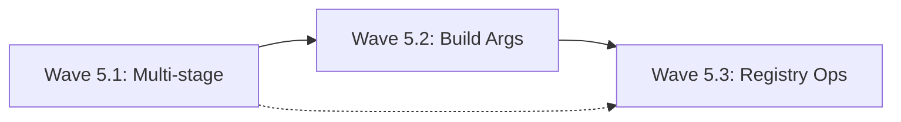

# Phase 5: Advanced Features - Detailed Implementation Plan

## Phase Overview
**Duration:** 7 days  
**Critical Path:** NO - Advanced features for power users  
**Base Branch:** `phase4-integration`  
**Target Integration Branch:** `phase5-integration`  
**Prerequisites:** Phase 4 complete with enhanced UX and caching

---

## Critical Libraries & Dependencies (MAINTAINER SPECIFIED)

### Required Libraries
```yaml
core_libraries:
  - name: "github.com/moby/buildkit"
    version: "v0.12.5"
    reason: "Advanced multi-stage build support and BuildKit compatibility. Industry standard for complex builds."
    usage: "Multi-stage build parsing, build arguments, advanced Dockerfile features"
    
  - name: "github.com/docker/cli"
    version: "v24.0.7"
    reason: "Docker CLI compatibility for build arguments and advanced features parsing."
    usage: "Build argument parsing, Dockerfile compatibility, CLI flag compatibility"
    
  - name: "github.com/go-git/go-git/v5"
    version: "v5.11.0"
    reason: "Git repository operations for build context from remote sources."
    usage: "Remote build context, git-based builds"
    
  - name: "gopkg.in/yaml.v3"
    version: "v3.0.1"
    reason: "YAML configuration parsing for advanced build configurations."
    usage: "Build configuration files, multi-image builds"
    
  - name: "github.com/containers/image/v5"
    version: "v5.30.0"
    reason: "Extend existing usage for advanced registry operations and image inspection."
    usage: "Image listing, registry browsing, image metadata operations"
```

### Interfaces to Reuse (MANDATORY)
```yaml
reused_from_previous:
  phase1:
    - "pkg/build/api/types.go: BuildRequest, BuildResponse - EXTEND with build args"
    - "pkg/build/api/builder.go: Builder interface - EXTEND with advanced methods"
    - "pkg/build/service.go: Service struct - ENHANCE with multi-stage support"
  phase2:
    - "pkg/cmd/build/root.go: BuildCmd - ADD advanced flags for build args, targets"
    - "pkg/cmd/build/flags.go: Flag parsing - EXTEND with new flag types"
  phase3:
    - "ALL test patterns and utilities - REUSE and EXTEND for advanced features"
  phase4:
    - "pkg/build/cache/manager.go: LayerCache - ENHANCE for multi-stage caching"
    - "pkg/cmd/build/progress.go: Progress reporting - EXTEND for complex builds"
    
forbidden_duplications:
  - "DO NOT create new CLI commands - extend existing build command"
  - "DO NOT implement new caching - enhance existing cache system"
  - "DO NOT duplicate registry operations - extend existing auth/push"
  - "DO NOT recreate build service - add advanced features to existing service"
```

---

## Wave 5.1: Multi-stage Build Support

### Overview
**Focus:** Implement multi-stage Dockerfile support  
**Dependencies:** Phase 4 complete  
**Parallelizable:** YES - Multi-stage parsing is independent

### E5.1.1: Multi-stage Dockerfile Parser
**Branch:** `phase5/wave1/effort1-multistage-parser`  
**Duration:** 16 hours  
**Estimated Lines:** 400 lines  
**Agent Assignment:** Single

#### Requirements
1. **MUST** parse multi-stage Dockerfiles with named stages
2. **MUST** handle COPY --from=stage syntax
3. **MUST** support build target selection
4. **MUST** integrate with existing Dockerfile parsing

#### Implementation Guidance

##### Directory Structure
```
pkg/
├── build/
│   ├── multistage/
│   │   ├── parser.go         # ~200 lines
│   │   ├── stages.go         # ~100 lines
│   │   ├── resolver.go       # ~100 lines
│   │   └── parser_test.go    # ~150 lines (separate file)
```

##### Multi-stage Parser (Maintainer Specified)
```go
// pkg/build/multistage/parser.go
package multistage

import (
    "fmt"
    "regexp"
    "strconv"
    "strings"
    
    "idpbuilder/pkg/build/errors"
)

// Stage represents a build stage in a multi-stage Dockerfile
type Stage struct {
    Name         string        `json:"name"`          // Stage name (from FROM ... AS name)
    Index        int           `json:"index"`         // Stage index (0-based)
    BaseImage    string        `json:"base_image"`    // Base image or previous stage
    Instructions []Instruction `json:"instructions"`  // Instructions in this stage
    Dependencies []string      `json:"dependencies"`  // Other stages this depends on
}

// Instruction represents a single Dockerfile instruction
type Instruction struct {
    Command    string            `json:"command"`     // FROM, RUN, COPY, etc.
    Args       []string          `json:"args"`        // Instruction arguments
    Flags      map[string]string `json:"flags"`       // Instruction flags (--from, etc.)
    LineNumber int               `json:"line_number"` // Line number in Dockerfile
    Raw        string            `json:"raw"`         // Original instruction text
}

// MultiStageDockerfile represents a parsed multi-stage Dockerfile
type MultiStageDockerfile struct {
    Stages       []Stage           `json:"stages"`
    StagesByName map[string]*Stage `json:"stages_by_name"`
    Dependencies map[string][]string `json:"dependencies"` // Stage dependency graph
}

// ParseMultiStageDockerfile parses a Dockerfile into stages
func ParseMultiStageDockerfile(content []byte) (*MultiStageDockerfile, error) {
    lines := strings.Split(string(content), "\n")
    
    msdf := &MultiStageDockerfile{
        Stages:       make([]Stage, 0),
        StagesByName: make(map[string]*Stage),
        Dependencies: make(map[string][]string),
    }
    
    var currentStage *Stage
    stageIndex := -1
    
    for lineNum, line := range lines {
        line = strings.TrimSpace(line)
        
        // Skip empty lines and comments
        if line == "" || strings.HasPrefix(line, "#") {
            continue
        }
        
        instruction, err := parseInstruction(line, lineNum+1)
        if err != nil {
            return nil, errors.WrapDockerfileError(err, "Dockerfile", lineNum+1)
        }
        
        // Handle FROM instruction (new stage)
        if instruction.Command == "FROM" {
            if currentStage != nil {
                // Finalize previous stage
                msdf.Stages = append(msdf.Stages, *currentStage)
                if currentStage.Name != "" {
                    msdf.StagesByName[currentStage.Name] = currentStage
                }
            }
            
            // Start new stage
            stageIndex++
            currentStage = &Stage{
                Index:        stageIndex,
                Instructions: make([]Instruction, 0),
                Dependencies: make([]string, 0),
            }
            
            // Parse FROM instruction
            if err := msdf.parseFROMInstruction(currentStage, instruction); err != nil {
                return nil, err
            }
        } else if currentStage != nil {
            // Add instruction to current stage
            currentStage.Instructions = append(currentStage.Instructions, *instruction)
            
            // Check for stage dependencies (COPY --from)
            if instruction.Command == "COPY" && instruction.Flags["from"] != "" {
                fromStage := instruction.Flags["from"]
                // Only add if it's a stage name (not external image)
                if !strings.Contains(fromStage, ":") && !isNumeric(fromStage) {
                    currentStage.Dependencies = append(currentStage.Dependencies, fromStage)
                }
            }
        }
    }
    
    // Finalize last stage
    if currentStage != nil {
        msdf.Stages = append(msdf.Stages, *currentStage)
        if currentStage.Name != "" {
            msdf.StagesByName[currentStage.Name] = currentStage
        }
    }
    
    // Build dependency graph
    msdf.buildDependencyGraph()
    
    return msdf, nil
}

// parseFROMInstruction parses FROM instruction and extracts stage info
func (msdf *MultiStageDockerfile) parseFROMInstruction(stage *Stage, instruction *Instruction) error {
    args := instruction.Args
    if len(args) == 0 {
        return fmt.Errorf("FROM instruction requires base image")
    }
    
    stage.BaseImage = args[0]
    
    // Check for stage name (FROM image AS name)
    for i, arg := range args {
        if strings.ToUpper(arg) == "AS" && i+1 < len(args) {
            stage.Name = args[i+1]
            break
        }
    }
    
    // If no name specified, use index-based name
    if stage.Name == "" {
        stage.Name = fmt.Sprintf("stage-%d", stage.Index)
    }
    
    return nil
}

// parseInstruction parses a single Dockerfile instruction
func parseInstruction(line string, lineNumber int) (*Instruction, error) {
    // Handle line continuations and complex parsing
    parts := strings.Fields(line)
    if len(parts) == 0 {
        return nil, fmt.Errorf("empty instruction")
    }
    
    instruction := &Instruction{
        Command:    strings.ToUpper(parts[0]),
        Args:       make([]string, 0),
        Flags:      make(map[string]string),
        LineNumber: lineNumber,
        Raw:        line,
    }
    
    // Parse command-specific syntax
    switch instruction.Command {
    case "COPY", "ADD":
        if err := parseCopyInstruction(instruction, parts[1:]); err != nil {
            return nil, err
        }
    case "RUN":
        instruction.Args = parts[1:]
    case "FROM":
        instruction.Args = parts[1:]
    default:
        instruction.Args = parts[1:]
    }
    
    return instruction, nil
}

// parseCopyInstruction handles COPY --from and other flags
func parseCopyInstruction(instruction *Instruction, args []string) error {
    var currentArgs []string
    
    for i := 0; i < len(args); i++ {
        arg := args[i]
        
        if strings.HasPrefix(arg, "--") {
            // Parse flag
            flagName := strings.TrimPrefix(arg, "--")
            
            if strings.Contains(flagName, "=") {
                // Flag with value: --from=stage
                parts := strings.SplitN(flagName, "=", 2)
                instruction.Flags[parts[0]] = parts[1]
            } else if i+1 < len(args) {
                // Flag with separate value: --from stage
                instruction.Flags[flagName] = args[i+1]
                i++ // Skip next argument
            } else {
                // Boolean flag
                instruction.Flags[flagName] = "true"
            }
        } else {
            currentArgs = append(currentArgs, arg)
        }
    }
    
    instruction.Args = currentArgs
    return nil
}

// GetStageByName returns a stage by name
func (msdf *MultiStageDockerfile) GetStageByName(name string) (*Stage, bool) {
    stage, exists := msdf.StagesByName[name]
    return stage, exists
}

// GetBuildOrder returns stages in correct build order considering dependencies
func (msdf *MultiStageDockerfile) GetBuildOrder(targetStage string) ([]Stage, error) {
    if targetStage == "" {
        // Return all stages in order
        return msdf.Stages, nil
    }
    
    // Find target stage
    target, exists := msdf.GetStageByName(targetStage)
    if !exists {
        return nil, fmt.Errorf("stage %q not found", targetStage)
    }
    
    // Build dependency tree and return stages up to target
    visited := make(map[string]bool)
    var result []Stage
    
    if err := msdf.collectDependencies(target.Name, visited, &result); err != nil {
        return nil, err
    }
    
    return result, nil
}

// collectDependencies recursively collects all dependencies for a stage
func (msdf *MultiStageDockerfile) collectDependencies(stageName string, visited map[string]bool, result *[]Stage) error {
    if visited[stageName] {
        return fmt.Errorf("circular dependency detected involving stage %q", stageName)
    }
    
    visited[stageName] = true
    
    // Get stage dependencies
    deps, exists := msdf.Dependencies[stageName]
    if exists {
        for _, dep := range deps {
            if err := msdf.collectDependencies(dep, visited, result); err != nil {
                return err
            }
        }
    }
    
    // Add this stage
    if stage, exists := msdf.GetStageByName(stageName); exists {
        *result = append(*result, *stage)
    }
    
    visited[stageName] = false // Unmark for other paths
    return nil
}

// buildDependencyGraph builds the dependency graph between stages
func (msdf *MultiStageDockerfile) buildDependencyGraph() {
    for _, stage := range msdf.Stages {
        msdf.Dependencies[stage.Name] = stage.Dependencies
    }
}

// isNumeric checks if a string represents a number
func isNumeric(s string) bool {
    _, err := strconv.Atoi(s)
    return err == nil
}
```

##### Stage Management (Maintainer Specified)
```go
// pkg/build/multistage/stages.go
package multistage

import (
    "fmt"
    "strings"
)

// StageBuilder manages building individual stages
type StageBuilder struct {
    dockerfile *MultiStageDockerfile
    builtStages map[string]string // stage name -> image ID
}

// NewStageBuilder creates a new stage builder
func NewStageBuilder(dockerfile *MultiStageDockerfile) *StageBuilder {
    return &StageBuilder{
        dockerfile:  dockerfile,
        builtStages: make(map[string]string),
    }
}

// BuildStage builds a specific stage and its dependencies
func (sb *StageBuilder) BuildStage(stageName string) (string, error) {
    // Check if already built
    if imageID, exists := sb.builtStages[stageName]; exists {
        return imageID, nil
    }
    
    stage, exists := sb.dockerfile.GetStageByName(stageName)
    if !exists {
        return "", fmt.Errorf("stage %q not found", stageName)
    }
    
    // Build dependencies first
    for _, dep := range stage.Dependencies {
        if _, err := sb.BuildStage(dep); err != nil {
            return "", fmt.Errorf("failed to build dependency %q: %w", dep, err)
        }
    }
    
    // Build this stage (placeholder - would integrate with Buildah)
    imageID := fmt.Sprintf("stage-%s-%d", stageName, len(sb.builtStages))
    sb.builtStages[stageName] = imageID
    
    return imageID, nil
}

// GetBuiltStages returns all built stage image IDs
func (sb *StageBuilder) GetBuiltStages() map[string]string {
    return sb.builtStages
}

// ResolveCopyFrom resolves COPY --from references
func (sb *StageBuilder) ResolveCopyFrom(fromRef string) (string, error) {
    // If it's a stage name
    if imageID, exists := sb.builtStages[fromRef]; exists {
        return imageID, nil
    }
    
    // If it's a stage index
    if idx, err := strconv.Atoi(fromRef); err == nil {
        if idx >= 0 && idx < len(sb.dockerfile.Stages) {
            stageName := sb.dockerfile.Stages[idx].Name
            return sb.ResolveCopyFrom(stageName)
        }
    }
    
    // If it's an external image reference
    if strings.Contains(fromRef, ":") || strings.Contains(fromRef, "/") {
        return fromRef, nil
    }
    
    return "", fmt.Errorf("cannot resolve COPY --from reference: %q", fromRef)
}

// ValidateStages checks for circular dependencies and other issues
func (sb *StageBuilder) ValidateStages() error {
    // Check for circular dependencies
    visited := make(map[string]bool)
    inStack := make(map[string]bool)
    
    for _, stage := range sb.dockerfile.Stages {
        if !visited[stage.Name] {
            if err := sb.detectCycle(stage.Name, visited, inStack); err != nil {
                return err
            }
        }
    }
    
    return nil
}

// detectCycle performs DFS to detect circular dependencies
func (sb *StageBuilder) detectCycle(stageName string, visited, inStack map[string]bool) error {
    visited[stageName] = true
    inStack[stageName] = true
    
    deps, exists := sb.dockerfile.Dependencies[stageName]
    if exists {
        for _, dep := range deps {
            if !visited[dep] {
                if err := sb.detectCycle(dep, visited, inStack); err != nil {
                    return err
                }
            } else if inStack[dep] {
                return fmt.Errorf("circular dependency detected: %s -> %s", stageName, dep)
            }
        }
    }
    
    inStack[stageName] = false
    return nil
}
```

#### Test Requirements (TDD)
```go
// pkg/build/multistage/parser_test.go
func TestParseMultiStageDockerfile(t *testing.T) {
    dockerfile := `FROM golang:1.21 AS builder
WORKDIR /app
COPY go.mod go.sum ./
RUN go mod download

FROM alpine:3.19 AS runner
RUN apk add --no-cache ca-certificates
COPY --from=builder /app/bin/app /usr/local/bin/app
CMD ["app"]`

    msdf, err := ParseMultiStageDockerfile([]byte(dockerfile))
    require.NoError(t, err)
    
    // Test basic parsing
    assert.Len(t, msdf.Stages, 2)
    assert.Equal(t, "builder", msdf.Stages[0].Name)
    assert.Equal(t, "runner", msdf.Stages[1].Name)
    
    // Test dependencies
    assert.Contains(t, msdf.Stages[1].Dependencies, "builder")
    
    // Test stage lookup
    builder, exists := msdf.GetStageByName("builder")
    assert.True(t, exists)
    assert.Equal(t, "golang:1.21", builder.BaseImage)
}

func TestCopyFromParsing(t *testing.T) {
    instruction := "COPY --from=builder /app/bin/app /usr/local/bin/app"
    
    parsed, err := parseInstruction(instruction, 1)
    require.NoError(t, err)
    
    assert.Equal(t, "COPY", parsed.Command)
    assert.Equal(t, "builder", parsed.Flags["from"])
    assert.Equal(t, []string{"/app/bin/app", "/usr/local/bin/app"}, parsed.Args)
}
```

---

## Wave 5.2: Build Arguments Support

### Overview
**Focus:** Implement --build-arg support for parameterized builds  
**Dependencies:** Wave 5.1 complete  
**Parallelizable:** YES - Build args are independent feature

### E5.2.1: Build Argument Processing
**Branch:** `phase5/wave2/effort1-build-args`  
**Duration:** 12 hours  
**Estimated Lines:** 300 lines  
**Agent Assignment:** Single

#### Requirements
1. **MUST** support --build-arg key=value CLI flags
2. **MUST** integrate with existing CLI flag parsing
3. **MUST** handle ARG instructions in Dockerfile
4. **MUST** support build-time variable substitution

#### Implementation Guidance

##### Build Arguments Handler (Maintainer Specified)
```go
// pkg/build/args/processor.go
package args

import (
    "fmt"
    "os"
    "regexp"
    "strings"
    
    "idpbuilder/pkg/build/api"
)

// BuildArgs represents build-time arguments
type BuildArgs struct {
    Args        map[string]string `json:"args"`         // User-provided args
    Defaults    map[string]string `json:"defaults"`     // ARG defaults from Dockerfile  
    Environment map[string]string `json:"environment"`  // Environment variables
}

// NewBuildArgs creates a new build arguments processor
func NewBuildArgs() *BuildArgs {
    return &BuildArgs{
        Args:        make(map[string]string),
        Defaults:    make(map[string]string),
        Environment: make(map[string]string),
    }
}

// AddArg adds a build argument from CLI
func (ba *BuildArgs) AddArg(key, value string) {
    ba.Args[key] = value
}

// AddArgFromString parses and adds argument from key=value string
func (ba *BuildArgs) AddArgFromString(arg string) error {
    parts := strings.SplitN(arg, "=", 2)
    if len(parts) != 2 {
        return fmt.Errorf("invalid build arg format: %q (expected key=value)", arg)
    }
    
    key := strings.TrimSpace(parts[0])
    value := strings.TrimSpace(parts[1])
    
    if key == "" {
        return fmt.Errorf("build arg key cannot be empty")
    }
    
    ba.AddArg(key, value)
    return nil
}

// SetDefault sets a default value from ARG instruction
func (ba *BuildArgs) SetDefault(key, defaultValue string) {
    ba.Defaults[key] = defaultValue
}

// ResolveArg resolves the final value for a build argument
func (ba *BuildArgs) ResolveArg(key string) (string, bool) {
    // Priority: CLI args > environment > defaults
    if value, exists := ba.Args[key]; exists {
        return value, true
    }
    
    if value, exists := ba.Environment[key]; exists {
        return value, true
    }
    
    if value, exists := ba.Defaults[key]; exists {
        return value, true
    }
    
    return "", false
}

// GetAllArgs returns all resolved arguments
func (ba *BuildArgs) GetAllArgs() map[string]string {
    result := make(map[string]string)
    
    // Start with defaults
    for key, value := range ba.Defaults {
        result[key] = value
    }
    
    // Override with environment
    for key, value := range ba.Environment {
        result[key] = value
    }
    
    // Override with CLI args
    for key, value := range ba.Args {
        result[key] = value
    }
    
    return result
}

// SubstituteVariables substitutes build args in instruction text
func (ba *BuildArgs) SubstituteVariables(instruction string) string {
    // Handle ${VAR} and $VAR syntax
    varRegex := regexp.MustCompile(`\$\{([^}]+)\}|\$([A-Za-z_][A-Za-z0-9_]*)`)
    
    return varRegex.ReplaceAllStringFunc(instruction, func(match string) string {
        var varName string
        
        if strings.HasPrefix(match, "${") {
            // ${VAR} syntax
            varName = match[2 : len(match)-1]
        } else {
            // $VAR syntax
            varName = match[1:]
        }
        
        if value, exists := ba.ResolveArg(varName); exists {
            return value
        }
        
        // Return original if not found
        return match
    })
}

// LoadFromEnvironment loads build args from environment variables
func (ba *BuildArgs) LoadFromEnvironment(allowedKeys []string) {
    for _, key := range allowedKeys {
        if value, exists := os.LookupEnv(key); exists {
            ba.Environment[key] = value
        }
    }
}

// ExtractArgInstructions extracts ARG instructions from Dockerfile
func ExtractArgInstructions(instructions []string) map[string]string {
    args := make(map[string]string)
    
    for _, instruction := range instructions {
        instruction = strings.TrimSpace(instruction)
        
        if strings.HasPrefix(strings.ToUpper(instruction), "ARG ") {
            argPart := strings.TrimSpace(instruction[4:])
            
            if strings.Contains(argPart, "=") {
                // ARG KEY=default_value
                parts := strings.SplitN(argPart, "=", 2)
                key := strings.TrimSpace(parts[0])
                defaultValue := strings.TrimSpace(parts[1])
                args[key] = defaultValue
            } else {
                // ARG KEY (no default)
                key := strings.TrimSpace(argPart)
                args[key] = ""
            }
        }
    }
    
    return args
}

// ValidateArgs validates that all required args are provided
func (ba *BuildArgs) ValidateArgs(requiredArgs []string) error {
    missing := make([]string, 0)
    
    for _, required := range requiredArgs {
        if _, exists := ba.ResolveArg(required); !exists {
            missing = append(missing, required)
        }
    }
    
    if len(missing) > 0 {
        return fmt.Errorf("missing required build arguments: %s", strings.Join(missing, ", "))
    }
    
    return nil
}
```

##### CLI Integration for Build Args (Maintainer Specified)
```go
// Extend pkg/cmd/build/flags.go to support build args

var (
    buildArgs []string // NEW: Build arguments flag
)

func init() {
    // Add to existing BuildCmd flags
    BuildCmd.Flags().StringArrayVar(&buildArgs, "build-arg", []string{},
        "Set build-time variables (format: key=value)")
}

// Extend buildOptionsFromFlags function:
func buildOptionsFromFlags(contextDir string) (*api.BuildRequest, error) {
    // ... existing code ...
    
    // Process build arguments
    buildArgsProcessor := args.NewBuildArgs()
    
    for _, arg := range buildArgs {
        if err := buildArgsProcessor.AddArgFromString(arg); err != nil {
            return nil, fmt.Errorf("invalid build arg %q: %w", arg, err)
        }
    }
    
    // Create enhanced build request
    request := &api.BuildRequest{
        DockerfilePath: dockerfileFlag,
        ContextDir:     contextDir,
        ImageName:      imageName,
        ImageTag:       imageTag,
        BuildArgs:      buildArgsProcessor.GetAllArgs(), // NEW FIELD
    }
    
    return request, nil
}
```

##### Extend API Types (Maintainer Specified)
```go
// Extend pkg/build/api/types.go to include build args

type BuildRequest struct {
    // ... existing fields ...
    
    // BuildArgs contains build-time arguments
    BuildArgs map[string]string `json:"buildArgs,omitempty"`
    
    // BuildTarget specifies the target stage for multi-stage builds
    BuildTarget string `json:"buildTarget,omitempty"`
}

// Validate method enhancement:
func (br *BuildRequest) Validate() error {
    // ... existing validation ...
    
    // Validate build args format
    for key, value := range br.BuildArgs {
        if key == "" {
            return fmt.Errorf("build arg key cannot be empty")
        }
        if strings.Contains(key, " ") {
            return fmt.Errorf("build arg key %q cannot contain spaces", key)
        }
        // Value can be empty (for environment-based args)
    }
    
    return nil
}
```

#### Test Requirements (TDD)
```go
// pkg/build/args/processor_test.go
func TestBuildArgs(t *testing.T) {
    ba := NewBuildArgs()
    
    // Test adding args
    err := ba.AddArgFromString("VERSION=1.0.0")
    assert.NoError(t, err)
    
    err = ba.AddArgFromString("DEBUG=true")
    assert.NoError(t, err)
    
    // Test resolution
    value, exists := ba.ResolveArg("VERSION")
    assert.True(t, exists)
    assert.Equal(t, "1.0.0", value)
    
    // Test variable substitution
    instruction := "RUN echo Version: $VERSION"
    result := ba.SubstituteVariables(instruction)
    assert.Equal(t, "RUN echo Version: 1.0.0", result)
}

func TestArgExtraction(t *testing.T) {
    instructions := []string{
        "FROM alpine:3.19",
        "ARG VERSION=latest",
        "ARG DEBUG",
        "RUN echo $VERSION",
    }
    
    args := ExtractArgInstructions(instructions)
    assert.Equal(t, "latest", args["VERSION"])
    assert.Equal(t, "", args["DEBUG"])
}
```

---

## Wave 5.3: Registry Operations and Image Management

### Overview
**Focus:** Advanced registry operations and image management  
**Dependencies:** Wave 5.2 complete  
**Parallelizable:** YES - Registry operations are independent

### E5.3.1: Image Listing and Registry Browser
**Branch:** `phase5/wave3/effort1-registry-ops`  
**Duration:** 16 hours  
**Estimated Lines:** 450 lines  
**Agent Assignment:** Single

#### Requirements
1. **MUST** implement image listing command
2. **MUST** browse Gitea registry contents
3. **MUST** show image metadata and tags
4. **MUST** integrate with existing CLI structure

#### Implementation Guidance

##### Registry Operations (Maintainer Specified)
```go
// pkg/registry/client.go
package registry

import (
    "context"
    "encoding/json"
    "fmt"
    "net/http"
    "sort"
    "strings"
    "time"
    
    "idpbuilder/pkg/build/auth"
    "idpbuilder/pkg/build/errors"
)

// Client handles registry operations
type RegistryClient struct {
    baseURL    string
    httpClient *http.Client
    auth       *auth.Credentials
}

// ImageInfo represents information about a container image
type ImageInfo struct {
    Name        string    `json:"name"`
    Tags        []string  `json:"tags"`
    CreatedAt   time.Time `json:"created_at"`
    UpdatedAt   time.Time `json:"updated_at"`
    Size        int64     `json:"size"`
    PullCount   int       `json:"pull_count"`
    Description string    `json:"description"`
}

// TagInfo represents detailed information about an image tag
type TagInfo struct {
    Name       string    `json:"name"`
    Digest     string    `json:"digest"`
    CreatedAt  time.Time `json:"created_at"`
    Size       int64     `json:"size"`
    MediaType  string    `json:"media_type"`
    ConfigSize int64     `json:"config_size"`
    Layers     []Layer   `json:"layers"`
}

// Layer represents an image layer
type Layer struct {
    Digest    string `json:"digest"`
    Size      int64  `json:"size"`
    MediaType string `json:"media_type"`
}

// NewRegistryClient creates a new registry client
func NewRegistryClient(registryURL string) (*RegistryClient, error) {
    // Get authentication credentials
    creds, err := auth.GetGiteaCredentials(context.Background())
    if err != nil {
        return nil, errors.NewBuildError("registry", errors.ErrorTypeAuth,
            "Failed to get registry credentials", err)
    }
    
    client := &http.Client{
        Timeout: 30 * time.Second,
        Transport: &http.Transport{
            TLSClientConfig: &tls.Config{
                InsecureSkipVerify: true, // For development clusters
            },
        },
    }
    
    return &RegistryClient{
        baseURL:    registryURL,
        httpClient: client,
        auth:       creds,
    }, nil
}

// ListImages lists all images in the registry
func (rc *RegistryClient) ListImages(ctx context.Context, namespace string) ([]ImageInfo, error) {
    // For Gitea, use the packages API
    url := fmt.Sprintf("%s/api/v1/packages/%s?type=container", 
        strings.TrimSuffix(rc.baseURL, "/api/v2"), namespace)
    
    req, err := http.NewRequestWithContext(ctx, "GET", url, nil)
    if err != nil {
        return nil, errors.NewBuildError("registry", errors.ErrorTypeNetwork,
            "Failed to create request", err)
    }
    
    // Add authentication
    req.SetBasicAuth(rc.auth.Username, rc.auth.Password)
    req.Header.Set("Accept", "application/json")
    
    resp, err := rc.httpClient.Do(req)
    if err != nil {
        return nil, errors.WrapNetworkError(err, "list images", url)
    }
    defer resp.Body.Close()
    
    if resp.StatusCode != http.StatusOK {
        return nil, fmt.Errorf("registry returned status %d", resp.StatusCode)
    }
    
    var packages []struct {
        Name        string    `json:"name"`
        CreatedAt   time.Time `json:"created_at"`
        Version     string    `json:"version"`
        FileCount   int       `json:"file_count"`
        Size        int64     `json:"size"`
        Description string    `json:"html_url"`
    }
    
    if err := json.NewDecoder(resp.Body).Decode(&packages); err != nil {
        return nil, errors.NewBuildError("registry", errors.ErrorTypeNetwork,
            "Failed to parse response", err)
    }
    
    // Convert to ImageInfo
    imageMap := make(map[string]*ImageInfo)
    
    for _, pkg := range packages {
        imageName := pkg.Name
        
        if info, exists := imageMap[imageName]; exists {
            info.Tags = append(info.Tags, pkg.Version)
            if pkg.CreatedAt.After(info.UpdatedAt) {
                info.UpdatedAt = pkg.CreatedAt
            }
            info.Size += pkg.Size
        } else {
            imageMap[imageName] = &ImageInfo{
                Name:        imageName,
                Tags:        []string{pkg.Version},
                CreatedAt:   pkg.CreatedAt,
                UpdatedAt:   pkg.CreatedAt,
                Size:        pkg.Size,
                Description: pkg.Description,
            }
        }
    }
    
    // Convert map to slice and sort
    var images []ImageInfo
    for _, info := range imageMap {
        sort.Strings(info.Tags)
        images = append(images, *info)
    }
    
    sort.Slice(images, func(i, j int) bool {
        return images[i].UpdatedAt.After(images[j].UpdatedAt)
    })
    
    return images, nil
}

// GetImageTags gets detailed information about image tags
func (rc *RegistryClient) GetImageTags(ctx context.Context, namespace, imageName string) ([]TagInfo, error) {
    // Use OCI Distribution API for tag details
    url := fmt.Sprintf("%s/v2/%s/%s/tags/list", rc.baseURL, namespace, imageName)
    
    req, err := http.NewRequestWithContext(ctx, "GET", url, nil)
    if err != nil {
        return nil, err
    }
    
    req.SetBasicAuth(rc.auth.Username, rc.auth.Password)
    
    resp, err := rc.httpClient.Do(req)
    if err != nil {
        return nil, errors.WrapNetworkError(err, "get image tags", url)
    }
    defer resp.Body.Close()
    
    if resp.StatusCode != http.StatusOK {
        return nil, fmt.Errorf("failed to get tags: status %d", resp.StatusCode)
    }
    
    var tagList struct {
        Name string   `json:"name"`
        Tags []string `json:"tags"`
    }
    
    if err := json.NewDecoder(resp.Body).Decode(&tagList); err != nil {
        return nil, err
    }
    
    // Get detailed info for each tag
    var tagInfos []TagInfo
    for _, tag := range tagList.Tags {
        info, err := rc.getTagDetails(ctx, namespace, imageName, tag)
        if err != nil {
            // Log error but continue with other tags
            continue
        }
        tagInfos = append(tagInfos, *info)
    }
    
    return tagInfos, nil
}

// getTagDetails gets detailed information about a specific tag
func (rc *RegistryClient) getTagDetails(ctx context.Context, namespace, imageName, tag string) (*TagInfo, error) {
    // Get manifest
    url := fmt.Sprintf("%s/v2/%s/%s/manifests/%s", rc.baseURL, namespace, imageName, tag)
    
    req, err := http.NewRequestWithContext(ctx, "GET", url, nil)
    if err != nil {
        return nil, err
    }
    
    req.SetBasicAuth(rc.auth.Username, rc.auth.Password)
    req.Header.Set("Accept", "application/vnd.docker.distribution.manifest.v2+json")
    
    resp, err := rc.httpClient.Do(req)
    if err != nil {
        return nil, err
    }
    defer resp.Body.Close()
    
    var manifest struct {
        MediaType string `json:"mediaType"`
        Config    struct {
            Digest string `json:"digest"`
            Size   int64  `json:"size"`
        } `json:"config"`
        Layers []struct {
            Digest string `json:"digest"`
            Size   int64  `json:"size"`
        } `json:"layers"`
    }
    
    if err := json.NewDecoder(resp.Body).Decode(&manifest); err != nil {
        return nil, err
    }
    
    // Convert layers
    var layers []Layer
    totalSize := manifest.Config.Size
    
    for _, layer := range manifest.Layers {
        layers = append(layers, Layer{
            Digest:    layer.Digest,
            Size:      layer.Size,
            MediaType: "application/vnd.docker.image.rootfs.diff.tar.gzip",
        })
        totalSize += layer.Size
    }
    
    return &TagInfo{
        Name:       tag,
        Digest:     resp.Header.Get("Docker-Content-Digest"),
        Size:       totalSize,
        MediaType:  manifest.MediaType,
        ConfigSize: manifest.Config.Size,
        Layers:     layers,
        CreatedAt:  time.Now(), // Would parse from config in real implementation
    }, nil
}

// DeleteImage deletes an image from the registry
func (rc *RegistryClient) DeleteImage(ctx context.Context, namespace, imageName, tag string) error {
    // Get manifest digest first
    tagInfo, err := rc.getTagDetails(ctx, namespace, imageName, tag)
    if err != nil {
        return err
    }
    
    // Delete by digest
    url := fmt.Sprintf("%s/v2/%s/%s/manifests/%s", rc.baseURL, namespace, imageName, tagInfo.Digest)
    
    req, err := http.NewRequestWithContext(ctx, "DELETE", url, nil)
    if err != nil {
        return err
    }
    
    req.SetBasicAuth(rc.auth.Username, rc.auth.Password)
    
    resp, err := rc.httpClient.Do(req)
    if err != nil {
        return errors.WrapNetworkError(err, "delete image", url)
    }
    defer resp.Body.Close()
    
    if resp.StatusCode != http.StatusAccepted {
        return fmt.Errorf("failed to delete image: status %d", resp.StatusCode)
    }
    
    return nil
}
```

##### Images CLI Command (Maintainer Specified)
```go
// pkg/cmd/images/list.go
package images

import (
    "context"
    "fmt"
    "os"
    "strings"
    "text/tabwriter"
    "time"
    
    "github.com/spf13/cobra"
    "github.com/fatih/color"
    
    "idpbuilder/pkg/registry"
)

var (
    namespaceFlag string
    formatFlag    string
    allFlag       bool
)

// ListCmd represents the images list command
var ListCmd = &cobra.Command{
    Use:   "images",
    Short: "List container images in Gitea registry",
    Long: `List container images stored in the idpbuilder cluster's Gitea registry.

Shows image names, tags, sizes, and creation times. Use filters to narrow results.

Examples:
  # List all images
  idpbuilder images
  
  # List images in specific namespace
  idpbuilder images --namespace myproject
  
  # Show detailed information
  idpbuilder images --format table`,
    RunE: runImagesList,
}

func init() {
    ListCmd.Flags().StringVarP(&namespaceFlag, "namespace", "n", "giteaadmin", 
        "Registry namespace to list")
    ListCmd.Flags().StringVarP(&formatFlag, "format", "f", "table", 
        "Output format (table, json, yaml)")
    ListCmd.Flags().BoolVarP(&allFlag, "all", "a", false,
        "Show all tags for each image")
}

func runImagesList(cmd *cobra.Command, args []string) error {
    ctx, cancel := context.WithTimeout(context.Background(), 30*time.Second)
    defer cancel()
    
    // Create registry client
    client, err := registry.NewRegistryClient("https://gitea.cnoe.localtest.me")
    if err != nil {
        return fmt.Errorf("failed to create registry client: %w", err)
    }
    
    // List images
    images, err := client.ListImages(ctx, namespaceFlag)
    if err != nil {
        return fmt.Errorf("failed to list images: %w", err)
    }
    
    if len(images) == 0 {
        fmt.Printf("No images found in namespace %s\n", namespaceFlag)
        return nil
    }
    
    // Display results based on format
    switch formatFlag {
    case "table":
        return displayImagesTable(images)
    case "json":
        return displayImagesJSON(images)
    case "yaml":
        return displayImagesYAML(images)
    default:
        return fmt.Errorf("unsupported format: %s", formatFlag)
    }
}

func displayImagesTable(images []registry.ImageInfo) error {
    w := tabwriter.NewWriter(os.Stdout, 0, 0, 2, ' ', 0)
    defer w.Flush()
    
    // Header
    fmt.Fprintf(w, "%s\t%s\t%s\t%s\t%s\n",
        color.New(color.Bold).Sprint("NAME"),
        color.New(color.Bold).Sprint("TAGS"),
        color.New(color.Bold).Sprint("SIZE"),
        color.New(color.Bold).Sprint("CREATED"),
        color.New(color.Bold).Sprint("UPDATED"))
    
    for _, image := range images {
        tags := strings.Join(image.Tags[:min(3, len(image.Tags))], ", ")
        if len(image.Tags) > 3 {
            tags += fmt.Sprintf(" (+%d more)", len(image.Tags)-3)
        }
        
        fmt.Fprintf(w, "%s\t%s\t%s\t%s\t%s\n",
            image.Name,
            tags,
            formatSize(image.Size),
            formatTime(image.CreatedAt),
            formatTime(image.UpdatedAt))
        
        // Show all tags if requested
        if allFlag && len(image.Tags) > 3 {
            for i := 3; i < len(image.Tags); i++ {
                fmt.Fprintf(w, "\t%s\t\t\t\n", image.Tags[i])
            }
        }
    }
    
    return nil
}

func formatSize(bytes int64) string {
    const unit = 1024
    if bytes < unit {
        return fmt.Sprintf("%d B", bytes)
    }
    div, exp := int64(unit), 0
    for n := bytes / unit; n >= unit; n /= unit {
        div *= unit
        exp++
    }
    return fmt.Sprintf("%.1f %cB", float64(bytes)/float64(div), "KMGTPE"[exp])
}

func formatTime(t time.Time) string {
    now := time.Now()
    if now.Sub(t) < 24*time.Hour {
        return t.Format("15:04")
    } else if now.Sub(t) < 7*24*time.Hour {
        return t.Format("Mon 15:04")
    } else {
        return t.Format("2006-01-02")
    }
}

func min(a, b int) int {
    if a < b {
        return a
    }
    return b
}
```

---

## Phase-Wide Constraints

### Architecture Decisions (Maintainer Specified)
```markdown
1. **Multi-stage Support**
   - Full compatibility with Docker multi-stage syntax
   - Efficient stage caching and reuse
   - Support for build target selection
   - Proper dependency resolution

2. **Build Arguments**
   - CLI compatibility with docker build --build-arg
   - Environment variable inheritance
   - Secure handling of sensitive values
   - Build-time variable substitution

3. **Registry Operations**
   - Read-only registry browsing for MVP
   - Gitea OCI registry API compatibility
   - Proper authentication handling
   - Graceful error handling for network issues
```

### Cross-Wave Dependencies


### Forbidden Duplications
- DO NOT recreate Dockerfile parsing - extend existing parser
- DO NOT implement new CLI commands - add subcommands to existing structure
- DO NOT duplicate registry authentication - reuse existing auth system
- DO NOT create separate caching - enhance existing cache for multi-stage

---

## Testing Strategy

### Phase-Level Testing
1. **Unit Tests**: >80% coverage for new advanced features
2. **Integration Tests**: Multi-stage builds and build arguments
3. **Registry Tests**: Image listing and metadata operations
4. **Compatibility Tests**: Docker CLI compatibility

### Advanced Feature Validation
```bash
# Multi-stage build test
idpbuilder build . -t multistage-test:latest --target production

# Build arguments test
idpbuilder build . -t args-test:latest --build-arg VERSION=1.0 --build-arg DEBUG=true

# Registry operations test
idpbuilder images
idpbuilder images --namespace myproject --format json
```

---

## Success Criteria

### Functional
- [ ] Multi-stage Dockerfiles build correctly with proper stage dependencies
- [ ] Build arguments work with CLI flags and environment variables
- [ ] Image listing shows accurate registry contents
- [ ] Build target selection works for multi-stage builds
- [ ] Registry operations handle authentication and errors gracefully

### Quality
- [ ] Advanced features maintain build performance
- [ ] Multi-stage caching improves build speed
- [ ] Error messages are clear for complex build scenarios
- [ ] CLI interface is intuitive and consistent

### Compatibility
- [ ] Docker CLI compatibility for common use cases
- [ ] Existing build functionality unaffected
- [ ] Gitea registry integration robust
- [ ] Build arguments security considerations addressed

This phase completes the container build feature with advanced capabilities that support complex development workflows and production deployment scenarios, making idpbuilder a comprehensive container development platform.