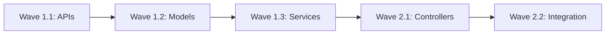

# Phase [X]: [Phase Name] - Detailed Implementation Plan

## Phase Overview
**Duration:** [X] days  
**Critical Path:** [YES/NO] - [Dependency explanation]  
**Base Branch:** `[previous-phase-integration or main]`  
**Target Integration Branch:** `phase[X]-integration`  
**Prerequisites:** [List required completions from previous phases]

---

## Critical Libraries & Dependencies

### Required Libraries (Maintainer Decision)
```yaml
# MAINTAINER MUST SPECIFY exact versions and reasons
core_libraries:
  - name: "[library-name]"
    version: "[specific-version]"
    reason: "[Why this library over alternatives]"
    usage: "[Where/how it will be used]"
    
  - name: "[another-library]"
    version: "[version]"
    reason: "[justification]"
    shared_with_phases: [1, 2]  # CRITICAL: Reuse from earlier phases
```

### Interfaces to Reuse (MANDATORY)
```yaml
# MUST reference interfaces/contracts from earlier phases
reused_from_previous:
  phase1:
    - "pkg/api/types.go: CoreInterface"
    - "pkg/contracts/base.go: ServiceContract"
  phase2:
    - "pkg/services/registry.go: RegistryInterface"
```

---

## Wave [X].[Y]: [Wave Name]

### Overview
**Focus:** [Primary goal of this wave]  
**Dependencies:** [What must be complete before this wave]  
**Parallelizable:** [YES/NO - Can efforts run concurrently?]

### E[X].[Y].[Z]: [Effort Name]
**Branch:** `phase[X]/wave[Y]/effort[Z]-[descriptive-name]`  
**Duration:** [X] hours  
**Estimated Lines:** [XXX] lines  
**Agent Assignment:** [Single/Parallel]

#### Requirements
1. **MUST** implement:
   - [Specific component/feature]
   - [Another requirement]
   
2. **MUST** reuse from Phase [N]:
   - [Specific interface/type to reuse]
   - [Shared utility/helper]

3. **MUST NOT**:
   - [Anti-pattern to avoid]
   - [Thing not to implement here]

#### Implementation Guidance

##### Directory Structure
```
pkg/
├── [module]/
│   ├── [component].go      # ~[XX] lines
│   ├── [component]_test.go # ~[XX] lines
│   └── interfaces.go       # REUSE from Phase [N]
```

##### Key Design Decisions (Maintainer Specified)
```markdown
1. **Pattern Choice**: [Repository/Factory/Observer/etc]
   - WHY: [Reasoning for this pattern]
   - HOW: [Brief implementation approach]

2. **Error Handling**: [Strategy]
   - Use [specific error library/pattern]
   - Consistent with Phase [N] approach

3. **Concurrency Model**: [If applicable]
   - [Goroutines/Channels/Mutex approach]
   - Based on [performance requirement]
```

##### Critical Implementation Details

###### ONLY FOR COMPLEX SECTIONS - Maintainer Provides Code Snippets
```[language]
// MAINTAINER NOTE: This specific logic is critical for [reason]
// DO NOT DEVIATE from this implementation

func criticalComplexFunction() error {
    // [10-20 lines of complex logic that MUST be implemented exactly]
    // This ensures [specific requirement/compatibility]
    
    return nil
}

// SW ENGINEER: Implement the rest following this pattern
```

##### Interface Contracts (MANDATORY REUSE)
```[language]
// MUST implement this interface from Phase [N]
type SharedInterface interface {
    // From pkg/[module]/interfaces.go (Phase [N])
    ExistingMethod() error
    
    // NEW in this phase
    ExtendedMethod() error
}
```

#### Test Requirements (TDD Approach)

##### Test Coverage Targets
- Unit Tests: [XX]% minimum
- Integration Tests: Required for [specific integrations]
- Performance Tests: [If applicable]

##### Test Scenarios (Maintainer Specified)
```[language]
// test/[module]/[component]_test.go

func TestCriticalScenario(t *testing.T) {
    // MAINTAINER: This test MUST pass
    testCases := []struct {
        name     string
        input    interface{}
        expected interface{}
        wantErr  bool
    }{
        {
            name:     "Must handle [edge case]",
            input:    [specific input],
            expected: [specific output],
            wantErr:  false,
        },
        // SW ENGINEER: Add more test cases
    }
}
```

#### Integration Points

##### With Previous Phases
```yaml
uses_from_phase1:
  - Component: "APIRegistry"
    Import: "pkg/api/registry"
    Usage: "Register new endpoints"
    
uses_from_phase2:
  - Component: "ServiceBus"
    Import: "pkg/services/bus"
    Usage: "Event propagation"
```

##### With Current Wave
```yaml
provides_to_efforts:
  - Interface: "DataProcessor"
    Used_By: ["E[X].[Y].[Z+1]", "E[X].[Y].[Z+2]"]
    Contract: "Must be thread-safe"
```

#### Success Criteria
- [ ] All interfaces from Phase [N] properly extended
- [ ] No code duplication with previous phases
- [ ] Tests achieve [XX]% coverage
- [ ] Integration with [component] verified
- [ ] Performance benchmarks met
- [ ] Line count under 800 (measured by line-counter.sh)

---

## Wave [X].[Y+1]: [Next Wave Name]

[Continue pattern for all waves...]

---

## Phase-Wide Constraints

### MANDATORY Code Reuse
```yaml
# Maintainer enforces these MUST be reused
must_reuse:
  - "pkg/common/logger": "Use existing logging from Phase 1"
  - "pkg/errors/handler": "Use centralized error handling from Phase 2"
  - "pkg/config/loader": "Use configuration system from Phase 1"
  
forbidden_duplications:
  - "DO NOT create new logging system"
  - "DO NOT implement separate error types"
  - "DO NOT build parallel configuration"
```

### Architecture Decisions (Maintainer Specified)
```markdown
1. **Database Access Pattern**
   - MUST use repository pattern established in Phase 2
   - MUST use the shared connection pool
   - NO direct SQL outside repositories

2. **API Versioning**
   - Follow v1alpha1 → v1beta1 → v1 progression
   - Maintain backward compatibility

3. **Concurrency Limits**
   - Max goroutines: [X]
   - Channel buffer sizes: [Y]
   - Based on Phase 1 performance tests
```

### Cross-Wave Dependencies


---

## Testing Strategy

### Phase-Level Testing
1. **Unit Tests**: Each effort must include
2. **Integration Tests**: After each wave
3. **Functional Tests**: End of phase (per PHASE-COMPLETION-FUNCTIONAL-TESTING.md)

### Performance Benchmarks
```yaml
benchmarks:
  - operation: "[Operation name]"
    target: "[X]ms p99 latency"
    load: "[Y] requests/second"
```

---

## Risk Mitigation

### Technical Risks
| Risk | Mitigation | Owner |
|------|------------|-------|
| [Library incompatibility] | [Use vendored version] | Maintainer |
| [Performance degradation] | [Implement caching layer] | SW Engineer |
| [API breaking changes] | [Version properly] | Code Reviewer |

---

## Maintainer Notes

### Critical Success Factors
```markdown
1. **ABSOLUTE REQUIREMENTS**
   - Reuse Phase [N] authentication system
   - Maintain API compatibility
   - Stay under line limits

2. **FORBIDDEN ACTIONS**
   - Do NOT refactor Phase [N] code
   - Do NOT introduce new frameworks
   - Do NOT skip integration tests

3. **Performance Considerations**
   - Cache [specific data] aggressively
   - Batch [operations] in groups of [X]
   - Use connection pooling for [resource]
```

### Complex Algorithm (Maintainer Provides)
```[language]
// CRITICAL: This algorithm MUST be implemented exactly as shown
// It handles [specific edge case] that took weeks to debug

func complexCriticalAlgorithm(input DataType) (OutputType, error) {
    // [20-30 lines of complex, critical logic]
    // DO NOT MODIFY without consulting maintainer
    
    // SW ENGINEER: You implement the surrounding code
    // but this core algorithm must remain exactly as specified
}
```

---

## Handoff Instructions

### For Orchestrator
1. Break each effort into working directories
2. Ensure no effort exceeds 800 lines
3. Task Code Reviewer to create IMPLEMENTATION-PLAN.md for each
4. Enforce sequential wave completion

### For SW Engineer
1. Follow implementation guidance strictly
2. Reuse specified components - no exceptions
3. Only implement assigned effort scope
4. Include tests as specified

### For Code Reviewer
1. Verify reuse of specified interfaces
2. Check line counts continuously
3. Ensure no duplication with previous phases
4. Validate test coverage meets requirements

---

## Phase Completion Checklist
- [ ] All waves complete
- [ ] All efforts under line limit
- [ ] All specified interfaces reused
- [ ] Test coverage targets met
- [ ] Integration tests passing
- [ ] Functional tests created
- [ ] Performance benchmarks achieved
- [ ] No code duplication with previous phases
- [ ] Documentation updated