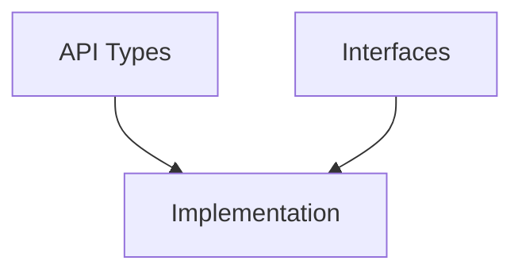

# Phase Planning Templates

## Overview

This directory contains templates for creating detailed phase-specific implementation plans. These plans bridge the gap between high-level project planning and actual code implementation by providing explicit, actionable instructions for developer agents.

## Available Templates

### 1. PHASEX-GENERIC-TEMPLATE.md
**Use this for:** Creating any new phase plan  
**Contains:** Complete structure with all sections, ready to customize

### 2. PHASE1-TEMPLATE.md  
**Use this for:** Foundation phases (APIs, contracts, schemas)  
**Example of:** How to structure API-first development

### 3. PHASE2-TEMPLATE.md
**Use this for:** Infrastructure phases (controllers, frameworks, libraries)  
**Example of:** Building reusable components

### 4. PHASE3-TEMPLATE.md
**Use this for:** Implementation phases (business logic, features)  
**Example of:** Complex implementation with potential splits

## How to Create a Phase Plan

### Step 1: Copy the Generic Template
```bash
cp PHASEX-GENERIC-TEMPLATE.md PHASE1-SPECIFIC-IMPL-PLAN.md
```

### Step 2: Fill in Phase Overview
- Set duration based on effort estimates
- Identify if it's on the critical path
- Specify base branch (usually previous phase's integration branch)
- Name the target integration branch

### Step 3: Define Waves
Waves are logical groupings of related efforts (like sprints):
- **Wave 1**: Usually foundational items (APIs, interfaces)
- **Wave 2**: Core implementations
- **Wave 3**: Additional features or integration

### Step 4: Detail Each Effort
For each effort, provide:

#### A. Source Material
```markdown
# If reusing code:
- Primary: `origin/feature/existing-implementation`
- Commits: abc123, def456

# If new development:
- Design Doc: link/to/design
- Reference: similar implementation
```

#### B. Requirements
Be extremely specific:
```markdown
1. **MUST** implement:
   - Exact feature with specific behavior
   - Error handling for X, Y, Z cases
   
2. **MUST NOT**:
   - Use deprecated APIs
   - Exceed 800 lines
```

#### C. TDD Tests
Write actual test code, not descriptions:
```go
func TestFeature(t *testing.T) {
    // Actual test implementation
    // Not just "test the feature"
}
```

#### D. Pseudo-Code
Detailed enough to guide implementation:
```
FUNCTION implement_feature():
    // Step-by-step logic
    IF condition:
        DO specific_action
    ELSE:
        DO alternative_action
```

#### E. Validation Commands
Exact commands to verify success:
```bash
go build ./...
go test ./... -cover
/tools/line-counter.sh -c branch-name
```

### Step 5: Create Dependency Graph
Use mermaid syntax to visualize dependencies:


### Step 6: Document Integration Strategy
Specify exact merge order and validation:
```bash
git merge --no-ff effort1-branch
make test || exit 1
git merge --no-ff effort2-branch
make test || exit 1
```

## Key Principles

### 1. Be Explicit, Not Abstract
❌ Bad: "Implement the controller"  
✅ Good: "Implement controller with workqueue, reconciliation loop, and leader election"

❌ Bad: "Test the feature"  
✅ Good: [Actual test code with assertions]

### 2. Prioritize Code Reuse
Always check for existing implementations:
```markdown
Source Material:
- Primary: origin/feature/existing-impl (preferred)
- Fallback: Write new only if necessary
```

### 3. Plan for Size Limits
Each effort should estimate lines and have a split strategy:
```yaml
estimated_lines: 650
if_exceeds_800:
  split_into:
    - Part 1: Core logic (400 lines)
    - Part 2: Tests (250 lines)
```

### 4. Include Recovery Plans
Every effort needs a rollback strategy:
```bash
# If validation fails
git checkout base-branch
git branch -D failed-effort
# Document in orchestrator-state.yaml
```

## Template Sections Explained

### Source Material Section
Identifies what existing code to reuse:
- List specific branches
- Note specific commits if known
- Reference external sources
- Indicate if new development

### Requirements Section
Define success criteria:
- **MUST**: Non-negotiable requirements
- **SHOULD**: Nice-to-have features
- **MUST NOT**: Things to avoid

### Test Requirements Section
TDD approach with actual test code:
- Unit tests for each component
- Integration tests for interactions
- Performance benchmarks if needed
- Edge cases and error conditions

### Pseudo-Code Section
Detailed implementation logic:
- Not actual code but clear algorithm
- Shows decision points
- Indicates where to reuse vs. write new
- Highlights integration points

### Validation Commands Section
Exact commands to verify success:
- Build commands
- Test commands with coverage
- Lint/format checks
- Line count verification
- Performance benchmarks

### Success Criteria Section
Checklist for effort completion:
- All tests passing
- Coverage targets met
- Line count within limits
- Documentation updated
- Review completed

## Common Patterns

### API Development Pattern
```
Wave 1: Types and Interfaces
Wave 2: Implementation
Wave 3: Tests and Documentation
```

### Feature Development Pattern
```
Wave 1: Core Logic
Wave 2: Integration
Wave 3: Optimization
```

### Infrastructure Pattern
```
Wave 1: Framework
Wave 2: Components
Wave 3: Tooling
```

## Tips for Writing Good Phase Plans

1. **Check existing code first** - Don't reinvent the wheel
2. **Write real tests** - Not test descriptions
3. **Be specific about branches** - Include commit hashes when known
4. **Plan for splits upfront** - Know which efforts might exceed limits
5. **Include performance gates** - Define measurable targets
6. **Document dependencies clearly** - Both in text and graphs
7. **Provide exact commands** - No ambiguity in validation

## Validation Checklist

Before considering a phase plan complete:

- [ ] Every effort has source material identified
- [ ] All requirements are specific and measurable
- [ ] Test code is written (not just described)
- [ ] Pseudo-code is detailed enough to follow
- [ ] Validation commands are exact
- [ ] Dependencies are graphed and tabled
- [ ] Integration strategy is explicit
- [ ] Line count estimates included
- [ ] Split strategies planned where needed
- [ ] Success criteria defined

## Example: Converting High-Level to Detailed

### High-Level (from orchestrator plan):
"Implement authentication system"

### Detailed (in phase plan):
```markdown
### E2.1.1: JWT Authentication
**Branch**: `/phase2/wave1/effort1-jwt-auth`
**Duration**: 4 hours

#### Source Material:
- Primary: `origin/feature/auth-jwt` (commits: abc123, def456)

#### Requirements:
1. **MUST** implement:
   - JWT token generation with RS256
   - Token validation middleware
   - Refresh token rotation
   - Blacklist for revoked tokens

#### Test Requirements:
[Actual test code with 10+ test cases]

#### Pseudo-Code:
[Detailed step-by-step implementation logic]

#### Validation:
[Exact commands to verify functionality]
```

## Integration with Orchestrator

The orchestrator uses these plans to:
1. Task agents with specific efforts
2. Verify completion criteria
3. Manage dependencies
4. Track progress
5. Handle splits if needed

Each plan becomes the contract between orchestrator and developer agents.