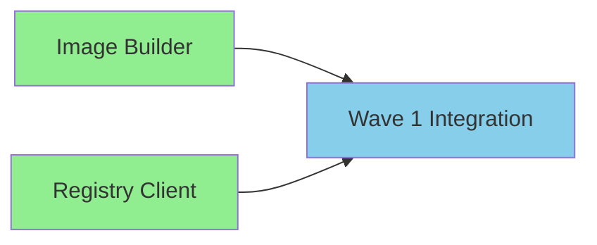
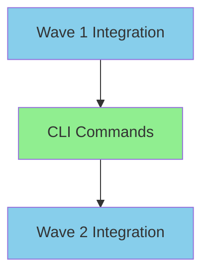

# PHASE 2 ARCHITECTURE PLAN: Build & Push Implementation

## Phase Overview
**Phase**: 2 - Build & Push Implementation  
**Duration**: Week 2 (5 days)  
**Dependencies**: Phase 1 Certificate Infrastructure (COMPLETE)  
**Base Branch**: idpbuilder-oci-build-push/phase1/integration  
**Total Efforts**: 3 (2 in Wave 1, 1 in Wave 2)  
**Estimated Lines**: ~1,700 lines  

## Executive Summary

Phase 2 implements the core OCI build and push functionality, leveraging the certificate infrastructure established in Phase 1. This phase delivers the MVP's primary value: building container images and pushing them to Gitea's registry without certificate errors.

## 🏗️ High-Level Architecture

### System Architecture Overview
```
┌─────────────────────────────────────────────────────────────┐
│                     CLI Layer (Wave 2)                       │
│  ┌──────────┐  ┌──────────┐  ┌───────────┐  ┌──────────┐  │
│  │  build   │  │   push   │  │   list    │  │   tag    │  │
│  │  command │  │  command │  │  command  │  │ command  │  │
│  └─────┬────┘  └─────┬────┘  └─────┬─────┘  └────┬─────┘  │
└────────┼─────────────┼─────────────┼──────────────┼────────┘
         │             │             │              │
         ▼             ▼             ▼              ▼
┌─────────────────────────────────────────────────────────────┐
│                   Build Layer (Wave 1)                       │
│  ┌────────────────────────────────────────────────────┐     │
│  │          go-containerregistry Builder              │     │
│  │  • Layer creation from context                     │     │
│  │  • Image manifest generation                       │     │
│  │  • Local tarball storage                          │     │
│  │  • Image tagging support                          │     │
│  └────────────────────────────────────────────────────┘     │
└──────────────────────────────────────────────────────────────┘
         │                                    │
         ▼                                    ▼
┌─────────────────────────────────────────────────────────────┐
│                  Registry Layer (Wave 1)                     │
│  ┌────────────────────────────────────────────────────┐     │
│  │             Gitea Registry Client                  │     │
│  │  • Authentication management                       │     │
│  │  • Push with certificate handling                  │     │
│  │  • Registry listing and management                 │     │
│  │  • Retry logic for transient failures             │     │
│  └────────────────────────────────────────────────────┘     │
└──────────────────────────────────────────────────────────────┘
         │                                    │
         ▼                                    ▼
┌─────────────────────────────────────────────────────────────┐
│            Certificate Infrastructure (Phase 1)              │
│  ┌────────────────────────────────────────────────────┐     │
│  │  • TrustStoreManager for cert handling             │     │
│  │  • KindCertExtractor for auto-extraction           │     │
│  │  • CertValidator for validation                    │     │
│  │  • FallbackHandler for --insecure mode            │     │
│  └────────────────────────────────────────────────────┘     │
└──────────────────────────────────────────────────────────────┘
```

## 📦 Package Structure

### Phase 2 Package Organization
```
pkg/
├── build/              # [WAVE 1] Image building functionality
│   ├── builder.go      # Main builder interface and implementation
│   ├── layer.go        # Layer creation utilities
│   ├── manifest.go     # Image manifest generation
│   ├── storage.go      # Local image storage management
│   └── context.go      # Build context handling
│
├── registry/           # [WAVE 1] Registry interaction
│   ├── gitea.go        # Gitea-specific registry client
│   ├── auth.go         # Authentication handling
│   ├── push.go         # Push operations with cert integration
│   ├── list.go         # Repository listing
│   └── retry.go        # Retry logic for transient failures
│
└── cmd/                # [WAVE 2] CLI commands
    ├── build.go        # Build command implementation
    ├── push.go         # Push command implementation
    ├── list.go         # List command (optional)
    └── tag.go          # Tag command (optional)
```

## 🔌 Interface Definitions

### Core Interfaces (Wave 1)

#### Builder Interface (E2.1.1)
```go
// pkg/build/builder.go
package build

import (
    "context"
    "github.com/google/go-containerregistry/pkg/v1"
)

// Builder handles OCI image assembly operations
type Builder interface {
    // BuildImage creates an OCI image from a context directory
    BuildImage(ctx context.Context, opts BuildOptions) (*BuildResult, error)
    
    // ListImages returns all locally cached images
    ListImages(ctx context.Context) ([]ImageInfo, error)
    
    // RemoveImage removes a locally cached image
    RemoveImage(ctx context.Context, imageID string) error
    
    // TagImage adds a tag to an existing image
    TagImage(ctx context.Context, source, target string) error
}

// BuildOptions configures the build process
type BuildOptions struct {
    ContextPath string   // Directory to build from
    Tag        string    // Image tag
    Exclusions []string  // Files to exclude
    Labels     map[string]string // Image labels
}

// BuildResult contains build output information
type BuildResult struct {
    ImageID    string   // Unique image identifier
    Digest     v1.Hash  // Image digest
    Size       int64    // Total image size
    StoragePath string  // Local storage location
}

// ImageInfo describes a locally stored image
type ImageInfo struct {
    ID         string
    Tags       []string
    Size       int64
    Created    time.Time
}
```

#### Registry Client Interface (E2.1.2)
```go
// pkg/registry/gitea.go
package registry

import (
    "context"
    "github.com/google/go-containerregistry/pkg/v1"
    "github.com/google/go-containerregistry/pkg/v1/remote"
)

// GiteaRegistry handles Gitea registry operations
type GiteaRegistry interface {
    // Authenticate stores credentials for registry operations
    Authenticate(ctx context.Context, username, password string) error
    
    // Push uploads an image to the registry
    Push(ctx context.Context, image v1.Image, reference string) error
    
    // List returns all images in a repository
    List(ctx context.Context, repository string) ([]string, error)
    
    // Delete removes an image from the registry
    Delete(ctx context.Context, reference string) error
    
    // GetRemoteOptions returns configured remote options with cert handling
    GetRemoteOptions() []remote.Option
}

// RegistryConfig holds registry configuration
type RegistryConfig struct {
    URL      string
    Username string
    Password string
    Insecure bool
}

// PushProgress tracks push operation progress
type PushProgress struct {
    TotalLayers   int
    PushedLayers  int
    CurrentLayer  string
    BytesUploaded int64
    TotalBytes    int64
}
```

### CLI Layer Interfaces (Wave 2)

#### Command Interfaces (E2.2.1)
```go
// pkg/cmd/commands.go
package cmd

import (
    "github.com/spf13/cobra"
)

// CommandBuilder creates CLI commands
type CommandBuilder interface {
    // BuildCommand creates the build command
    BuildCommand() *cobra.Command
    
    // PushCommand creates the push command
    PushCommand() *cobra.Command
    
    // ListCommand creates the list command
    ListCommand() *cobra.Command
    
    // TagCommand creates the tag command
    TagCommand() *cobra.Command
}

// CommandConfig holds shared command configuration
type CommandConfig struct {
    Verbose  bool
    Config   string // Config file path
    Insecure bool   // Allow insecure registries
}
```

## 🔗 Phase 1 Integration Points

### Certificate Infrastructure Integration

#### Using TrustStoreManager from Phase 1
```go
// pkg/registry/gitea.go
import (
    "github.com/jessesanford/idpbuilder/pkg/certs"
)

type giteaRegistryImpl struct {
    trustStore certs.TrustStoreManager
    config     RegistryConfig
}

func (r *giteaRegistryImpl) GetRemoteOptions() []remote.Option {
    // Use Phase 1's TrustStoreManager to configure TLS
    transportOpt, err := r.trustStore.ConfigureTransport(r.config.URL)
    if err != nil {
        // Handle error
    }
    
    return []remote.Option{
        transportOpt,
        remote.WithAuth(r.authenticator),
    }
}
```

#### Leveraging Certificate Validation
```go
// pkg/registry/push.go
func (r *giteaRegistryImpl) Push(ctx context.Context, image v1.Image, ref string) error {
    // Check if registry is configured as insecure
    if r.config.Insecure {
        r.trustStore.SetInsecure(r.config.URL, true)
    }
    
    // Get remote options with proper cert configuration
    opts := r.GetRemoteOptions()
    
    // Push with certificate handling from Phase 1
    return remote.Write(ref, image, opts...)
}
```

## 🚀 Wave Dependencies and Parallelization

### Wave 1: Core Build & Push (Days 6-7)
**Parallelizable**: YES - Both efforts can run in parallel
- **E2.1.1**: Image Builder (no dependencies on E2.1.2)
- **E2.1.2**: Registry Client (no dependencies on E2.1.1)



### Wave 2: CLI Integration (Days 8-9)
**Dependencies**: Requires Wave 1 completion
- **E2.2.1**: CLI Commands (depends on both Wave 1 efforts)



## 🏗️ Implementation Architecture Details

### E2.1.1: go-containerregistry Image Builder (~600 lines)

#### Core Components
1. **Context Handler** (~150 lines)
   - Read build context directory
   - Apply .dockerignore rules
   - Create tar archive of files

2. **Layer Builder** (~150 lines)
   - Create v1.Layer from tar archive
   - Calculate digests
   - Compress layer data

3. **Manifest Generator** (~100 lines)
   - Create OCI image manifest
   - Set image configuration
   - Add layer references

4. **Storage Manager** (~100 lines)
   - Save images as OCI tarballs
   - Manage local image cache
   - Handle image tagging

5. **Builder Orchestrator** (~100 lines)
   - Coordinate build process
   - Handle build options
   - Return build results

### E2.1.2: Gitea Registry Client (~600 lines)

#### Core Components
1. **Authentication Manager** (~100 lines)
   - Store credentials securely
   - Create authenticators for ggcr
   - Handle token refresh

2. **Push Handler** (~200 lines)
   - Configure remote options
   - Integrate with TrustStoreManager
   - Execute push with retries
   - Report progress

3. **Registry Operations** (~150 lines)
   - List repository contents
   - Delete images
   - Query image metadata

4. **Retry Logic** (~100 lines)
   - Handle transient failures
   - Exponential backoff
   - Circuit breaker pattern

5. **Error Handler** (~50 lines)
   - Parse registry errors
   - Provide clear messages
   - Suggest remediation

### E2.2.1: CLI Commands (~500 lines)

#### Core Components
1. **Build Command** (~150 lines)
   - Parse command arguments
   - Validate context path
   - Call Builder interface
   - Display progress

2. **Push Command** (~150 lines)
   - Parse image reference
   - Load image from storage
   - Call Registry client
   - Handle --insecure flag

3. **List Command** (~50 lines)
   - List local images
   - Format output

4. **Tag Command** (~50 lines)
   - Add tags to images
   - Update local storage

5. **Common Utilities** (~100 lines)
   - Configuration loading
   - Output formatting
   - Error handling

## 🔒 Security Considerations

### Certificate Handling
- **Automatic**: Use Phase 1's auto-extraction by default
- **Manual Override**: Support explicit certificate paths
- **Insecure Mode**: Require explicit --insecure flag
- **Audit Logging**: Log all security-related decisions

### Authentication Security
- **Credential Storage**: Never store plaintext passwords
- **Token Management**: Use short-lived tokens where possible
- **Secure Transport**: Always use HTTPS with proper certs

## 🧪 Testing Strategy

### Unit Testing Requirements
Each effort must achieve 80% test coverage:

#### E2.1.1 Tests
- Mock file system for context handling
- Test layer creation with various inputs
- Validate manifest generation
- Test storage operations

#### E2.1.2 Tests
- Mock registry responses
- Test authentication flows
- Validate retry logic
- Test error handling

#### E2.2.1 Tests
- Test command parsing
- Validate flag handling
- Test output formatting
- Mock underlying services

### Integration Testing (Phase-level)
- End-to-end build and push workflow
- Certificate handling validation
- Error recovery scenarios
- Performance benchmarks

## 📊 Performance Targets

### Build Performance
- Context processing: < 5 seconds for 100MB
- Layer creation: < 10 seconds for 500MB
- Manifest generation: < 1 second
- Local storage: < 2 seconds

### Push Performance
- Authentication: < 2 seconds
- Layer upload: > 10MB/s (network dependent)
- Manifest push: < 1 second
- Total push time: < 60 seconds for 500MB image

## 🚦 Success Criteria

### Wave 1 Success Metrics
- ✅ Can create OCI image from directory
- ✅ Can authenticate with Gitea
- ✅ Can push with proper certificates
- ✅ All tests passing (>80% coverage)

### Wave 2 Success Metrics
- ✅ CLI commands functional
- ✅ --insecure flag works
- ✅ Clear error messages
- ✅ Integration tests passing

### Phase 2 Completion
- ✅ Full build-push workflow operational
- ✅ Zero certificate errors in normal operation
- ✅ MVP requirements satisfied
- ✅ Ready for project integration

## 🔄 Incremental Development Strategy

### Building on Phase 1
1. **Import Certificate Packages**: All Phase 2 efforts import from `pkg/certs`
2. **Use TrustStoreManager**: Registry client uses existing trust configuration
3. **Leverage Validators**: Reuse certificate validation logic
4. **Extend Error Handling**: Build on Phase 1's error patterns

### Wave 1 → Wave 2 Flow
1. Wave 1 creates core functionality
2. Wave 1 integration validates interfaces
3. Wave 2 builds on stable Wave 1 APIs
4. Wave 2 adds user-facing layer

## 🎯 Risk Mitigation

### Technical Risks
1. **go-containerregistry API changes**: Pin to specific version
2. **Large context directories**: Implement streaming tar creation
3. **Network interruptions**: Comprehensive retry logic
4. **Certificate rotation**: Reload certs on each operation

### Process Risks
1. **Effort size violations**: Proactive monitoring at 500 lines
2. **Integration conflicts**: Clear interface boundaries
3. **Testing gaps**: Mandatory coverage checks

## 📝 Implementation Notes

### Key Design Decisions
1. **Single-layer images**: Simplify MVP, multi-stage is post-MVP
2. **Local tarball storage**: Avoid daemon dependency
3. **Explicit --insecure**: Never silently bypass security
4. **Progress reporting**: Clear user feedback

### Anti-Patterns to Avoid
- ❌ Hardcoded registry URLs
- ❌ Silent certificate bypass
- ❌ Synchronous blocking operations
- ❌ Tight coupling between layers

## 🔗 External Dependencies

### Required Libraries
```go
// Wave 1 Dependencies
github.com/google/go-containerregistry v0.19.0
github.com/sirupsen/logrus v1.9.3

// Wave 2 Dependencies  
github.com/spf13/cobra v1.8.1
github.com/spf13/viper v1.19.0
```

### Phase 1 Dependencies
```go
// All efforts import from Phase 1
github.com/jessesanford/idpbuilder/pkg/certs
github.com/jessesanford/idpbuilder/pkg/certvalidation
github.com/jessesanford/idpbuilder/pkg/fallback
```

## 🏁 Phase 2 Deliverables

### Wave 1 Deliverables
1. **Functional image builder** using go-containerregistry
2. **Working registry client** with certificate integration
3. **Unit tests** with >80% coverage
4. **Integration branch** with both efforts merged

### Wave 2 Deliverables
1. **CLI commands** (build, push, optionally list/tag)
2. **End-to-end tests** validating full workflow
3. **Basic documentation** for command usage
4. **Phase 2 integration branch** ready for project merge

## ✅ Architecture Validation Checklist

### Independent Mergeability (R307)
- ✅ Each effort can merge independently to integration
- ✅ No breaking changes between efforts
- ✅ Feature flags for incomplete features (if needed)
- ✅ Build remains green throughout

### Incremental Building (R308)
- ✅ Wave 2 builds on Wave 1 integration
- ✅ Phase 2 builds on Phase 1 integration
- ✅ No "big bang" integration required
- ✅ Architecture supports gradual enhancement

### Size Compliance
- ✅ E2.1.1: ~600 lines (within 800 limit)
- ✅ E2.1.2: ~600 lines (within 800 limit)
- ✅ E2.2.1: ~500 lines (within 800 limit)

### Testing Requirements
- ✅ Each effort includes comprehensive tests
- ✅ 80% coverage target for all code
- ✅ Integration tests at phase level

---

**Document Version**: 1.0  
**Created**: 2025-09-07  
**Author**: @agent-architect  
**Phase**: 2 - Build & Push Implementation  
**Status**: READY FOR IMPLEMENTATION