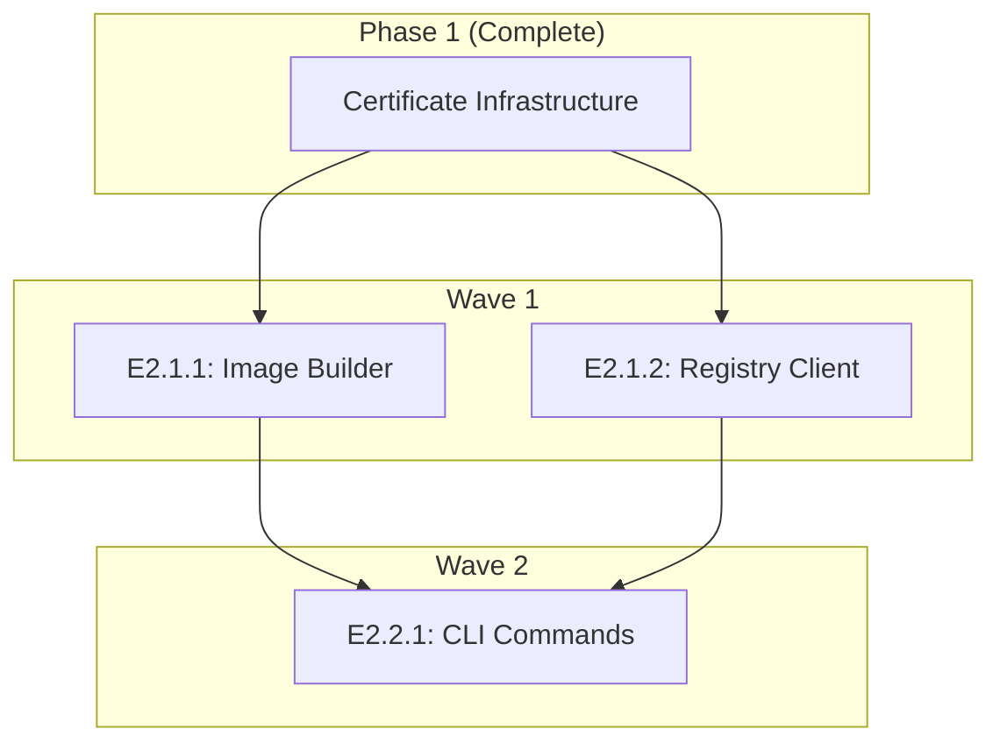

# Phase 2 Architecture Plan: Build & Push Implementation

**Phase**: 2 - Build & Push Implementation  
**Architect**: @agent-architect  
**Date**: 2025-09-02  
**State**: PHASE_ARCHITECTURE_PLANNING  
**Status**: PLANNING COMPLETE

## Executive Summary

Phase 2 will deliver the core build and push functionality, leveraging the certificate infrastructure from Phase 1. This phase focuses on assembling OCI images using go-containerregistry and pushing them to the Gitea registry with proper certificate handling. The architecture is designed for **atomic PR mergeability** per R220 requirements, ensuring each effort can be merged independently to main without breaking the build.

## Phase 2 Objectives

1. **Build Command**: Assemble OCI images from context directories
2. **Push Command**: Push images to Gitea with automatic certificate handling  
3. **CLI Integration**: User-friendly commands with clear error messages
4. **Certificate Integration**: Leverage Phase 1 infrastructure seamlessly

## Effort Overview

| Effort | Description | Estimated Lines | Wave | Dependencies |
|--------|-------------|-----------------|------|--------------|
| E2.1.1 | go-containerregistry Image Builder | 600 | 1 | Phase 1 types |
| E2.1.2 | Gitea Registry Client | 600 | 1 | Phase 1 certs, E2.1.1 interfaces |
| E2.2.1 | CLI Commands (build, push) | 500 | 2 | E2.1.1, E2.1.2 |

## Technical Architecture

### Component Architecture

```
┌─────────────────────────────────────────────────┐
│                  CLI Layer                       │
│            cmd/build.go, cmd/push.go            │
└─────────────┬──────────────┬────────────────────┘
              │              │
    ┌─────────▼──────┐  ┌───▼──────────────┐
    │  Build Layer   │  │  Registry Layer   │
    │  pkg/build/    │  │  pkg/registry/    │
    │  - Builder     │  │  - GiteaClient    │
    │  - ImageStore  │  │  - Authenticator  │
    └─────────┬──────┘  └───┬──────────────┘
              │              │
    ┌─────────▼──────────────▼────────────────┐
    │       Certificate Infrastructure         │
    │            (Phase 1 - Complete)          │
    │  - KindCertExtractor                     │
    │  - TrustStoreManager                     │
    │  - TransportConfigProvider               │
    └──────────────────────────────────────────┘
```

### Interface Design for Atomic PRs

#### Core Interfaces (E2.1.1 - First PR)

```go
// pkg/build/types.go - MUST be in first PR
package build

import (
    "context"
    v1 "github.com/google/go-containerregistry/pkg/v1"
)

// Builder defines the contract for image building
// This interface MUST be defined even if implementation is minimal
type Builder interface {
    // BuildImage assembles an OCI image from a context directory
    BuildImage(ctx context.Context, contextPath string, tag string) (v1.Image, error)
    
    // StoreImage saves the built image to local cache
    StoreImage(ctx context.Context, image v1.Image, tag string) error
}

// ImageStore defines local image storage operations
type ImageStore interface {
    // List returns all cached images
    List(ctx context.Context) ([]string, error)
    
    // Get retrieves a specific image
    Get(ctx context.Context, tag string) (v1.Image, error)
    
    // Delete removes an image from cache
    Delete(ctx context.Context, tag string) error
}

// BuildOptions configures build behavior
type BuildOptions struct {
    // Exclusions defines patterns to exclude from build context
    Exclusions []string
    
    // Platform specifies target platform
    Platform string
    
    // Labels to add to the image
    Labels map[string]string
}
```

#### Registry Interfaces (E2.1.2 - Second PR)

```go
// pkg/registry/types.go - Can reference build.Builder
package registry

import (
    "context"
    "github.com/jessesanford/idpbuilder-oci-go-cr/pkg/certs"
)

// GiteaClient defines registry operations
type GiteaClient interface {
    // Push uploads an image to the registry
    Push(ctx context.Context, image string, tag string, opts PushOptions) error
    
    // List returns available tags for a repository
    List(ctx context.Context, repository string) ([]string, error)
}

// Authenticator handles registry authentication
type Authenticator interface {
    // GetCredentials retrieves credentials for registry
    GetCredentials(ctx context.Context, registry string) (*Credentials, error)
    
    // Refresh updates expired tokens
    Refresh(ctx context.Context) error
}

// PushOptions configures push behavior
type PushOptions struct {
    // Insecure allows insecure registry connections
    Insecure bool
    
    // TransportConfig from Phase 1
    TransportConfig *certs.TransportConfig
    
    // ProgressReporter for upload feedback
    ProgressReporter ProgressReporter
}
```

### Dependency Graph



## Wave Strategy

### Wave 1: Core Infrastructure (E2.1.1, E2.1.2)
**Parallel Execution**: YES - Both efforts can be developed simultaneously

#### Why Parallel is Safe:
1. **E2.1.1** defines and implements build interfaces
2. **E2.1.2** defines and implements registry interfaces  
3. Both depend on Phase 1 but not on each other initially
4. Interfaces are defined first, allowing independent development
5. Each can be merged independently to main

#### Atomic PR Requirements:
- E2.1.1 MUST include interface definitions even with minimal implementation
- E2.1.2 can reference E2.1.1 interfaces but must compile independently
- Both must have feature flags for incomplete functionality

### Wave 2: CLI Integration (E2.2.1)
**Sequential Execution**: After Wave 1 complete

#### Dependencies:
- Requires both E2.1.1 and E2.1.2 to be merged
- Integrates both components via CLI commands
- Activates feature flags for complete functionality

## Integration Points with Phase 1

### Certificate Infrastructure Usage

```go
// Example: Registry client using Phase 1 certificates
func (c *giteaClient) Push(ctx context.Context, image, tag string, opts PushOptions) error {
    // Use Phase 1 TransportConfigProvider
    transport, err := c.transportProvider.GetTransport(ctx, c.registryURL)
    if err != nil {
        return fmt.Errorf("failed to get transport: %w", err)
    }
    
    // Configure go-containerregistry with custom transport
    remoteOpts := []remote.Option{
        remote.WithTransport(transport),
        remote.WithAuth(c.authenticator),
    }
    
    // Push using configured transport
    return remote.Write(ref, img, remoteOpts...)
}
```

### Error Handling Integration

```go
// Using Phase 1 fallback strategies
func handlePushError(err error, fallback *fallback.Handler) error {
    strategy, strategyErr := fallback.HandleCertError(err)
    if strategyErr != nil {
        return err // Original error if no strategy
    }
    
    // Apply recommended strategy
    return strategy.Apply()
}
```

## Feature Flags for Atomic Deployment

### Required Feature Flags

```go
// pkg/features/flags.go
package features

const (
    // EnableBuildCommand controls build functionality
    EnableBuildCommand = "IDPBUILDER_ENABLE_BUILD"
    
    // EnablePushCommand controls push functionality
    EnablePushCommand = "IDPBUILDER_ENABLE_PUSH"
    
    // EnableLocalCache controls image caching
    EnableLocalCache = "IDPBUILDER_ENABLE_CACHE"
)

// IsEnabled checks if a feature is enabled
func IsEnabled(flag string) bool {
    return os.Getenv(flag) == "true"
}
```

### CLI Integration with Flags

```go
// cmd/root.go
func init() {
    if features.IsEnabled(features.EnableBuildCommand) {
        rootCmd.AddCommand(buildCmd)
    }
    
    if features.IsEnabled(features.EnablePushCommand) {
        rootCmd.AddCommand(pushCmd)
    }
}
```

## Risk Assessment and Mitigation

### Technical Risks

| Risk | Probability | Impact | Mitigation |
|------|-------------|--------|------------|
| go-containerregistry API changes | Low | High | Pin to specific version (v0.19.0) |
| Transport configuration complexity | Medium | Medium | Extensive integration testing |
| CLI flag conflicts | Low | Low | Use cobra's built-in validation |
| Image assembly performance | Medium | Medium | Implement progress reporting |
| Registry authentication failures | Medium | High | Clear error messages, retry logic |

### Architectural Risks

| Risk | Probability | Impact | Mitigation |
|------|-------------|--------|------------|
| Interface changes breaking compatibility | Low | High | Stable interface design upfront |
| Feature flag misconfiguration | Medium | Medium | Default to disabled, clear docs |
| Circular dependencies | Low | High | Strict dependency graph enforcement |
| Missing Phase 1 functionality | Low | High | Validate Phase 1 integration first |

## Success Criteria

### Wave 1 Success
- E2.1.1 builds images successfully
- E2.1.2 authenticates with Gitea
- Both efforts independently mergeable
- Interfaces stable and documented
- Unit tests passing (80% coverage)

### Wave 2 Success  
- CLI commands functional
- Build command assembles images
- Push command uploads to Gitea
- Certificate handling automatic
- Error messages clear and actionable

### Phase 2 Complete
- All commands working end-to-end
- Integration with Phase 1 seamless
- No certificate errors in normal operation
- All feature flags properly configured
- Documentation complete

## Atomic PR Compliance (R220)

### Every Effort is Independently Mergeable

#### E2.1.1 (Image Builder)
```yaml
atomic_design:
  defines_interfaces: true
  minimal_implementation: "Creates empty images"
  feature_flag: "IDPBUILDER_ENABLE_BUILD"
  dependencies: ["Phase 1 types only"]
  breaks_build: false
  tests_pass: true
```

#### E2.1.2 (Registry Client)  
```yaml
atomic_design:
  defines_interfaces: true
  minimal_implementation: "Auth only, no push"
  feature_flag: "IDPBUILDER_ENABLE_PUSH"
  dependencies: ["Phase 1 certs", "E2.1.1 interfaces"]
  breaks_build: false
  tests_pass: true
```

#### E2.2.1 (CLI Commands)
```yaml
atomic_design:
  integrates_components: true
  activates_features: true
  feature_flags: ["ENABLE_BUILD", "ENABLE_PUSH"]
  dependencies: ["E2.1.1", "E2.1.2"]
  breaks_build: false
  tests_pass: true
```

## Implementation Guidelines

### For SW Engineers

1. **Start with Interfaces**: Define all interfaces before implementation
2. **Feature Flag Everything**: Incomplete features must be behind flags
3. **Test Isolation**: Each effort must have independent tests
4. **Document APIs**: All public methods need godoc comments
5. **Progress Reporting**: Implement feedback for long operations

### For Code Reviewers

1. **Verify Atomic PRs**: Each PR must be independently mergeable
2. **Check Feature Flags**: Ensure incomplete features are flagged
3. **Validate Interfaces**: Confirm interface stability
4. **Test Coverage**: Enforce 80% minimum coverage
5. **Size Limits**: No effort exceeds 800 lines

### For Integration Agent

1. **Sequential Merging**: Merge efforts in dependency order
2. **Feature Flag State**: Document which flags are enabled
3. **Integration Tests**: Run after each merge
4. **Build Verification**: Ensure build passes after each PR
5. **Branch Protection**: Enforce all checks before merge

## Recommended Merge Order

1. **Wave 1 - Parallel Development, Sequential Merge**:
   - First: E2.1.1 (Image Builder) - Defines core interfaces
   - Second: E2.1.2 (Registry Client) - Can reference E2.1.1
   
2. **Wave 2 - After Wave 1 Complete**:
   - E2.2.1 (CLI Commands) - Integrates both components

## Architecture Decision Records

### ADR-001: Use go-containerregistry for Image Operations
**Decision**: Use google/go-containerregistry instead of Docker daemon
**Rationale**: Daemonless operation, better testing, cleaner API
**Consequences**: Must handle all image assembly logic

### ADR-002: Feature Flags for Gradual Rollout
**Decision**: Every new feature behind environment variable flags
**Rationale**: Allows atomic PRs without breaking existing functionality
**Consequences**: Additional configuration complexity

### ADR-003: Separate Build and Registry Packages
**Decision**: Keep build and registry logic in separate packages
**Rationale**: Clear separation of concerns, independent testing
**Consequences**: Need well-defined interfaces between packages

### ADR-004: Reuse Phase 1 Certificate Infrastructure
**Decision**: Direct integration with Phase 1 TransportConfigProvider
**Rationale**: Avoid duplication, leverage tested code
**Consequences**: Strong coupling to Phase 1 interfaces

## Conclusion

This Phase 2 Architecture Plan provides a clear roadmap for implementing the build and push functionality while maintaining atomic PR mergeability. The design ensures that each effort can be developed, tested, and merged independently without breaking the build. Feature flags enable gradual activation of functionality, and clear interfaces support parallel development where appropriate.

The architecture leverages Phase 1's certificate infrastructure effectively while maintaining clean separation between build, registry, and CLI layers. This design supports the MVP goal of solving the certificate problem while delivering core OCI functionality within the two-week timeline.

---

**Document Version**: 1.0  
**Framework Compliance**: Software Factory 2.0 - R220 Atomic PR Architecture  
**Review Status**: READY FOR IMPLEMENTATION