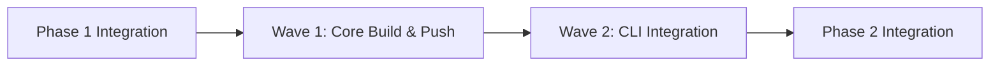

# Phase 2: Build & Push Implementation Plan

## 📌 Phase Overview

**Phase Number**: 2  
**Phase Name**: Build & Push Implementation  
**Duration**: 1 week (5 days)  
**Start Date**: Week 2 Day 1  
**Target Completion**: Week 2 Day 5  
**Total Waves**: 2  
**Total Efforts**: 3  
**Target Lines**: 1,700 (±10%)  
**Base Branch**: idpbuilder-oci-build-push/phase1/integration  

### Phase Mission
Phase 2 delivers the core OCI build and push functionality, enabling the MVP to build container images from local directories and push them to Gitea's registry using the certificate infrastructure established in Phase 1.

### Phase Dependencies
- **Requires**: Phase 1 complete (Certificate Infrastructure)
- **Blocks**: None (final phase)
- **External**: go-containerregistry library v0.19.0

## 🎯 Success Criteria

### Mandatory Requirements
- [ ] All efforts under 800 lines (measured by line-counter.sh)
- [ ] Test coverage ≥ 80%
- [ ] All code reviews passed
- [ ] Architect review passed
- [ ] Integration tests passing
- [ ] Performance benchmarks met

### Deliverables
- [ ] Functional OCI image builder using go-containerregistry
- [ ] Working Gitea registry client with certificate integration
- [ ] CLI commands for build and push operations
- [ ] --insecure flag support for development environments
- [ ] End-to-end build-push workflow operational

### Quality Gates
| Gate | Threshold | Current | Status |
|------|-----------|---------|--------|
| Code Coverage | 80% | - | 🔴 |
| Review Pass Rate | 80% | - | 🔴 |
| Build Success | 100% | - | 🔴 |
| Integration Tests | 100% | - | 🔴 |
| Performance | <60s for 500MB | - | 🔴 |

## 🌊 Wave Structure

### Wave Sequence
```
Wave 1: Core Build & Push ──────── (Parallel: Yes, Max: 2)
Wave 2: CLI Integration ──────── (Parallel: No) [Depends on Wave 1]
```

### Wave Dependencies


## 🌊 Wave 1: Core Build & Push

**Scope**: Implement foundational build and registry push capabilities  
**Can Parallelize**: Yes  
**Max Parallel Efforts**: 2  
**Total Efforts**: 2  
**Estimated Lines**: 1,200  
**Base Branch**: idpbuilder-oci-build-push/phase1/integration  

### Objectives
- Create OCI images from local build contexts
- Push images to Gitea registry with proper certificate handling
- Establish clean interfaces for CLI layer integration

### Dependencies
- **Internal**: Phase 1 Certificate Infrastructure (pkg/certs, pkg/certvalidation, pkg/fallback)
- **External**: go-containerregistry v0.19.0

### Effort Breakdown

#### E2.1.1: go-containerregistry-image-builder
**Branch**: `phase2/wave1/image-builder`  
**Can Parallelize**: Yes  
**Parallel With**: [E2.1.2]  
**Estimated Size**: 600 lines  
**Dependencies**: None (can start immediately)  
**Directory**: `efforts/phase2/wave1/image-builder/pkg/`  

**Requirements**:
- [ ] Build context directory processing with tar archiving
- [ ] Layer creation from tar archives with compression
- [ ] OCI manifest generation with proper configuration
- [ ] Local image storage as OCI tarballs
- [ ] Image tagging and metadata management
- [ ] Support for .dockerignore patterns

**Deliverables**:
- `pkg/build/builder.go` - Main Builder interface and implementation (~150 lines)
- `pkg/build/context.go` - Build context handling and tar creation (~150 lines)
- `pkg/build/layer.go` - Layer creation utilities (~100 lines)
- `pkg/build/manifest.go` - OCI manifest generation (~100 lines)
- `pkg/build/storage.go` - Local tarball storage management (~100 lines)
- `pkg/build/builder_test.go` - Comprehensive unit tests
- `pkg/build/context_test.go` - Context handling tests
- `pkg/build/integration_test.go` - Integration tests

**Interface Specification**:
```go
// Builder handles OCI image assembly operations
type Builder interface {
    BuildImage(ctx context.Context, opts BuildOptions) (*BuildResult, error)
    ListImages(ctx context.Context) ([]ImageInfo, error)
    RemoveImage(ctx context.Context, imageID string) error
    TagImage(ctx context.Context, source, target string) error
}

type BuildOptions struct {
    ContextPath string
    Tag        string
    Exclusions []string
    Labels     map[string]string
}

type BuildResult struct {
    ImageID    string
    Digest     v1.Hash
    Size       int64
    StoragePath string
}
```

**Test Requirements**:
- Unit tests for all public functions (80% coverage minimum)
- Mock file system for context handling tests
- Test various .dockerignore patterns
- Validate manifest generation correctness
- Test concurrent build operations
- Performance test for large contexts (>100MB)

**Success Metrics**:
- Test coverage ≥ 80%
- No TODO comments remaining
- All linting rules pass
- Build time <5s for 100MB context
- Zero memory leaks

#### E2.1.2: gitea-registry-client
**Branch**: `phase2/wave1/gitea-client`  
**Can Parallelize**: Yes  
**Parallel With**: [E2.1.1]  
**Estimated Size**: 600 lines  
**Dependencies**: Phase 1 Certificate Infrastructure  
**Directory**: `efforts/phase2/wave1/gitea-client/pkg/`  

**Requirements**:
- [ ] Registry authentication with token management
- [ ] Push operation with Phase 1 certificate integration
- [ ] Repository listing and image management
- [ ] Retry logic with exponential backoff
- [ ] Progress reporting for push operations
- [ ] Support for --insecure mode using Phase 1 fallback handler

**Deliverables**:
- `pkg/registry/gitea.go` - GiteaRegistry interface and implementation (~200 lines)
- `pkg/registry/auth.go` - Authentication handling (~100 lines)
- `pkg/registry/push.go` - Push operations with cert integration (~150 lines)
- `pkg/registry/list.go` - Repository listing operations (~50 lines)
- `pkg/registry/retry.go` - Retry logic and circuit breaker (~100 lines)
- `pkg/registry/gitea_test.go` - Unit tests
- `pkg/registry/push_test.go` - Push operation tests
- `pkg/registry/integration_test.go` - Integration tests with mock registry

**Phase 1 Integration**:
```go
import (
    "github.com/jessesanford/idpbuilder/pkg/certs"
    "github.com/jessesanford/idpbuilder/pkg/certvalidation"
    "github.com/jessesanford/idpbuilder/pkg/fallback"
)

type giteaRegistryImpl struct {
    trustStore certs.TrustStoreManager
    validator  certvalidation.CertValidator
    fallback   fallback.FallbackHandler
    config     RegistryConfig
}

func (r *giteaRegistryImpl) GetRemoteOptions() []remote.Option {
    // Use Phase 1's TrustStoreManager to configure TLS
    transportOpt, err := r.trustStore.ConfigureTransport(r.config.URL)
    if err != nil && r.config.Insecure {
        // Use Phase 1's fallback handler for --insecure mode
        transportOpt = r.fallback.GetInsecureTransport()
    }
    
    return []remote.Option{
        transportOpt,
        remote.WithAuth(r.authenticator),
    }
}
```

**Test Requirements**:
- Mock registry responses for all operations
- Test authentication flows including token refresh
- Validate retry logic with various failure scenarios
- Test certificate integration with Phase 1 components
- Test --insecure mode fallback
- Performance test for large image pushes (>500MB)

**Success Metrics**:
- Test coverage ≥ 80%
- Retry logic handles transient failures
- Progress reporting accurate
- Certificate handling seamless
- Push performance >10MB/s

### Wave 1 Integration Plan
1. Both efforts start in parallel from phase1/integration branch
2. Each effort implements in isolated workspace
3. Run unit tests continuously during development
4. Merge E2.1.1 to `phase2/wave1-integration`
5. Merge E2.1.2 to `phase2/wave1-integration`
6. Run integration test suite
7. Verify interfaces work together
8. Perform architect review
9. Address any issues
10. Create wave integration tag

## 🌊 Wave 2: CLI Integration

**Scope**: Add user-facing CLI commands for build and push operations  
**Can Parallelize**: No (depends on Wave 1 interfaces)  
**Max Parallel Efforts**: 1  
**Total Efforts**: 1  
**Estimated Lines**: 500  
**Base Branch**: phase2/wave1-integration  

### Objectives
- Provide intuitive CLI commands for building and pushing images
- Integrate with Wave 1 components seamlessly
- Support configuration via flags and config files
- Provide clear error messages and progress feedback

### Dependencies
- **Internal**: Wave 1 complete (Builder and Registry interfaces)
- **External**: spf13/cobra v1.8.1, spf13/viper v1.19.0

### Effort Breakdown

#### E2.2.1: cli-commands
**Branch**: `phase2/wave2/cli-commands`  
**Can Parallelize**: No  
**Parallel With**: None  
**Estimated Size**: 500 lines  
**Dependencies**: [E2.1.1, E2.1.2]  
**Directory**: `efforts/phase2/wave2/cli-commands/pkg/`  

**Requirements**:
- [ ] Build command with context validation
- [ ] Push command with image reference parsing
- [ ] List command for local images
- [ ] Tag command for image tagging
- [ ] Configuration file support
- [ ] --insecure flag handling
- [ ] Progress bars and status output
- [ ] Comprehensive error messages

**Deliverables**:
- `pkg/cmd/build.go` - Build command implementation (~150 lines)
- `pkg/cmd/push.go` - Push command implementation (~150 lines)
- `pkg/cmd/list.go` - List command (~50 lines)
- `pkg/cmd/tag.go` - Tag command (~50 lines)
- `pkg/cmd/common.go` - Shared utilities and config (~100 lines)
- `pkg/cmd/build_test.go` - Build command tests
- `pkg/cmd/push_test.go` - Push command tests
- `pkg/cmd/integration_test.go` - End-to-end CLI tests

**Command Specifications**:
```bash
# Build command
idpbuilder build [context] --tag [image:tag] [flags]
  --exclude-file    .dockerignore file path
  --label           Add metadata labels
  --verbose         Verbose output

# Push command
idpbuilder push [image:tag] --registry [url] [flags]
  --username        Registry username
  --password        Registry password
  --insecure        Allow insecure registry
  --verbose         Verbose output

# List command
idpbuilder list [flags]
  --format          Output format (json|table)

# Tag command
idpbuilder tag [source] [target] [flags]
```

**Integration with Wave 1**:
```go
import (
    "github.com/jessesanford/idpbuilder/pkg/build"
    "github.com/jessesanford/idpbuilder/pkg/registry"
)

func buildCommand(cmd *cobra.Command, args []string) error {
    // Use Wave 1's Builder interface
    builder := build.NewBuilder(buildConfig)
    
    result, err := builder.BuildImage(ctx, build.BuildOptions{
        ContextPath: args[0],
        Tag:        flagTag,
        Exclusions: exclusions,
        Labels:     labels,
    })
    
    if err != nil {
        return fmt.Errorf("build failed: %w", err)
    }
    
    fmt.Printf("Successfully built image: %s\n", result.ImageID)
    fmt.Printf("Size: %d bytes\n", result.Size)
    return nil
}

func pushCommand(cmd *cobra.Command, args []string) error {
    // Use Wave 1's Registry interface
    reg := registry.NewGiteaRegistry(registryConfig)
    
    if flagInsecure {
        reg.SetInsecure(true)
    }
    
    // Load image from local storage
    image, err := loadImage(args[0])
    if err != nil {
        return fmt.Errorf("failed to load image: %w", err)
    }
    
    // Push with progress reporting
    err = reg.Push(ctx, image, args[0])
    if err != nil {
        return fmt.Errorf("push failed: %w", err)
    }
    
    fmt.Printf("Successfully pushed %s\n", args[0])
    return nil
}
```

**Test Requirements**:
- Test command parsing and flag validation
- Mock underlying Builder and Registry interfaces
- Test error handling and user feedback
- Validate configuration file loading
- Test output formatting options
- End-to-end test of build-push workflow

**Success Metrics**:
- Test coverage ≥ 80%
- Commands intuitive and well-documented
- Error messages clear and actionable
- Progress feedback accurate
- Configuration flexible

### Wave 2 Integration Plan
1. Create branch from phase2/wave1-integration
2. Implement CLI commands using Wave 1 interfaces
3. Add comprehensive command tests
4. Run end-to-end workflow tests
5. Merge to `phase2/wave2-integration`
6. Perform usability testing
7. Update documentation
8. Architect review
9. Prepare for phase integration

## 🔄 Phase Integration Strategy

### Pre-Integration Checklist
- [ ] All waves complete and integrated
- [ ] All tests passing (unit, integration, e2e)
- [ ] Performance benchmarks met (<60s for 500MB image)
- [ ] No critical TODOs remaining
- [ ] Documentation updated
- [ ] Security review complete

### Integration Steps
1. **Create Phase Branch**
   ```bash
   git checkout phase1/integration
   git checkout -b phase2-integration
   ```

2. **Merge Wave Branches**
   ```bash
   git merge phase2/wave1-integration
   git merge phase2/wave2-integration
   ```

3. **Run Full Test Suite**
   ```bash
   make test-all
   make test-integration
   make test-performance
   make test-e2e
   ```

4. **Verify MVP Requirements**
   - Build image from local directory
   - Push to Gitea registry
   - No certificate errors
   - --insecure flag works

5. **Architect Review**
   - Request architect review
   - Demonstrate full workflow
   - Address feedback
   - Get approval

6. **Create Final Integration**
   ```bash
   git checkout -b idpbuilder-oci-build-push/phase2/integration
   git push origin idpbuilder-oci-build-push/phase2/integration
   ```

## 📊 Risk Analysis

### Technical Risks
| Risk | Probability | Impact | Mitigation |
|------|------------|--------|------------|
| go-containerregistry API complexity | Medium | High | Study examples, create PoC early |
| Large build contexts (>1GB) | Low | Medium | Implement streaming tar creation |
| Network interruptions during push | Medium | Medium | Comprehensive retry logic |
| Certificate rotation during operation | Low | Low | Reload certs on each operation |
| Registry authentication failures | Medium | Medium | Clear error messages, retry logic |

### Sequencing Risks
- **Wave 1 Delay**: Would block Wave 2 CLI work
- **Interface Changes**: Could require Wave 2 rework
- **Integration Issues**: May require additional effort
- **Review Rejections**: Could trigger effort splits

### Mitigation Strategies
1. **Early Interface Definition**: Lock interfaces before implementation
2. **Continuous Integration**: Test integration after each effort
3. **Proactive Splitting**: Monitor size at 500 lines
4. **Parallel Reviews**: Start reviews before full completion
5. **Buffer Time**: Include 20% schedule buffer

## 📈 Metrics and Tracking

### Progress Tracking
```yaml
wave_1:
  efforts_planned: 2
  efforts_completed: 0
  efforts_in_progress: 0
  lines_estimated: 1200
  lines_actual: 0
  
wave_2:
  efforts_planned: 1
  efforts_completed: 0
  efforts_in_progress: 0
  lines_estimated: 500
  lines_actual: 0
```

### Quality Metrics
- **Code Coverage**: Target 80%, Current: 0%
- **Review Pass Rate**: Target 80%, Current: 0%
- **Bug Density**: Target <2/KLOC, Current: 0
- **Technical Debt**: Target <5 hours, Current: 0

### Performance Metrics
- **Build Time (100MB)**: Target <5s
- **Push Time (500MB)**: Target <60s
- **Memory Usage**: Target <500MB
- **CPU Usage**: Target <80% single core

## 🧪 Testing Strategy

### Test Levels
1. **Unit Tests** (Effort Level)
   - Coverage target: 80%
   - Framework: Go standard testing
   - Location: `*_test.go` files alongside code

2. **Integration Tests** (Wave Level)
   - Coverage target: 70%
   - Framework: Go testing with test containers
   - Location: `integration_test.go` files

3. **End-to-End Tests** (Phase Level)
   - Coverage target: 60%
   - Framework: CLI testing with real registry
   - Location: `e2e/` directory

### Test Priorities
- P0: Core build and push must work
- P1: Certificate handling must be correct
- P2: Error handling must be comprehensive
- P3: Performance must meet targets

### Test Scenarios
1. **Build Tests**
   - Empty context directory
   - Large context (>100MB)
   - Symbolic links in context
   - .dockerignore patterns
   - Concurrent builds

2. **Push Tests**
   - Successful push with certs
   - Push with --insecure flag
   - Network interruption recovery
   - Authentication failures
   - Large image push (>500MB)

3. **CLI Tests**
   - All command variations
   - Configuration file loading
   - Flag validation
   - Error message clarity
   - Progress reporting accuracy

## 📚 Documentation Requirements

### Code Documentation
- All public APIs must have godoc comments
- Complex algorithms need inline comments
- Configuration options must be documented
- Error codes must be catalogued

### User Documentation
- [ ] CLI command reference with examples
- [ ] Build context requirements
- [ ] Registry configuration guide
- [ ] Troubleshooting guide
- [ ] Performance tuning guide

### Developer Documentation
- [ ] Architecture diagrams
- [ ] Interface specifications
- [ ] Testing guide
- [ ] Contributing guidelines

## 🔒 Security Considerations

### Security Requirements
- [ ] No credentials in code or logs
- [ ] Secure credential storage
- [ ] TLS verification by default
- [ ] Explicit --insecure flag required
- [ ] Audit logging for security events

### Security Checklist
- [ ] No hardcoded credentials
- [ ] No credential leakage in errors
- [ ] Registry tokens properly managed
- [ ] Build context validated
- [ ] No path traversal vulnerabilities

## 🚀 Deployment Considerations

### Integration Requirements
- [ ] Works with existing idpbuilder
- [ ] No breaking changes to current functionality
- [ ] Feature flag for new functionality (if needed)
- [ ] Backward compatibility maintained

### Deployment Checklist
- [ ] All tests passing
- [ ] Performance acceptable
- [ ] Documentation complete
- [ ] Security review passed
- [ ] MVP requirements met

## 📝 Notes and Assumptions

### Assumptions
- Single-layer images sufficient for MVP (multi-stage is post-MVP)
- Local tarball storage acceptable (no daemon dependency)
- Gitea registry supports standard OCI push protocol
- go-containerregistry v0.19.0 API stable

### Design Decisions
- **Local Storage**: Use OCI tarballs to avoid daemon dependency
- **Single Layer**: Simplify MVP, add multi-layer post-MVP
- **Explicit Security**: Never silently bypass certificate checks
- **Progress Reporting**: Provide clear user feedback during operations

### Open Questions
- Optimal chunk size for layer uploads?
- Maximum context size to support?
- Credential caching strategy?

## 🔄 Implementation Guidelines

### For SW Engineers

#### Starting an Effort
1. Read this implementation plan thoroughly
2. Read the Phase 2 architecture plan
3. Check out from the specified base branch
4. Create effort directory structure
5. Import required Phase 1 packages
6. Implement interfaces as specified
7. Write tests continuously
8. Monitor size with line-counter.sh

#### Code Organization
```
efforts/phase2/wave[N]/[effort-name]/
├── pkg/
│   ├── [package]/
│   │   ├── [interface].go
│   │   ├── [implementation].go
│   │   ├── [helpers].go
│   │   └── [tests].go
│   └── integration_test.go
├── go.mod
├── go.sum
├── Makefile
└── README.md
```

#### Quality Checklist
- [ ] Interfaces match specification exactly
- [ ] All public functions have godoc
- [ ] Error handling comprehensive
- [ ] Tests achieve 80% coverage
- [ ] No TODO comments remain
- [ ] Size under 800 lines

### For Code Reviewers

#### Review Focus Areas
1. **Interface Compliance**: Exact match to specification
2. **Phase 1 Integration**: Proper use of certificate infrastructure
3. **Error Handling**: Clear, actionable error messages
4. **Test Coverage**: Minimum 80% with quality tests
5. **Performance**: Meets specified targets
6. **Security**: No credential leakage, proper TLS handling

#### Common Issues to Check
- Hardcoded values that should be configurable
- Missing error wrapping for context
- Inadequate retry logic
- Poor progress reporting
- Certificate handling bypasses

## 🏁 Phase 2 Deliverables Summary

### Wave 1 Deliverables
1. **Functional image builder** with go-containerregistry
2. **Working registry client** with certificate integration
3. **Unit tests** with >80% coverage
4. **Integration branch** with both efforts merged

### Wave 2 Deliverables
1. **CLI commands** for build, push, list, tag
2. **End-to-end tests** validating full workflow
3. **User documentation** for all commands
4. **Phase 2 integration branch** ready for project merge

### MVP Validation
- ✅ Can build OCI image from local directory
- ✅ Can push to Gitea registry without cert errors
- ✅ --insecure flag works for development
- ✅ Clear error messages and progress feedback
- ✅ Performance meets targets

---

**Phase Plan Version**: 1.0  
**Created**: 2025-09-07  
**Last Updated**: 2025-09-07  
**Created By**: @agent-code-reviewer  
**Status**: Ready for Implementation

**Remember**: 
- Efforts MUST stay under 800 lines (monitor at 500)
- Test coverage is mandatory (80% minimum)
- Reviews are not optional
- Integration requires architect approval
- Use Phase 1 certificate infrastructure
- Parallelize Wave 1 efforts for efficiency