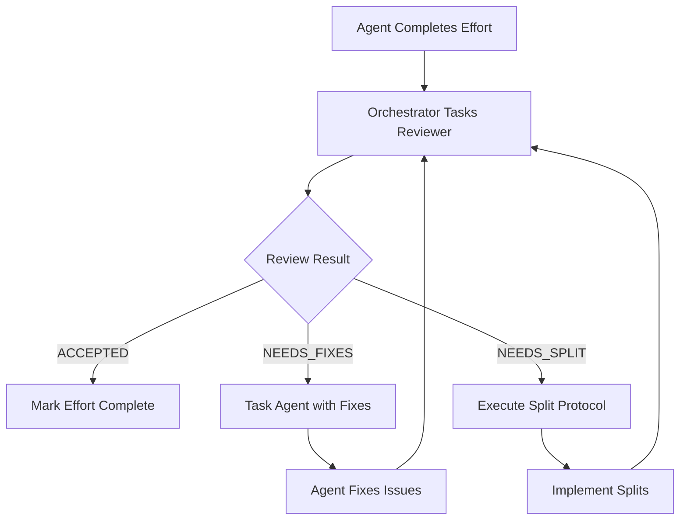

# Orchestrator Code Review Integration Instructions

## CRITICAL: No Code Acceptance Without Review

### For @agent-orchestrator-prompt-engineer-task-master

## Workflow Integration



## Mandatory Review Process

### 1. When Agent Reports Completion

```python
def handle_agent_completion(effort, agent_result):
    """
    NEVER mark complete without review
    """
    # DO NOT do this:
    # mark_effort_complete(effort)  # WRONG!
    
    # ALWAYS do this:
    review_needed = queue_for_review(effort)
    start_code_review(effort)
```

### 2. Tasking the Code Reviewer

When creating the review task for @agent-kcp-kubernetes-code-reviewer:

```markdown
## Task Template for Code Reviewer

You are reviewing effort E${PHASE}.${WAVE}.${EFFORT} - ${EFFORT_NAME}
Implemented by: @agent-kcp-go-lang-sr-sw-eng
Branch: ${BRANCH_NAME}

MANDATORY DOCUMENTS TO FOLLOW:
1. Comprehensive Guide: /workspaces/agent-configs/tmc-orchestrator-impl-8-20-2025/KCP-CODE-REVIEWER-COMPREHENSIVE-GUIDE.md
2. Quick Reference: /workspaces/agent-configs/tmc-orchestrator-impl-8-20-2025/CODE-REVIEWER-QUICK-REFERENCE.md
3. Review Examples: /workspaces/agent-configs/tmc-orchestrator-impl-8-20-2025/CODE-REVIEW-EXAMPLES.md

CRITICAL REQUIREMENTS:
- Size measurement: ONLY use /workspaces/kcp-shared-tools/tmc-pr-line-counter.sh
- Phase ${PHASE} requirements: ${PHASE_SPECIFIC_REQUIREMENTS}
- Coverage requirement: ${COVERAGE_PERCENT}%
- Base branch: ${EXPECTED_BASE_BRANCH}

Execute review in this order:
1. Size check (800 line limit)
2. Phase compliance check
3. Code quality analysis
4. Architecture compliance
5. Commit history review
6. Test coverage verification
7. Build and lint checks

Output your review to:
/workspaces/agent-configs/tmc-orchestrator-impl-8-20-2025/phase${PHASE}/wave${WAVE}/effort${EFFORT}/code-review/

Return one of:
- ACCEPTED (with review document)
- NEEDS_FIXES (with specific fixes required)
- NEEDS_SPLIT (with split plan)
```

### 3. Handling Review Results

```python
def process_review_result(effort, review_result):
    """
    Orchestrator must handle all three outcomes
    """
    
    if review_result.status == 'ACCEPTED':
        # Only NOW can we mark complete
        mark_effort_complete(effort)
        log(f"Effort {effort.id} accepted after review")
        
    elif review_result.status == 'NEEDS_FIXES':
        # Re-task the original agent
        fixes_required = review_result.required_fixes
        
        task = create_fix_task(effort, fixes_required)
        agent = get_original_agent(effort) or get_available_agent()
        
        agent.execute(task)
        # Will loop back to review after fixes
        
    elif review_result.status == 'NEEDS_SPLIT':
        # Execute split protocol
        split_plan = review_result.split_plan
        
        # Check for exception
        if review_result.exception_granted:
            # Reviewer granted exception
            log(f"Exception granted for {effort.id}: {review_result.exception_reason}")
            mark_effort_complete_with_exception(effort)
        else:
            # Must split
            execute_split_protocol(effort, split_plan)
            # Each split will be reviewed separately
```

### 4. Fix Request Template

When reviewer requests fixes:

```markdown
## Task for @agent-kcp-go-lang-sr-sw-eng

Your effort E${PHASE}.${WAVE}.${EFFORT} requires fixes before acceptance.

Review result: /workspaces/agent-configs/tmc-orchestrator-impl-8-20-2025/phase${PHASE}/wave${WAVE}/effort${EFFORT}/code-review/CODE-REVIEW-${DATE}.md

REQUIRED FIXES:
${FIXES_FROM_REVIEW}

Instructions:
1. Read the complete review document
2. Fix each issue listed
3. Update your WORK-LOG with fixes applied
4. Ensure all tests still pass
5. Commit fixes with message: "fix(${SCOPE}): address review comments"

After fixes, the code will be re-reviewed.
```

### 5. Split Execution After Review

When reviewer requires split:

```markdown
## Split Required for E${PHASE}.${WAVE}.${EFFORT}

Review determined branch exceeds 800 lines without valid exception.

Split plan: /workspaces/agent-configs/tmc-orchestrator-impl-8-20-2025/phase${PHASE}/wave${WAVE}/effort${EFFORT}/code-review/BRANCH-SPLIT-PLAN-${DATE}.md

CRITICAL: Follow continuous execution protocol:
- DO NOT STOP between splits
- Implement ALL splits sequentially
- Each split will be reviewed separately

See: /workspaces/agent-configs/tmc-orchestrator-impl-8-20-2025/EFFORT-SPLIT-CONTINUOUS-EXECUTION-PROTOCOL.md
```

## Review Loop Tracking

The orchestrator must track review iterations:

```yaml
effort_tracking:
  E3.1.1:
    implementation_attempts: 1
    review_iterations: 3
    status_history:
      - timestamp: 2025-08-20T10:00:00Z
        status: NEEDS_FIXES
        issues: ["hardcoded values", "low coverage"]
      - timestamp: 2025-08-20T11:30:00Z
        status: NEEDS_FIXES
        issues: ["coverage still 83% (need 90%)"]
      - timestamp: 2025-08-20T13:00:00Z
        status: ACCEPTED
    final_status: ACCEPTED
```

## Critical Rules for Orchestrator

1. **NEVER** mark effort complete without review passing
2. **ALWAYS** provide reviewer with comprehensive guide references
3. **ONLY** use tmc-pr-line-counter.sh for size measurement
4. **ENFORCE** phase-specific requirements in review request
5. **ITERATE** reviews until ACCEPTED or split complete
6. **TRACK** all review iterations for audit trail
7. **RESPECT** reviewer exceptions for >800 lines

## Review Status Decision Tree

```
Agent Says "Complete"
        ↓
Task Code Reviewer
        ↓
    Review Result
    ↙    ↓    ↘
ACCEPTED  FIXES  SPLIT
   ↓       ↓      ↓
Complete  Fix   Split
         Loop   Loop
```

## Success Metrics

The orchestrator has succeeded when:
- 100% of efforts pass code review
- 0 efforts marked complete without review
- All fixes from reviews are implemented
- All splits are properly executed
- Final validation script passes

Remember: The code reviewer is the quality gate. No code proceeds without its approval.