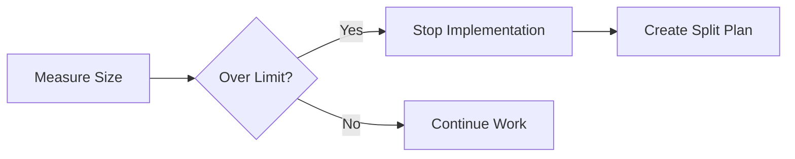

# Effort Split Continuous Execution Protocol

## Overview
This protocol defines the mandatory procedure for handling efforts that exceed the configured size limit. Splits MUST be executed sequentially and continuously until all code is within limits.

## Trigger Conditions
- Effort measured at >configured_limit lines (excluding generated code)
- Code Reviewer identifies during review
- SW Engineer detects during implementation

## Split Execution Flow

### 1. Detection Phase


### 2. Planning Phase (Code Reviewer)
```markdown
MANDATORY STEPS:
1. Run detailed size analysis: line-counter.sh -d
2. Identify logical groupings
3. Design splits <configured_limit each
4. Create SPLIT-SUMMARY.md with:
   - Number of splits required
   - Files per split
   - Dependencies between splits
   - Execution order
```

### 3. Sequential Execution Phase

**CRITICAL: Splits are NEVER parallel**

```python
for split_number in range(1, total_splits + 1):
    # 1. Create split branch
    create_split_branch(f"effort-part{split_number}")
    
    # 2. Spawn SW Engineer for this split only
    implement_split(split_number)
    
    # 3. Measure split size
    if measure_size() > limit:
        # Recursive split required
        return to_planning_phase()
    
    # 4. Review split
    review_result = code_review(split_number)
    
    # 5. Handle review outcome
    if review_result == "NEEDS_FIXES":
        fix_and_review_again()
    elif review_result == "NEEDS_SPLIT":
        return to_planning_phase()
    
    # 6. Mark split complete
    mark_split_complete(split_number)
    
    # 7. Continue to next split
    # DO NOT STOP, DO NOT RETURN TO ORCHESTRATOR
```

## Split Implementation Rules

### For SW Engineer
1. **Work ONLY on assigned split files**
2. **Ignore files assigned to other splits**
3. **Maintain feature boundaries**
4. **Test only split functionality**
5. **Measure continuously**

### For Code Reviewer
1. **Review each split independently**
2. **Verify size compliance**
3. **Check split completeness**
4. **Ensure no cross-split dependencies**
5. **Document any issues clearly**

## File Organization

```
/workspaces/efforts/phase{X}/wave{Y}/effort{Z}/
├── SPLIT-SUMMARY.md              # Master split plan
├── effort{Z}-part1/               # First split
│   ├── [split 1 files]
│   └── SPLIT-1-COMPLETE.md
├── effort{Z}-part2/               # Second split
│   ├── [split 2 files]
│   └── SPLIT-2-COMPLETE.md
└── effort{Z}-part{N}/             # Nth split
    ├── [split N files]
    └── SPLIT-N-COMPLETE.md
```

## Continuous Execution Requirements

### The Orchestrator MUST:
1. **NOT interrupt split sequence**
2. **Wait for ALL splits to complete**
3. **Track split progress in state file**
4. **Only proceed after final split accepted**

### The System MUST:
1. **Continue through all splits**
2. **Not return control between splits**
3. **Complete the entire sequence**
4. **Handle recursive splits if needed**

## Example Split Execution

```yaml
# Original effort: 2400 lines
# Limit: 800 lines
# Required splits: 3

Split 1:
  files: [api/types.go, api/validation.go]
  lines: 750
  status: COMPLETE

Split 2:
  files: [controller/reconcile.go]
  lines: 780
  status: COMPLETE

Split 3:
  files: [controller/webhooks.go, tests/]
  lines: 720
  status: COMPLETE

# All splits complete, effort can be marked done
```

## Anti-Patterns to Avoid

### ❌ NEVER DO THIS:
1. **Run splits in parallel** - Dependencies will break
2. **Skip split reviews** - Quality will suffer
3. **Combine splits** - Size limits will be violated
4. **Stop mid-sequence** - Effort will be incomplete
5. **Return to orchestrator between splits** - Context will be lost

### ✅ ALWAYS DO THIS:
1. **Execute sequentially** - Maintain dependencies
2. **Review each split** - Ensure quality
3. **Measure continuously** - Prevent violations
4. **Complete all splits** - Ensure completeness
5. **Document progress** - Maintain traceability

## Recovery Procedures

### If Split Fails Review:
1. Fix issues in current split
2. Re-review current split
3. Continue to next split
4. Do NOT restart sequence

### If Split Still Over Limit:
1. Stop current split
2. Create sub-split plan
3. Execute sub-splits sequentially
4. Continue with remaining splits

## Success Criteria

### Split Sequence Complete When:
- All splits implemented
- All splits reviewed and accepted
- All splits under size limit
- No outstanding issues
- Integration tested

### Then and Only Then:
- Mark effort complete
- Update orchestrator state
- Proceed to next effort

## Important Notes

1. **Size limit is non-negotiable**
2. **Sequential execution is mandatory**
3. **Continuous execution is required**
4. **All splits must pass review**
5. **No shortcuts or exceptions**

This protocol ensures large efforts are properly decomposed while maintaining quality and traceability.