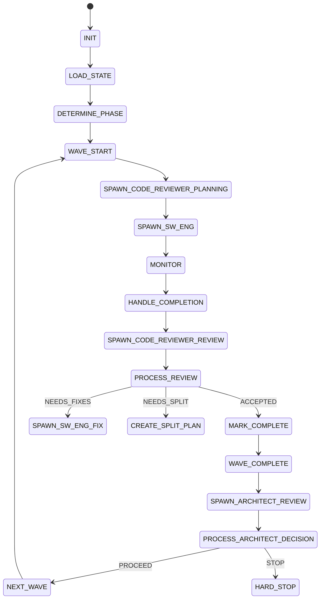
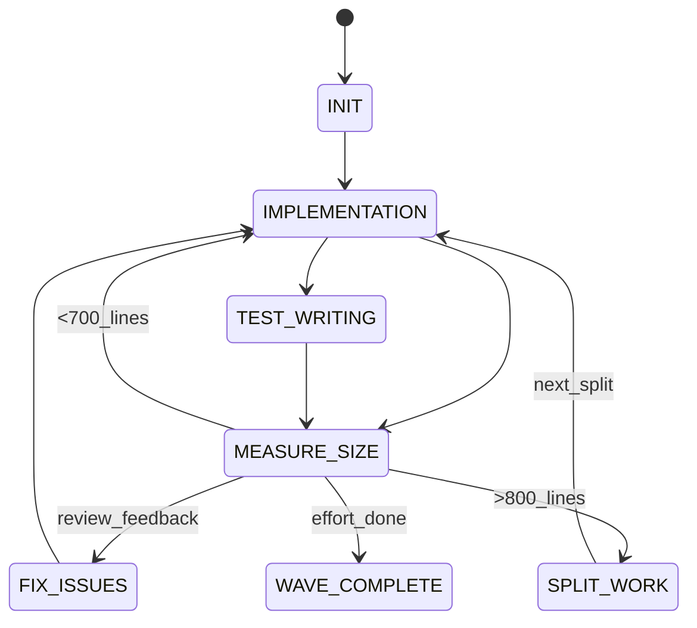
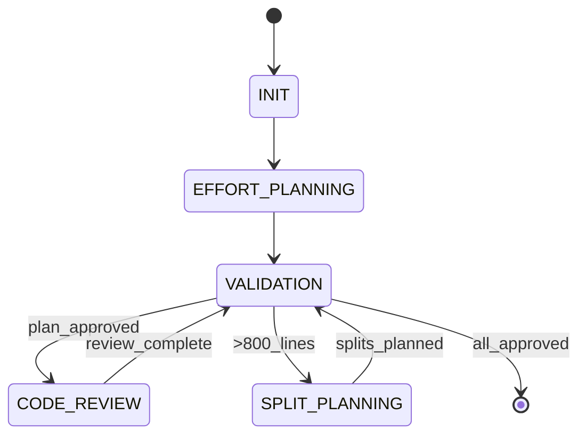
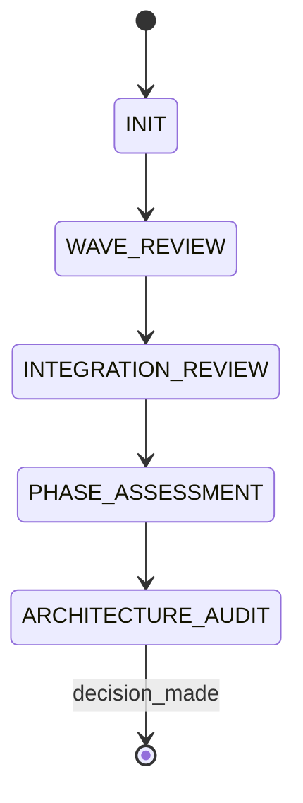

# 🔄 STATE MACHINE TRANSITIONS QUICK REFERENCE

## 🎯 ORCHESTRATOR STATE FLOW



### 🚨 Critical Transition Rules:
```
┌─────────────────────────────────────────────┐
│ SPAWN_SW_ENG: <5s parallel spawn timing    │
│ MONITOR: Check every 5 messages            │  
│ WAVE_COMPLETE: Create integration branch   │
│ HARD_STOP: Only when architect says STOP   │
└─────────────────────────────────────────────┘
```

## 🛠️ SW ENGINEER STATE FLOW



### 🚨 Critical Size Gates:
```
┌─────────────────────────────────────────────┐
│ MEASURE_SIZE: Use line-counter.sh    │
│ >700 lines: Plan completion carefully      │
│ >800 lines: MANDATORY split required       │
│ SPLIT_WORK: Sequential splits only         │
└─────────────────────────────────────────────┘
```

## 🔍 CODE REVIEWER STATE FLOW



### 🚨 Critical Review Gates:
```
┌─────────────────────────────────────────────┐
│ EFFORT_PLANNING: Must create detailed plan │
│ CODE_REVIEW: Use line-counter.sh    │
│ SPLIT_PLANNING: All splits <800 lines      │
│ VALIDATION: 80%+ first-try success rate    │
└─────────────────────────────────────────────┘
```

## 🏗️ ARCHITECT STATE FLOW



### 🚨 Critical Assessment Gates:
```
┌─────────────────────────────────────────────┐
│ WAVE_REVIEW: Verify all <800 lines         │
│ INTEGRATION_REVIEW: Check merge conflicts   │
│ PHASE_ASSESSMENT: ON_TRACK/OFF_TRACK call  │
│ DECISION: PROCEED/PROCEED_WITH_CHANGES/STOP │
└─────────────────────────────────────────────┘
```

## 📋 UNIVERSAL TRANSITION PROTOCOL

### Before ANY State Transition:
```bash
# 1. Complete current state work
echo "current_work_complete: true"

# 2. Save checkpoint  
echo "# Checkpoint: $(date)" > checkpoint.md
echo "State: ${CURRENT_STATE}" >> checkpoint.md
echo "Work completed: ${WORK_SUMMARY}" >> checkpoint.md

# 3. Update state file
sed -i "s/current_state: .*/current_state: ${NEXT_STATE}/" state.yaml
echo "transition_time: $(date -Iseconds)" >> state.yaml
echo "transition_reason: ${REASON}" >> state.yaml

# 4. Commit state change
git add state.yaml checkpoint.md
git commit -m "state: transition from ${CURRENT_STATE} to ${NEXT_STATE}"

# 5. Load next state rules
source agent-states/${AGENT}/${NEXT_STATE}/rules.md
```

## 🚨 CRITICAL TRANSITION CHECKPOINTS

### Orchestrator Checkpoints:
| From State | To State | Checkpoint Required |
|------------|----------|-------------------|
| SPAWN_SW_ENG | MONITOR | Record spawn timestamps |
| WAVE_COMPLETE | SPAWN_ARCHITECT_REVIEW | Create integration branch |
| PROCESS_ARCHITECT_DECISION | HARD_STOP | Document failure reason |

### SW Engineer Checkpoints:
| From State | To State | Checkpoint Required |
|------------|----------|-------------------|
| IMPLEMENTATION | MEASURE_SIZE | Current line count |
| MEASURE_SIZE | SPLIT_WORK | Split decision justification |
| TEST_WRITING | MEASURE_SIZE | Coverage percentage |

### Code Reviewer Checkpoints:
| From State | To State | Checkpoint Required |
|------------|----------|-------------------|
| EFFORT_PLANNING | VALIDATION | Implementation plan created |
| CODE_REVIEW | VALIDATION | Size measurement completed |
| SPLIT_PLANNING | VALIDATION | All splits <800 lines verified |

### Architect Checkpoints:
| From State | To State | Checkpoint Required |
|------------|----------|-------------------|
| WAVE_REVIEW | INTEGRATION_REVIEW | Size compliance verified |
| INTEGRATION_REVIEW | PHASE_ASSESSMENT | Merge assessment completed |
| PHASE_ASSESSMENT | ARCHITECTURE_AUDIT | Trajectory decision made |

## ⚡ STATE TRANSITION TRIGGERS

### Orchestrator Triggers:
```
SPAWN_SW_ENG → MONITOR: All agents spawned in <5s
MONITOR → HANDLE_COMPLETION: Agent reports completion
WAVE_COMPLETE → SPAWN_ARCHITECT_REVIEW: Integration branch ready
PROCESS_ARCHITECT_DECISION → HARD_STOP: Architect says STOP
```

### SW Engineer Triggers:
```
IMPLEMENTATION → MEASURE_SIZE: Every ~200 lines
MEASURE_SIZE → SPLIT_WORK: >800 lines detected
FIX_ISSUES → IMPLEMENTATION: All review issues addressed
TEST_WRITING → MEASURE_SIZE: Coverage targets met
```

### Code Reviewer Triggers:
```
EFFORT_PLANNING → VALIDATION: Plan completeness check
CODE_REVIEW → VALIDATION: Size + pattern compliance check
VALIDATION → SPLIT_PLANNING: >800 lines OR major issues
SPLIT_PLANNING → VALIDATION: Split strategy approved
```

### Architect Triggers:
```
WAVE_REVIEW → INTEGRATION_REVIEW: All efforts verified <800 lines
INTEGRATION_REVIEW → PHASE_ASSESSMENT: Merge readiness confirmed
PHASE_ASSESSMENT → ARCHITECTURE_AUDIT: Trajectory assessment complete
ARCHITECTURE_AUDIT → [*]: PROCEED/PROCEED_WITH_CHANGES/STOP decision
```

## 🛑 BLOCKED TRANSITION CONDITIONS

### Orchestrator Cannot Transition If:
- ❌ Parallel spawn timing >5s average
- ❌ Agent not responding >30 minutes
- ❌ Integration branch creation failed
- ❌ State file update failed

### SW Engineer Cannot Transition If:
- ❌ Wrong directory/branch detected
- ❌ Size measurement tool unavailable  
- ❌ Test coverage below phase minimum
- ❌ Critical compilation errors

### Code Reviewer Cannot Transition If:
- ❌ Implementation plan incomplete
- ❌ Line counting tool failed
- ❌ Split plan creates >800 line splits
- ❌ Critical pattern violations found

### Architect Cannot Transition If:
- ❌ Size compliance verification failed
- ❌ Integration conflicts unresolved
- ❌ Critical architectural issues found
- ❌ Previous decision requires clarification

## 🔄 RECOVERY FROM BLOCKED TRANSITIONS

### General Recovery Protocol:
```
1. STOP current transition attempt
2. Document blocking condition clearly
3. Address root cause systematically  
4. Verify resolution completely
5. Retry transition with checkpoint
6. Report to orchestrator if critical
```

### Emergency Escalation:
- **SW Engineer → Orchestrator**: Size limit exceeded
- **Code Reviewer → Orchestrator**: Critical issues found
- **Architect → All**: STOP decision issued
- **Any Agent → All**: Wrong environment detected

---
**REMEMBER**: State machine is ABSOLUTE TRUTH. No shortcuts, no skipping, no exceptions.