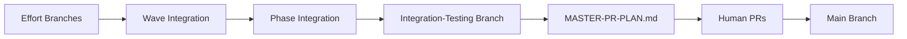

# 🚨 RULE R009 - Mandatory Integration Branch Creation

**Criticality:** BLOCKING - Cannot proceed without integration  
**Grading Impact:** -30% for missing integration branch  
**Enforcement:** AT EVERY WAVE COMPLETION

## Rule Statement

EVERY wave completion REQUIRES an integration branch BEFORE starting the next wave. NO EXCEPTIONS.

## Integration Requirements

### Wave Integration Hierarchy
```
phase1/wave1/effort1 ─┐
phase1/wave1/effort2 ─┼─→ phase1/wave1-integration ─┐
phase1/wave1/effort3 ─┘                             │
                                                     ├─→ phase1-integration
phase1/wave2/effort1 ─┐                             │
phase1/wave2/effort2 ─┼─→ phase1/wave2-integration ─┘
```

### Mandatory Integration Points

| Completion Event | Required Integration Branch | Before Proceeding To |
|-----------------|----------------------------|---------------------|
| Wave Complete | phase{N}/wave{M}-integration | Next Wave |
| Phase Complete | phase{N}-integration | Next Phase |
| All Efforts in Wave | wave-integration | Wave Review |
| All Waves in Phase | phase-integration | Phase Review |

## Integration Protocol

### Step 1: Verify Wave Completion
```bash
verify_wave_complete() {
    local phase=$1
    local wave=$2
    
    echo "🔍 Verifying wave completion..."
    
    # Check all efforts completed
    local pending=$(grep -c "state: in_progress" orchestrator-state.json)
    if [ "$pending" -gt 0 ]; then
        echo "❌ Cannot integrate: $pending efforts still in progress"
        return 1
    fi
    
    # Check all reviews passed
    local failed_reviews=$(grep -c "review: failed" orchestrator-state.json)
    if [ "$failed_reviews" -gt 0 ]; then
        echo "❌ Cannot integrate: $failed_reviews failed reviews"
        return 1
    fi
    
    echo "✅ Wave ready for integration"
    return 0
}
```

### Step 2: Create Integration Branch
```bash
create_integration_branch() {
    local phase=$1
    local wave=$2
    local integration_branch="phase${phase}/wave${wave}-integration"
    
    echo "🌿 Creating integration branch: $integration_branch"
    
    # Create from base
    git checkout main
    git pull origin main
    git checkout -b "$integration_branch"
    
    # Merge each effort sequentially
    for effort_branch in $(list_wave_effort_branches $phase $wave); do
        echo "📥 Merging $effort_branch..."
        git merge --no-ff "$effort_branch" || {
            echo "❌ Merge conflict in $effort_branch!"
            handle_merge_conflict "$effort_branch"
        }
    done
    
    # Push integration branch
    git push -u origin "$integration_branch"
    echo "✅ Integration branch created and pushed"
}
```

### Step 3: Run Integration Tests
```bash
run_integration_tests() {
    local integration_branch=$1
    
    echo "🧪 Running integration tests..."
    
    # Run test suite
    make test-integration || {
        echo "❌ Integration tests failed!"
        return 1
    }
    
    # Check for regressions
    make test-regression || {
        echo "❌ Regression detected!"
        return 1
    }
    
    echo "✅ All integration tests passed"
}
```

### Step 4: Update State File
```bash
update_integration_state() {
    local phase=$1
    local wave=$2
    local integration_branch="phase${phase}/wave${wave}-integration"
    
    # Update orchestrator-state.json
    cat >> orchestrator-state.json << EOF

integration_branches:
  - branch: "$integration_branch"
    created: "$(date -Iseconds)"
    phase: $phase
    wave: $wave
    efforts_merged: $(list_wave_efforts $phase $wave | wc -l)
    status: "ready_for_review"
EOF
    
    git add orchestrator-state.json
    git commit -m "state: Created integration branch $integration_branch"
    git push
}
```

## Required Validations

### Pre-Integration Checklist
```bash
pre_integration_checklist() {
    echo "📋 PRE-INTEGRATION CHECKLIST"
    echo "============================"
    
    # 1. All efforts complete
    echo -n "✓ All efforts complete: "
    check_efforts_complete && echo "PASS" || echo "FAIL"
    
    # 2. All reviews passed
    echo -n "✓ All reviews passed: "
    check_reviews_passed && echo "PASS" || echo "FAIL"
    
    # 3. Size compliance
    echo -n "✓ All efforts <800 lines: "
    check_size_compliance && echo "PASS" || echo "FAIL"
    
    # 4. Tests passing
    echo -n "✓ All tests passing: "
    check_tests_passing && echo "PASS" || echo "FAIL"
    
    # 5. No uncommitted work
    echo -n "✓ No uncommitted work: "
    check_clean_status && echo "PASS" || echo "FAIL"
}
```

### Post-Integration Verification
```bash
post_integration_verification() {
    echo "🔍 POST-INTEGRATION VERIFICATION"
    
    # Branch exists and pushed
    git ls-remote --heads origin "$integration_branch" || {
        echo "❌ Integration branch not pushed!"
        return 1
    }
    
    # Can build
    make build || {
        echo "❌ Build failed after integration!"
        return 1
    }
    
    # State updated
    grep -q "$integration_branch" orchestrator-state.json || {
        echo "❌ State file not updated!"
        return 1
    }
    
    echo "✅ Integration verified"
}
```

## Common Violations

### VIOLATION: Skipping Integration
```bash
# ❌ WRONG: Starting next wave without integration
echo "Wave 1 complete, starting Wave 2..."
# No integration branch created
```

### VIOLATION: Partial Integration
```bash
# ❌ WRONG: Only merging some efforts
git checkout -b phase1/wave1-integration
git merge effort1  # Missing effort2, effort3
```

### VIOLATION: No Testing
```bash
# ❌ WRONG: Creating branch without tests
git checkout -b integration
git merge effort1 effort2
git push  # No tests run
```

## Correct Patterns

### GOOD: Full Integration Flow
```bash
echo "🏁 Wave 2 Complete - Starting Integration"
echo "========================================="

# 1. Verify completion
verify_wave_complete 1 2

# 2. Create integration branch
create_integration_branch 1 2

# 3. Run tests
run_integration_tests "phase1/wave2-integration"

# 4. Update state
update_integration_state 1 2

# 5. Request review
echo "🚀 Spawning Architect for integration review"
```

### GOOD: Handling Conflicts
```bash
# When conflicts occur
echo "⚠️ Merge conflict detected"
echo "📋 Creating conflict resolution plan"
echo "🚀 Spawning SW Engineer to resolve"
# Wait for resolution
echo "✅ Conflict resolved, continuing integration"
```

## Integration Branch Naming

### Standard Format (UPDATED per R271-R280)
```
phase{N}/wave{M}-integration     # Wave integration
phase{N}-integration              # Phase integration
integration-testing-{timestamp}   # Final integration (NEW - NEVER main!)
```

### CRITICAL: Main Branch Protection
```bash
# ❌ NEVER create 'main-integration' or merge to main
# ✅ ALWAYS use 'integration-testing-{timestamp}' for final validation
```

### Examples
```
phase1/wave1-integration
phase1/wave2-integration
phase1-integration
phase2/wave1-integration
phase2-integration
```

## Grading Criteria

```python
def grade_integration_compliance(orchestrator):
    total_waves = orchestrator.completed_waves
    integration_branches = orchestrator.integration_branches_created
    
    # Base compliance
    compliance_rate = integration_branches / total_waves
    
    grade = 100
    
    # Deductions
    if compliance_rate < 1.0:
        missing = total_waves - integration_branches
        grade -= (missing * 30)  # -30% per missing
    
    # Check quality
    for branch in orchestrator.integration_branches:
        if not branch.tests_passed:
            grade -= 10
        if not branch.all_efforts_included:
            grade -= 15
        if branch.created_late:  # After starting next wave
            grade -= 20
    
    return max(grade, 0)
```

## Recovery Protocol

If integration was missed:

1. **STOP current wave immediately**
2. **Create integration branch now**
3. **Merge all previous wave efforts**
4. **Run full test suite**
5. **Update state file**
6. **Document in recovery log**
7. **Accept grading penalty**
8. **Continue with current wave**

## Integration Mantra

```
Every wave needs integration
No integration, no progression
Test everything after merging
Document in state, always pushing
Integration branches are MANDATORY
```

## 🔴🔴🔴 ADDENDUM: FINAL INTEGRATION PROTOCOL (R271-R280) 🔴🔴🔴

### The Complete Integration Lifecycle



### Final Integration to Production

**Software Factory's Role ENDS at integration-testing:**

```bash
# Software Factory does THIS:
create_integration_testing_and_validate() {
    # 1. Create test branch from main
    git checkout main && git pull
    git checkout -b integration-testing-$(date +%Y%m%d-%H%M%S)
    
    # 2. Merge everything
    for phase in phase*-integration; do
        git merge --no-ff "$phase"
    done
    
    # 3. Validate it works
    make build && make test && make deploy-test
    
    # 4. Generate PR plan
    generate_master_pr_plan > MASTER-PR-PLAN.md
    
    echo "✅ Software Factory work complete"
    echo "👥 Humans take over from here"
}

# Humans do THIS:
execute_pr_plan() {
    # Read MASTER-PR-PLAN.md
    # Create PRs in specified order
    # Review and merge each PR
    # Main branch gets production code
}
```

### Grading Impact (UPDATED)

- Missing wave integration: -30%
- Missing phase integration: -40%
- No integration-testing branch: -50%
- No MASTER-PR-PLAN.md: -100% (R279 violation)
- **Attempting to merge to main: -200% (R280 SUPREME LAW VIOLATION)**
- **Actually pushing to main: IMMEDIATE TERMINATION**

---
**Remember:** Integration branches prevent chaos. Create them, test them, document them. But NEVER touch main - that's for humans only!