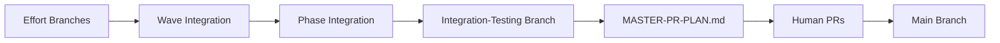

# 🔴🔴🔴 SUPREME LAW R009 - Mandatory Wave/Phase Integration Protocol

**Criticality:** SUPREME LAW - Foundation of trunk-based development  
**Grading Impact:** -100% for skipping wave integration, -30% for other violations  
**Enforcement:** MANDATORY at EVERY wave/phase completion  
**Consolidates:** R104 (workspace location), R336 (enforcement timing)

## Rule Statement

**EVERY wave MUST be fully integrated and its integration branch created BEFORE the next wave can start. The next wave's efforts MUST use the previous wave's integration branch as their base. This creates TRUE trunk-based development.**

### 🔴 ABSOLUTE REQUIREMENTS 🔴
1. Wave N must complete ALL reviews before integration
2. Wave N integration branch MUST be created before Wave N+1 starts
3. Wave N+1 efforts MUST use Wave N integration as base branch
4. Integration branches are created in TARGET repository, NOT software-factory
5. NO EXCEPTIONS - this is the foundation of incremental development

## Target Repository Configuration (from R104)

### CRITICAL: Integration Location
**Integration branches are ALWAYS created in the TARGET repository being developed, NOT in the software-factory repository!**

```yaml
# Read from: $CLAUDE_PROJECT_DIR/target-repo-config.yaml
repository_path: /path/to/target/repo  # Absolute path
repository_name: target-project-name
default_branch: main  # Base for integrations
```

### Workspace Structure Requirements
```bash
# Wave Integration Workspace
$CLAUDE_PROJECT_DIR/efforts/phase{X}/wave{Y}/integration-workspace/
└── [target-repo-name]/  # Clone of TARGET repository
    └── phase{X}-wave{Y}-integration  # Branch created HERE

# Phase Integration Workspace  
$CLAUDE_PROJECT_DIR/efforts/phase{X}/phase-integration/
└── [target-repo-name]/  # Fresh clone of TARGET repository
    └── phase{X}-integration  # Branch created HERE
```

## Integration Requirements

### Wave Integration Hierarchy
```
phase1/wave1/effort1 ─┐
phase1/wave1/effort2 ─┼─→ phase1/wave1-integration ─┐
phase1/wave1/effort3 ─┘                             │
                                                     ├─→ phase1-integration
phase1/wave2/effort1 ─┐                             │
phase1/wave2/effort2 ─┼─→ phase1/wave2-integration ─┘
```

### Mandatory Integration Flow (SUPREME LAW)

```
Wave N efforts complete
    ↓
WAVE_COMPLETE (verify all reviews passed)
    ↓
INTEGRATION (setup infrastructure)
    ↓
SPAWN_CODE_REVIEWER_MERGE_PLAN (create merge plan)
    ↓
SPAWN_INTEGRATION_AGENT (execute merges)
    ↓
MONITORING_INTEGRATION (verify success)
    ↓
WAVE_REVIEW (architect reviews integrated wave)
    ↓
WAVE_START (Wave N+1 MUST use wave-N-integration as base!)
```

### Mandatory Integration Points

| Completion Event | Required Integration Branch | Before Proceeding To | Base for Next |
|-----------------|----------------------------|---------------------|---------------|
| Wave N Complete | phase{X}-wave{N}-integration | Wave N+1 | Wave N+1 efforts |
| Phase X Complete | phase{X}-integration | Phase X+1 | Phase X+1 Wave 1 |
| All Efforts in Wave | wave-integration | Wave Review | Next wave planning |
| All Waves in Phase | phase-integration | Phase Assessment | Next phase |

## Why This Is CRITICAL (The Problem Without It)

### Without Mandatory Wave Integration (BROKEN):
```
main
  ├─→ P1W1 efforts (from main)
  ├─→ P1W2 efforts (ALSO from main - missing W1 work!)
  └─→ P1W3 efforts (ALSO from main - missing W1 & W2 work!)
```
**Result**: Massive conflicts, broken dependencies, integration nightmare

### With Mandatory Wave Integration (CORRECT):
```
main
  └─→ P1W1 efforts → wave1-integration
                        └─→ P1W2 efforts → wave2-integration
                                              └─→ P1W3 efforts
```
**Result**: Incremental integration, conflicts detected early, true CI/CD

## Integration Protocol

### Step 1: Verify Wave Completion
```bash
verify_wave_complete() {
    local phase=$1
    local wave=$2
    
    echo "🔍 Verifying wave completion..."
    
    # Check all efforts completed
    local pending=$(grep -c "state: in_progress" orchestrator-state.json)
    if [ "$pending" -gt 0 ]; then
        echo "❌ Cannot integrate: $pending efforts still in progress"
        return 1
    fi
    
    # Check all reviews passed
    local failed_reviews=$(grep -c "review: failed" orchestrator-state.json)
    if [ "$failed_reviews" -gt 0 ]; then
        echo "❌ Cannot integrate: $failed_reviews failed reviews"
        return 1
    fi
    
    echo "✅ Wave ready for integration"
    return 0
}
```

### Step 2: Create Integration Branch (TARGET REPOSITORY!)
```bash
create_integration_branch() {
    local phase=$1
    local wave=$2
    local integration_branch="phase${phase}/wave${wave}-integration"
    
    echo "🌿 Creating integration branch: $integration_branch"
    
    # CRITICAL: Work in TARGET repository, not software-factory!
    TARGET_REPO=$(yq '.repository_path' "$CLAUDE_PROJECT_DIR/target-repo-config.yaml")
    TARGET_NAME=$(yq '.repository_name' "$CLAUDE_PROJECT_DIR/target-repo-config.yaml")
    
    # Create fresh workspace
    INTEGRATION_DIR="/efforts/phase${phase}/wave${wave}/integration-workspace"
    rm -rf "$INTEGRATION_DIR"
    mkdir -p "$INTEGRATION_DIR"
    
    # Clone TARGET repository
    cd "$INTEGRATION_DIR"
    git clone "$TARGET_REPO" "$TARGET_NAME"
    cd "$TARGET_NAME"
    
    # Verify NOT software-factory
    if git remote get-url origin | grep -q "software-factory"; then
        echo "❌ CRITICAL: Wrong repository!"
        exit 1
    fi
    
    # Determine base branch per R308 + this rule
    if [[ $phase -eq 1 && $wave -eq 1 ]]; then
        BASE="main"
    elif [[ $wave -eq 1 ]]; then
        # First wave of new phase: from previous phase integration
        PREV_PHASE=$((phase - 1))
        BASE="phase${PREV_PHASE}-integration"
    else
        # SUBSEQUENT WAVES: FROM PREVIOUS WAVE INTEGRATION!
        PREV_WAVE=$((wave - 1))
        BASE="phase${phase}-wave${PREV_WAVE}-integration"
    fi
    
    # Verify base exists (enforcement)
    if ! git ls-remote --heads origin "$BASE" > /dev/null 2>&1; then
        echo "🔴🔴🔴 R009 VIOLATION: Required base branch missing!"
        echo "Cannot create Wave $wave integration without: $BASE"
        exit 9  # R009 violation
    fi
    
    git checkout "$BASE"
    git pull origin "$BASE"
    git checkout -b "$integration_branch"
    
    # Merge each effort sequentially
    for effort_branch in $(list_wave_effort_branches $phase $wave); do
        echo "📥 Merging $effort_branch..."
        git merge --no-ff "$effort_branch" || {
            echo "❌ Merge conflict in $effort_branch!"
            handle_merge_conflict "$effort_branch"
        }
    done
    
    # Push integration branch
    git push -u origin "$integration_branch"
    echo "✅ Integration branch created and pushed"
}
```

### Step 3: Run Integration Tests
```bash
run_integration_tests() {
    local integration_branch=$1
    
    echo "🧪 Running integration tests..."
    
    # Run test suite
    make test-integration || {
        echo "❌ Integration tests failed!"
        return 1
    }
    
    # Check for regressions
    make test-regression || {
        echo "❌ Regression detected!"
        return 1
    }
    
    echo "✅ All integration tests passed"
}
```

### Step 4: Update State File
```bash
update_integration_state() {
    local phase=$1
    local wave=$2
    local integration_branch="phase${phase}/wave${wave}-integration"
    
    # Update orchestrator-state.json
    cat >> orchestrator-state.json << EOF

integration_branches:
  - branch: "$integration_branch"
    created: "$(date -Iseconds)"
    phase: $phase
    wave: $wave
    efforts_merged: $(list_wave_efforts $phase $wave | wc -l)
    status: "ready_for_review"
EOF
    
    git add orchestrator-state.json
    git commit -m "state: Created integration branch $integration_branch"
    git push
}
```

## Required Validations

### Pre-Integration Checklist
```bash
pre_integration_checklist() {
    echo "📋 PRE-INTEGRATION CHECKLIST"
    echo "============================"
    
    # 1. All efforts complete
    echo -n "✓ All efforts complete: "
    check_efforts_complete && echo "PASS" || echo "FAIL"
    
    # 2. All reviews passed
    echo -n "✓ All reviews passed: "
    check_reviews_passed && echo "PASS" || echo "FAIL"
    
    # 3. Size compliance
    echo -n "✓ All efforts <800 lines: "
    check_size_compliance && echo "PASS" || echo "FAIL"
    
    # 4. Tests passing
    echo -n "✓ All tests passing: "
    check_tests_passing && echo "PASS" || echo "FAIL"
    
    # 5. No uncommitted work
    echo -n "✓ No uncommitted work: "
    check_clean_status && echo "PASS" || echo "FAIL"
}
```

### Post-Integration Verification
```bash
post_integration_verification() {
    echo "🔍 POST-INTEGRATION VERIFICATION"
    
    # Branch exists and pushed
    git ls-remote --heads origin "$integration_branch" || {
        echo "❌ Integration branch not pushed!"
        return 1
    }
    
    # Can build
    make build || {
        echo "❌ Build failed after integration!"
        return 1
    }
    
    # State updated
    grep -q "$integration_branch" orchestrator-state.json || {
        echo "❌ State file not updated!"
        return 1
    }
    
    echo "✅ Integration verified"
}
```

## State Machine Enforcement

### FORBIDDEN State Transitions:
- ❌ `WAVE_COMPLETE` → `WAVE_START` (skips integration!)
- ❌ `WAVE_COMPLETE` → `PLANNING` (skips integration!)
- ❌ `WAVE_REVIEW` → `WAVE_START` without verifying integration exists

### REQUIRED State Transitions:
- ✅ `WAVE_COMPLETE` → `INTEGRATION`
- ✅ `INTEGRATION` → `SPAWN_CODE_REVIEWER_MERGE_PLAN`
- ✅ `MONITORING_INTEGRATION` → `WAVE_REVIEW`
- ✅ `WAVE_REVIEW` → `WAVE_START` (only after integration verified)

## Common Violations

### VIOLATION: Skipping Integration (AUTOMATIC FAILURE)
```bash
# ❌ WRONG: Starting next wave without integration
current_state: WAVE_COMPLETE → WAVE_START  # NO! -100% FAILURE!
# Wave 2 starting without Wave 1 integration
```

### VIOLATION: Partial Integration
```bash
# ❌ WRONG: Only merging some efforts
git checkout -b phase1/wave1-integration
git merge effort1  # Missing effort2, effort3
```

### VIOLATION: No Testing
```bash
# ❌ WRONG: Creating branch without tests
git checkout -b integration
git merge effort1 effort2
git push  # No tests run
```

## Correct Patterns

### GOOD: Full Integration Flow
```bash
echo "🏁 Wave 2 Complete - Starting Integration"
echo "========================================="

# 1. Verify completion
verify_wave_complete 1 2

# 2. Create integration branch
create_integration_branch 1 2

# 3. Run tests
run_integration_tests "phase1/wave2-integration"

# 4. Update state
update_integration_state 1 2

# 5. Request review
echo "🚀 Spawning Architect for integration review"
```

### GOOD: Handling Conflicts
```bash
# When conflicts occur
echo "⚠️ Merge conflict detected"
echo "📋 Creating conflict resolution plan"
echo "🚀 Spawning SW Engineer to resolve"
# Wait for resolution
echo "✅ Conflict resolved, continuing integration"
```

## Integration Branch Naming

### Standard Format (UPDATED per R271-R280)
```
phase{N}/wave{M}-integration     # Wave integration
phase{N}-integration              # Phase integration
integration-testing-{timestamp}   # Final integration (NEW - NEVER main!)
```

### CRITICAL: Main Branch Protection
```bash
# ❌ NEVER create 'main-integration' or merge to main
# ✅ ALWAYS use 'integration-testing-{timestamp}' for final validation
```

### Examples
```
phase1/wave1-integration
phase1/wave2-integration
phase1-integration
phase2/wave1-integration
phase2-integration
```

## Stop Work Conditions

**IMMEDIATE STOP if:**
1. Wave > 1 starting without previous wave integration branch
2. Efforts using main as base when integration exists
3. WAVE_COMPLETE transitioning directly to WAVE_START
4. Integration branch missing when wave review requested
5. Integration happening in software-factory repo instead of target

## Grading Criteria

```python
def grade_integration_compliance(orchestrator):
    total_waves = orchestrator.completed_waves
    integration_branches = orchestrator.integration_branches_created
    
    # Base compliance
    compliance_rate = integration_branches / total_waves
    
    grade = 100
    
    # SUPREME LAW violations
    if skipped_wave_integration:
        return 0  # -100% AUTOMATIC FAILURE
    
    # Major violations
    if wrong_base_branch:
        grade -= 100  # Using main instead of integration
    
    # Standard deductions
    if compliance_rate < 1.0:
        missing = total_waves - integration_branches
        grade -= (missing * 30)  # -30% per missing
    
    # Check quality
    for branch in orchestrator.integration_branches:
        if not branch.tests_passed:
            grade -= 10
        if not branch.all_efforts_included:
            grade -= 15
        if branch.created_late:  # After starting next wave
            grade -= 20
    
    return max(grade, 0)
```

## Recovery Protocol

If integration was missed:

1. **STOP current wave immediately**
2. **Create integration branch now**
3. **Merge all previous wave efforts**
4. **Run full test suite**
5. **Update state file**
6. **Document in recovery log**
7. **Accept grading penalty**
8. **Continue with current wave**

## Integration Mantra

```
Every wave needs integration
No integration, no progression
Next wave uses previous integration
Never in software-factory, always in target
Test everything after merging
Document in state, always pushing
The chain of integration is sacred:
Wave 1 → wave1-integration → Wave 2 → wave2-integration → Wave 3
Break the chain = Break the build = FAILURE
```

## 🔴🔴🔴 ADDENDUM: FINAL INTEGRATION PROTOCOL (R271-R280) 🔴🔴🔴

### The Complete Integration Lifecycle



### Final Integration to Production

**Software Factory's Role ENDS at integration-testing:**

```bash
# Software Factory does THIS:
create_integration_testing_and_validate() {
    # 1. Create test branch from main
    git checkout main && git pull
    git checkout -b integration-testing-$(date +%Y%m%d-%H%M%S)
    
    # 2. Merge everything
    for phase in phase*-integration; do
        git merge --no-ff "$phase"
    done
    
    # 3. Validate it works
    make build && make test && make deploy-test
    
    # 4. Generate PR plan
    generate_master_pr_plan > MASTER-PR-PLAN.md
    
    echo "✅ Software Factory work complete"
    echo "👥 Humans take over from here"
}

# Humans do THIS:
execute_pr_plan() {
    # Read MASTER-PR-PLAN.md
    # Create PRs in specified order
    # Review and merge each PR
    # Main branch gets production code
}
```

### Grading Impact (UPDATED)

- Missing wave integration: -30%
- Missing phase integration: -40%
- No integration-testing branch: -50%
- No MASTER-PR-PLAN.md: -100% (R279 violation)
- **Attempting to merge to main: -200% (R280 SUPREME LAW VIOLATION)**
- **Actually pushing to main: IMMEDIATE TERMINATION**

---

## Integration with Other Rules

- **R308**: Incremental branching (defines base branch logic)
- **R282**: Phase integration protocol (phase-level integration)
- **R327**: Mandatory re-integration after fixes
- **R234**: Mandatory state traversal (prevents skipping states)
- **R222**: Code review gate (ensures reviews before integration)

**Remember:** Every wave stands on the shoulders of the integrated wave before it! Integration branches prevent chaos. Create them IN THE TARGET REPO, test them, document them. But NEVER touch main - that's for humans only!