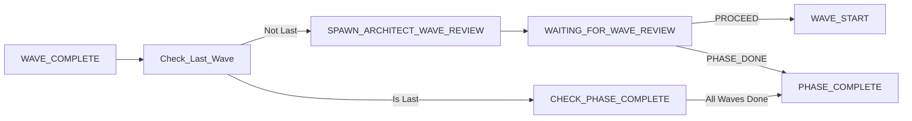

# 🚨🚨🚨 R105: Wave Completion Protocol 🚨🚨🚨

**Category:** State-Specific Rules  
**Agents:** orchestrator (primary), architect (review)  
**Criticality:** BLOCKING - No wave can complete without full compliance  
**State:** WAVE_COMPLETE

## CORE PROTOCOL

### 1. MANDATORY COMPLETION REQUIREMENTS

A wave is **ONLY** considered complete when:
- All efforts in wave have `review_status: PASSED`
- Wave integration branch created and tested
- All effort branches successfully merged
- Tests pass on integration branch (>95% success rate)
- Architect review completed (see R258)
- State file updated with completion status
- Transition to appropriate next state

### 2. WAVE COMPLETION SEQUENCE

```bash
# 1. Verify all efforts completed
check_all_efforts_complete() {
    local wave_efforts=$(yq '.efforts_in_progress[] | select(.wave == '$CURRENT_WAVE')' orchestrator-state.yaml)
    
    for effort in $wave_efforts; do
        local status=$(echo "$effort" | yq '.review_status')
        if [[ "$status" != "PASSED" ]]; then
            echo "❌ Effort not complete: $(echo "$effort" | yq '.name')"
            return 1
        fi
    done
    
    echo "✅ All efforts complete with PASSED status"
    return 0
}

# 2. Create wave integration branch
create_wave_integration_branch() {
    local branch_name="phase-${CURRENT_PHASE}-wave-${CURRENT_WAVE}-integration"
    
    cd $CLAUDE_PROJECT_DIR
    git checkout -b "$branch_name" main
    
    # Merge all effort branches
    for effort_branch in $(yq '.efforts_in_progress[].branch' orchestrator-state.yaml); do
        git merge --no-ff "$effort_branch" -m "integrate: $effort_branch into wave $CURRENT_WAVE"
    done
    
    git push -u origin "$branch_name"
    echo "✅ Wave integration branch created: $branch_name"
}

# 3. Run integration tests
run_wave_integration_tests() {
    cd $CLAUDE_PROJECT_DIR
    
    # Run full test suite
    go test ./... -v > wave-${CURRENT_WAVE}-test-results.log
    local test_result=$?
    
    if [[ $test_result -ne 0 ]]; then
        echo "❌ Wave integration tests failed"
        return 1
    fi
    
    echo "✅ Wave integration tests passed"
    return 0
}

# 4. Trigger architect review
trigger_architect_review() {
    echo "🏗️ Spawning architect for wave review..."
    cd $CLAUDE_PROJECT_DIR
    claude_spawn architect --state WAVE_REVIEW \
        --phase "$CURRENT_PHASE" \
        --wave "$CURRENT_WAVE"
}
```

### 3. COMPLETION CRITERIA

#### All Efforts Complete
```yaml
completion_criteria:
  all_efforts_passed: true
  no_efforts_in_progress: true
  no_blocked_efforts: true
  all_splits_resolved: true
```

#### Integration Success
```yaml
integration_requirements:
  branch_created: true
  all_merges_successful: true
  no_merge_conflicts: true
  build_succeeds: true
  tests_pass: true
  test_coverage: ">80%"
```

#### Review Approval
```yaml
review_requirements:
  architect_review: REQUIRED
  review_report_created: true  # R258
  decision: PROCEED_NEXT_WAVE or PROCEED_PHASE_ASSESSMENT
```

### 4. STATE FILE UPDATES

```bash
# Update state file with wave completion
update_wave_completion_state() {
    local timestamp=$(date -Iseconds)
    
    # Move efforts from in_progress to completed
    yq -i ".efforts_completed += .efforts_in_progress" orchestrator-state.yaml
    yq -i ".efforts_in_progress = []" orchestrator-state.yaml
    
    # Update wave completion metadata
    yq -i ".waves_completed.phase${CURRENT_PHASE}.wave${CURRENT_WAVE} = {
        \"completed_at\": \"$timestamp\",
        \"integration_branch\": \"$branch_name\",
        \"efforts_count\": $effort_count,
        \"test_result\": \"PASSED\",
        \"review_status\": \"PENDING\"
    }" orchestrator-state.yaml
    
    # Commit state file (R288)
    git add orchestrator-state.yaml
    git commit -m "state: wave $CURRENT_WAVE complete - awaiting review"
    git push
}
```

### 5. TRANSITION DECISIONS



### 6. WAVE COMPLETION CHECKLIST

```markdown
## Wave ${N} Completion Checklist

### Effort Completion
- [ ] All efforts have review_status: PASSED
- [ ] No efforts remain in progress
- [ ] All splits (if any) completed
- [ ] All fixes (if any) applied

### Integration
- [ ] Wave integration branch created
- [ ] All effort branches merged
- [ ] No merge conflicts
- [ ] Build succeeds on integration branch

### Testing
- [ ] Unit tests pass (100%)
- [ ] Integration tests pass (>95%)
- [ ] Test coverage >80%
- [ ] No new security vulnerabilities
- [ ] Performance benchmarks met

### Documentation
- [ ] Work logs updated for all efforts
- [ ] Integration notes documented
- [ ] Known issues documented
- [ ] Next wave dependencies identified

### Review
- [ ] Architect review triggered
- [ ] Review report created (R258)
- [ ] Decision received and valid

### State Management
- [ ] State file updated
- [ ] State file committed and pushed
- [ ] TODOs saved (R187)
- [ ] Next state determined
```

### 7. ERROR CONDITIONS

```bash
handle_wave_completion_errors() {
    local error_type=$1
    
    case "$error_type" in
        EFFORTS_INCOMPLETE)
            echo "❌ Cannot complete wave - efforts still in progress"
            transition_to "MONITOR"
            ;;
        INTEGRATION_FAILED)
            echo "❌ Wave integration failed - merge conflicts"
            transition_to "ERROR_RECOVERY"
            ;;
        TESTS_FAILED)
            echo "❌ Wave integration tests failed"
            transition_to "FIX_WAVE_ISSUES"
            ;;
        REVIEW_REJECTED)
            echo "❌ Architect rejected wave"
            transition_to "WAVE_REWORK"
            ;;
    esac
}
```

### 8. GRADING IMPACT

```yaml
wave_completion_violations:
  incomplete_efforts_marked_complete: -30%  # Critical violation
  missing_integration_branch: -25%
  skipping_tests: -20%
  no_architect_review: -30%
  missing_state_update: -15%
  missing_review_report: -25%  # R258 violation
```

### 9. INTEGRATION WITH OTHER RULES

- **R258**: Mandatory Wave Review Report creation
- **R288**: Mandatory State File Updates
- **R288**: Mandatory State File Commit Push
- **R187**: TODO Save Triggers (save on wave completion)
- **R009**: Integration Branch Creation
- **R022**: Architect Size Verification
- **R256**: Mandatory Phase Assessment Gate (if last wave)

### 10. ORCHESTRATOR RESPONSIBILITIES

The orchestrator MUST:
```bash
# Complete wave completion protocol
complete_wave() {
    echo "📊 Starting wave $CURRENT_WAVE completion protocol..."
    
    # Step 1: Verify all efforts complete
    check_all_efforts_complete || return 1
    
    # Step 2: Create integration branch
    create_wave_integration_branch || return 1
    
    # Step 3: Run tests
    run_wave_integration_tests || return 1
    
    # Step 4: Update state file
    update_wave_completion_state
    
    # Step 5: Save TODOs (R187)
    save_todos "WAVE_COMPLETE"
    
    # Step 6: Trigger architect review
    trigger_architect_review
    
    # Step 7: Transition to waiting state
    transition_to "WAITING_FOR_WAVE_REVIEW"
    
    echo "✅ Wave $CURRENT_WAVE completion protocol complete"
}
```

## ENFORCEMENT

This rule is enforced by:
- State machine preventing wave progression without completion
- Orchestrator following protocol exactly
- Architect review gate before next wave
- Automated validation checks
- Grading penalties for violations

## SUMMARY

**R105 Core Mandate: Waves must be FULLY complete before progression!**

- All efforts must have passed review
- Integration branch must exist and work
- Tests must pass on integrated code
- Architect must review and approve
- State must be properly updated
- No shortcuts or partial completions allowed

---
**Created**: Wave completion protocol for Software Factory 2.0
**Purpose**: Ensure proper wave integration and validation
**Enforcement**: BLOCKING - No exceptions