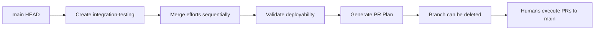

# Rule R272: Integration Testing Branch Requirement

## Rule Statement
All Software Factory integration and validation MUST occur in a dedicated `integration-testing` branch created from main's HEAD. This branch serves as the proving ground for all effort branches WITHOUT ever modifying the main branch.

## Criticality Level
**BLOCKING** - Cannot proceed to SUCCESS without integration-testing branch
Violation = -50% grade penalty

## Core Principle
**"Test everything in isolation, deliver through human review"**

## Detailed Requirements

### 1. Integration Testing Branch Creation

```bash
create_integration_testing_branch() {
    local timestamp=$(date +%Y%m%d-%H%M%S)
    
    # MUST start from main's current HEAD
    git checkout main
    git pull origin main
    
    # Create timestamped branch
    INTEGRATION_BRANCH="integration-testing-${timestamp}"
    git checkout -b "$INTEGRATION_BRANCH"
    
    # Document branch creation
    echo "Integration Testing Branch: $INTEGRATION_BRANCH" > INTEGRATION-INFO.md
    echo "Created from: main @ $(git rev-parse HEAD)" >> INTEGRATION-INFO.md
    echo "Created at: $(date -u +%Y-%m-%dT%H:%M:%SZ)" >> INTEGRATION-INFO.md
    
    # This branch is ephemeral - not pushed to origin
    # It exists only to prove integration works
}
```

### 2. Integration Sequence Protocol

All effort branches must be merged in dependency order:

```bash
# Phase 1 efforts (foundation - no dependencies)
phase1/wave1/effort1 → integration-testing
phase1/wave1/effort2 → integration-testing
phase1/wave2/effort1 → integration-testing

# Phase 2 efforts (depends on phase 1)
phase2/wave1/effort1 → integration-testing
phase2/wave2/effort1 → integration-testing

# Continue for all phases...
```

### 3. Conflict Resolution Documentation

Every conflict encountered MUST be documented:

```markdown
## Conflict Resolution Log

### Conflict 1: main.go imports
- Branches: phase1/wave2/effort3 + phase2/wave1/effort1
- Resolution: Merge both import blocks
- Test Result: ✅ Builds successfully

### Conflict 2: go.mod dependencies
- Branches: Multiple
- Resolution: Run `go mod tidy` after each merge
- Test Result: ✅ Dependencies resolved
```

### 4. Build Validation After Each Merge

```bash
validate_after_merge() {
    local effort_branch=$1
    
    echo "Validating after merging $effort_branch..."
    
    # Runtime-specific validation
    case $(detect_runtime) in
        go)
            go build . || return 1
            go test ./... || return 1
            ;;
        python)
            python -m pytest || return 1
            ;;
        nodejs)
            npm test || return 1
            ;;
    esac
    
    echo "✅ Validation passed for $effort_branch"
}
```

### 5. Branch Lifecycle



## What This Branch Contains

After completion, integration-testing branch has:
- All effort branches merged in order
- Conflict resolutions applied
- Full working software
- Build/test validation results
- BUT never pushed to origin main

## What This Branch Enables

1. **Proof of Integration**: Shows all efforts work together
2. **Conflict Discovery**: Identifies integration issues early
3. **PR Order Planning**: Determines optimal merge sequence
4. **Risk Mitigation**: Tests everything without touching main
5. **Human Review Path**: Clear plan for actual PRs

## Integration with Other Rules

### Dependencies
- R014: Branch naming convention
- R251: Repository separation

### Enables
- R271: Production validation
- R279: MASTER-PR-PLAN generation
- R280: Main branch protection

## Common Violations to Avoid

### ❌ WRONG: Using main directly
```bash
git checkout main
git merge effort1  # NEVER DO THIS!
```

### ❌ WRONG: Using old integration branch
```bash
git checkout integration-testing-20250827-120000  # Old branch
git merge new-effort  # Wrong base!
```

### ✅ RIGHT: Fresh branch from main
```bash
git checkout main
git pull origin main
git checkout -b integration-testing-$(date +%Y%m%d-%H%M%S)
# Now safe to test integration
```

## Grading Impact

- Missing integration-testing branch: -50%
- Using stale base (not main HEAD): -25%
- Pushing to main: -100% (SUPREME LAW violation)
- Poor conflict documentation: -10%

## State Machine Integration

The `CREATE_INTEGRATION_TESTING` state creates this branch.
The `INTEGRATION_TESTING` state performs all merges here.
The `PR_PLAN_CREATION` state uses this to generate the plan.

## Summary

R272 ensures all integration happens in a safe, isolated branch that proves everything works without risking main branch integrity. This branch is the sandbox where we validate that all efforts compose correctly before humans review and merge the actual PRs.