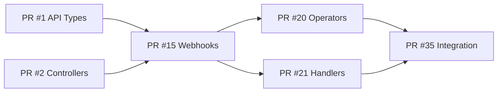

# Rule R279: MASTER-PR-PLAN Requirement (SUPREME LAW)

## Rule Statement
Every Software Factory project MUST generate a comprehensive MASTER-PR-PLAN.md that provides the EXACT sequence and instructions for humans to create Pull Requests from effort branches to main. This is the bridge between automated development and human-reviewed integration.

## Criticality Level
**SUPREME LAW** - No project succeeds without PR plan
Violation = -100% AUTOMATIC FAILURE

## Core Principle
**"The Factory proves it works, humans review and merge"**

## MASTER-PR-PLAN.md Structure

### Required Components

```markdown
# MASTER-PR-PLAN - [Project Name]

## 🎯 Executive Summary
- **Total Effort Branches**: 47
- **Estimated PRs**: 47 (one per effort)
- **Integration Testing Branch**: integration-testing-20250828-143000
- **Build Status**: ✅ PASSING
- **All Tests**: ✅ PASSING
- **Deployment Verified**: ✅ SUCCESS

## 📋 PR Execution Instructions

### For Repository Maintainers:
1. Review this plan completely before starting
2. Execute PRs in the EXACT order specified
3. Each PR must be reviewed and merged before proceeding
4. If conflicts arise, consult the conflict resolution guide
5. Run tests after each merge to main

## 🔄 PR Merge Sequence

### PHASE 1 - Foundation Layer
**Goal**: Establish core types, interfaces, and basic structure
**Dependencies**: None - can be merged in any order within phase
**Critical Path**: PR #1-3 must merge before Phase 2

#### PR #1: Core API Types
- **Branch**: `phase1/wave1/effort1-api-types`
- **Commit SHA**: `abc123def456`
- **Files Changed**: 15 files (+850 lines, -0 lines)
- **Description**: Defines core Kubernetes CRDs and API types
- **Tests**: Unit tests included, 100% coverage
- **Review Focus**: 
  - API naming conventions
  - Field validation rules
  - Backwards compatibility considerations
- **Conflicts**: None expected
- **Merge Command**:
  ```bash
  gh pr create --base main --head phase1/wave1/effort1-api-types \
    --title "feat(api): Add core API types and CRDs" \
    --body "See MASTER-PR-PLAN.md PR #1"
  ```

#### PR #2: Controller Interfaces
- **Branch**: `phase1/wave1/effort2-controller-interfaces`
- **Commit SHA**: `def789ghi012`
- **Files Changed**: 8 files (+450 lines, -0 lines)
- **Description**: Controller interfaces and contracts
- **Tests**: Interface tests included
- **Review Focus**: 
  - Interface design patterns
  - Error handling contracts
- **Conflicts**: None expected
- **Dependencies**: None

[Continue for all efforts...]

### PHASE 2 - Business Logic
**Goal**: Implement core business logic and controllers
**Dependencies**: MUST merge all Phase 1 PRs first
**Critical Path**: PR #15 blocks PR #16-18

#### PR #15: Webhook Framework
- **Branch**: `phase2/wave1/effort1-webhook-framework`
- **Commit SHA**: `789xyz123abc`
- **Files Changed**: 22 files (+1,200 lines, -50 lines)
- **Description**: Validation and mutation webhook framework
- **Tests**: Integration tests included
- **Review Focus**:
  - Security implications
  - Performance impact
  - Webhook configuration
- **⚠️ CONFLICTS EXPECTED**:
  ```diff
  # main.go - Resolution required
  - import "old/package"
  + import "old/package"
  + import "webhook/package"  // Add this line
  
  # Resolve by keeping both imports
  ```
- **Dependencies**: Requires PR #1-5 merged first

## 📊 Dependency Graph



## ⚠️ Conflict Resolution Guide

### Known Conflicts and Resolutions

#### Conflict 1: main.go imports (PR #15 + PR #16)
**When**: Merging PR #16 after PR #15
**File**: cmd/main.go
**Resolution**:
```go
// Take both import blocks
import (
    // From PR #15
    "webhooks/admission"
    "webhooks/validation"
    
    // From PR #16
    "controllers/reconcile"
    "controllers/watch"
)
```
**Test After**: `go build ./cmd/main.go`

#### Conflict 2: go.mod dependencies
**When**: Multiple PRs add dependencies
**Resolution**: Run `go mod tidy` after each merge
**Test After**: `go mod verify`

## 🧪 Testing Protocol

### After Each PR Merge:
```bash
# Quick smoke test
make test-smoke || go test ./... -short

# After every 5 PRs
make test || go test ./...

# After each phase
make test-integration
make test-e2e
```

### If Tests Fail After Merge:
1. Do NOT proceed to next PR
2. Check if it's a flaky test (rerun 3 times)
3. If persistent, consider reverting the PR
4. Fix in the effort branch
5. Create a new PR with fixes

## 🔄 Rollback Procedures

### Single PR Rollback:
```bash
# Revert the merge commit
git revert -m 1 <merge-commit-sha>
gh pr create --title "revert: PR #X" --body "Reverting due to <reason>"
```

### Multi-PR Rollback (Phase rollback):
```bash
# Find the last good commit
git log --oneline | grep "Before Phase X"
git revert <from-commit>..<to-commit>
```

## 📈 Progress Tracking

### Phase 1 Checklist:
- [ ] PR #1: API Types
- [ ] PR #2: Controller Interfaces  
- [ ] PR #3: Common Utilities
- [ ] PR #4: Test Framework
- [ ] Integration test passing
- [ ] Performance baseline established

### Phase 2 Checklist:
- [ ] PR #15: Webhook Framework
- [ ] PR #16: Admission Controllers
- [ ] PR #17: Validation Rules
- [ ] Integration test passing
- [ ] Security scan passing

## 🚀 Deployment Validation

After all PRs merged:
```bash
# Final validation
git checkout main
git pull origin main

# Build
make build
./binary --version

# Test
make test-all

# Deploy to staging
make deploy-staging

# Smoke test
make test-smoke-staging
```

## 📝 Notes for Reviewers

### Review Priority Order:
1. **Security**: Authentication, authorization, input validation
2. **API Design**: Breaking changes, backwards compatibility  
3. **Performance**: Database queries, caching, algorithms
4. **Code Quality**: Patterns, maintainability, documentation
5. **Tests**: Coverage, quality, integration tests

### Red Flags to Watch For:
- Hardcoded secrets or credentials
- Missing error handling
- Unbounded loops or recursion
- Missing rate limiting
- SQL injection vulnerabilities
- Missing tests for critical paths

## 📊 Metrics and Validation

### Integration Testing Results:
- **Branch**: integration-testing-20250828-143000
- **All efforts merged**: ✅ Success
- **Build status**: ✅ Passing
- **Test results**: 2,847 passing, 0 failing
- **Code coverage**: 78.4%
- **Security scan**: No critical issues
- **Performance tests**: Meeting SLAs

### Production Readiness:
- [x] All unit tests passing
- [x] Integration tests passing
- [x] Security scan completed
- [x] Performance validated
- [x] Documentation complete
- [x] Runbook created
- [x] Deployment verified

## 🆘 Support and Escalation

### If You Encounter Issues:
1. Check the conflict resolution guide
2. Consult integration-testing branch for working reference
3. Contact: @software-factory-team
4. Escalation: @platform-architects

### Emergency Procedures:
- Hotline: #software-factory-emergency
- Break glass: Can merge all to integration branch first
- Fallback: Create single consolidated PR (not recommended)

## 📎 Appendix

### A. Effort Branch Details
[Complete list of all branches with SHAs, sizes, and descriptions]

### B. Test Coverage Report
[Detailed coverage by package]

### C. Performance Benchmarks
[Before/after metrics]

### D. Security Scan Results
[Full security audit report]
```

## PR Plan Generation Algorithm

```python
def generate_master_pr_plan(integration_branch, effort_branches):
    """Generate the MASTER-PR-PLAN.md document"""
    
    plan = {
        'metadata': {
            'total_efforts': len(effort_branches),
            'integration_branch': integration_branch,
            'generated_at': datetime.now(),
            'validation_status': 'PASSED'
        },
        'phases': []
    }
    
    # Analyze dependencies
    dependency_graph = build_dependency_graph(effort_branches)
    
    # Determine merge order
    merge_order = topological_sort(dependency_graph)
    
    # Group by phases
    for phase_num in range(1, get_phase_count() + 1):
        phase_efforts = filter_phase_efforts(merge_order, phase_num)
        
        phase = {
            'number': phase_num,
            'efforts': [],
            'dependencies': get_phase_dependencies(phase_num)
        }
        
        for effort in phase_efforts:
            pr_info = {
                'number': get_pr_number(effort),
                'branch': effort.branch,
                'sha': effort.head_sha,
                'files_changed': count_files(effort),
                'lines_added': count_additions(effort),
                'description': effort.description,
                'conflicts': detect_conflicts(effort),
                'resolution': generate_resolution(effort),
                'tests': effort.test_status,
                'command': generate_pr_command(effort)
            }
            phase['efforts'].append(pr_info)
        
        plan['phases'].append(phase)
    
    return format_as_markdown(plan)
```

## Validation Requirements

The MASTER-PR-PLAN.md MUST include:

1. **Exact merge order** - No ambiguity allowed
2. **Conflict resolutions** - Pre-solved with instructions
3. **Test points** - When to run tests
4. **Rollback procedures** - How to undo if needed
5. **Dependencies** - Clear blocking relationships
6. **Commands** - Exact PR creation commands
7. **Validation results** - Proof everything works

## Integration with Other Rules

### Prerequisites
- R271: Production validation completed
- R272: Integration testing branch exists
- R273-278: All validations passed

### Enables
- SUCCESS state
- Human review process
- Production deployment

## Common Issues

### Issue: "PR order unclear"
**Solution**: Use dependency graph, topological sort

### Issue: "Conflicts not documented"
**Solution**: Test full integration, document all conflicts

### Issue: "PR fails after merge"
**Solution**: Include rollback procedures, test points

## Grading Impact

**AUTOMATIC FAILURE (-100%) if:**
- No MASTER-PR-PLAN.md generated
- PR order incorrect
- Conflicts not documented
- Missing validation results

**Grade Reductions:**
- Poor formatting: -10%
- Missing commands: -15%
- No rollback plan: -20%
- Unclear dependencies: -15%

## Summary

R279 is the critical bridge between automated Software Factory development and human-controlled integration. The MASTER-PR-PLAN.md is not just documentation - it's the executable instructions for delivering the software to production through proper review channels.