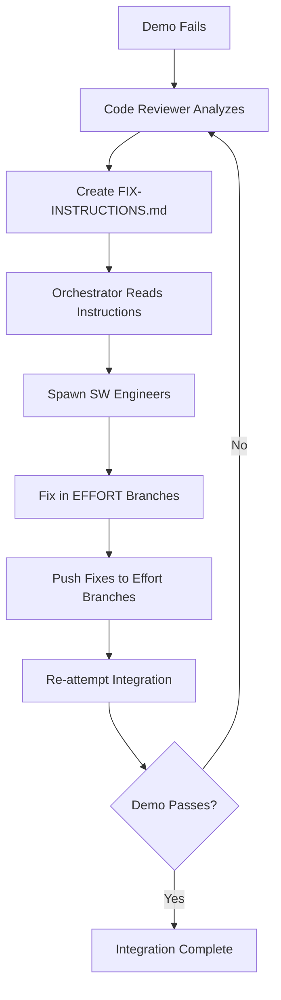

# 🚨🚨🚨 RULE R291: Integration Demo Requirement

## Classification
- **Category**: Integration Management
- **Criticality Level**: 🚨🚨🚨 BLOCKING
- **Enforcement**: MANDATORY for all integrations
- **Penalty**: -50% to -75% for violations

## The Rule

**EVERY integration at EVERY level (Wave, Phase, Project) MUST produce a working build, automated test harness, and demonstrable functionality before marking integration as complete.**

## 🚨🚨🚨 CRITICAL: DEMO MUST PASS BEFORE INTEGRATION COMPLETE 🚨🚨🚨

**Integration is NOT complete until:**
1. ✅ Demo builds successfully (no compilation errors)
2. ✅ Demo runs without errors (no runtime failures)
3. ✅ Demo shows features working (actual functionality)
4. ✅ All tests in demo pass (zero test failures)

**If demo fails:**
- ❌ Integration is BLOCKED
- ❌ Must fix issues and retry
- ❌ Cannot proceed until demo passes
- ❌ Cannot mark integration complete
- ❌ Cannot transition to next state

**THIS IS A GATE, NOT DOCUMENTATION!** The demo must actually work, not just be documented.

## Requirements

### 1. 🏗️ MANDATORY BUILD VERIFICATION

**NO INTEGRATION IS COMPLETE WITHOUT A WORKING BUILD:**

```bash
# Required for EVERY integration
verify_build() {
    echo "🏗️ Running build verification..."
    
    # 1. Clean build environment
    rm -rf dist/ build/ out/ target/
    
    # 2. Execute build with full logging
    if npm run build 2>&1 | tee build.log; then
        echo "✅ Build successful"
    else
        echo "❌ Build failed - integration incomplete!"
        exit 1
    fi
    
    # 3. Verify build artifacts exist
    if [ -d "dist" ] || [ -d "build" ] || [ -d "out" ] || [ -d "target" ]; then
        echo "✅ Build artifacts created"
        ls -la dist/ build/ out/ target/ 2>/dev/null | tee artifacts.log
    else
        echo "❌ No build artifacts found!"
        exit 1
    fi
    
    # 4. Verify executable/runnable
    if [ -f "dist/index.js" ] || [ -f "build/main" ] || [ -f "target/*.jar" ]; then
        echo "✅ Executable verified"
    else
        echo "⚠️ Verify executable manually"
    fi
}
```

**Build Requirements:**
- Must compile/build successfully
- Must produce verifiable artifacts
- Must capture build logs
- Must be runnable/executable
- Build failures = integration incomplete

### 2. 🧪 MANDATORY TEST HARNESS

**EVERY INTEGRATION MUST HAVE AN AUTOMATED TEST HARNESS:**

```bash
# Template for test-harness.sh
cat > test-harness.sh << 'EOF'
#!/bin/bash
# Integration Test Harness
echo "🧪 Starting Integration Test Suite"
echo "=================================="

FAILED=0

# Unit tests (REQUIRED)
echo "📦 Running unit tests..."
if npm test 2>&1 | tee unit-tests.log; then
    echo "✅ Unit tests passed"
else
    echo "❌ Unit tests failed"
    ((FAILED++))
fi

# Integration tests (REQUIRED)
echo "🔗 Running integration tests..."
if npm run test:integration 2>&1 | tee integration-tests.log; then
    echo "✅ Integration tests passed"
else
    echo "❌ Integration tests failed"
    ((FAILED++))
fi

# Feature verification (REQUIRED)
echo "🎯 Verifying new features..."
if ./verify-features.sh; then
    echo "✅ Features verified"
else
    echo "❌ Feature verification failed"
    ((FAILED++))
fi

echo "=================================="
if [ $FAILED -eq 0 ]; then
    echo "✅ ALL TESTS PASSED!"
    exit 0
else
    echo "❌ $FAILED test suites failed!"
    exit 1
fi
EOF

chmod +x test-harness.sh
```

**Test Harness Requirements:**
- Must be automated and repeatable
- Must test integrated functionality
- Must clearly show pass/fail status
- Must capture test logs
- Must verify new features work

### 3. 🎬 MANDATORY DEMO

**EVERY INTEGRATION MUST DEMONSTRATE WORKING FUNCTIONALITY:**

```bash
# Demo documentation template
cat > INTEGRATION-DEMO.md << 'EOF'
# Integration Demo

## Build Status
- Build: ✅ PASSING
- Tests: ✅ ALL PASSING
- Integration: ✅ COMPLETE

## Features Demonstrated
1. [Feature 1]: Working implementation with evidence
2. [Feature 2]: Integration verified with test results
3. [Feature 3]: Functionality demonstrated

## How to Run Demo
```bash
# Start application
npm start

# Run demo script
./demo-features.sh

# Verify outputs
curl http://localhost:3000/api/new-feature
```

## Evidence
- Build log: build.log
- Test results: test-results.log
- Screenshots: demos/integration/
- Demo script: demo-features.sh
EOF
```

**Demo Requirements:**
- Must create demo documentation
- Must show actual functionality working
- Must provide reproduction steps
- Must capture evidence (logs/screenshots)
- Must prove integration delivers value

### 4. Level-Specific Requirements

#### Wave Integration Demo
```bash
# Wave level requirements
- Demonstrate wave-specific features
- Show integration of all efforts in wave
- Verify no regression in previous features
- Create WAVE-DEMO.md
- Create wave-test-harness.sh
```

#### Phase Integration Demo
```bash
# Phase level requirements
- Demonstrate all waves integrated
- Show phase-level functionality complete
- Run comprehensive test suite
- Create PHASE-${N}-DEMO.md
- Create phase${N}-test-harness.sh
- Verify against phase plan deliverables
```

#### Project Integration Demo
```bash
# Project level requirements
- Demonstrate complete project functionality
- Show all phases working together
- Run full E2E test suite
- Create PROJECT-DEMO.md
- Create project-test-harness.sh
- Include performance metrics
- Include security scan results
```

## 🔧 FAILED DEMO FIX PROTOCOL

**When integration demo fails, follow this EXACT process:**

### 1. Code Reviewer Creates Fix Instructions
When demo fails (build errors, test failures, runtime issues):
```bash
# Code Reviewer analyzes failures
analyze_demo_failure() {
    echo "🔍 Analyzing demo failure..."
    
    # Check build logs
    grep -i "error\|fail" build.log > build-errors.txt
    
    # Check test logs
    grep -i "fail\|error" test-results.log > test-failures.txt
    
    # Identify affected efforts
    echo "Affected efforts:" > affected-efforts.txt
    # Trace errors back to source efforts
}

# Create fix instructions
cat > FIX-INSTRUCTIONS.md << 'EOF'
# INTEGRATION DEMO FIX INSTRUCTIONS

## Demo Failure Summary
- Build Status: ❌ FAILED
- Test Status: ❌ FAILED
- Error Type: [compilation/runtime/test]

## Root Cause Analysis
1. [Error 1]: Located in effort-X, file Y, line Z
2. [Error 2]: Located in effort-Y, file A, line B

## Required Fixes

### Effort: [effort-name-1]
**Branch**: feature/effort-name-1
**Issues**:
- [ ] Fix compilation error in src/module.ts line 45
- [ ] Update test expectations in tests/module.test.ts
- [ ] Add missing dependency to package.json

### Effort: [effort-name-2]
**Branch**: feature/effort-name-2
**Issues**:
- [ ] Fix API integration error
- [ ] Update configuration for new endpoint

## Verification Steps
1. Fix issues in effort branches
2. Run local build and tests
3. Push fixes to effort branches
4. Re-attempt integration
EOF
```

### 2. Orchestrator Receives Instructions
```bash
# Orchestrator reads fix instructions
read_fix_instructions() {
    if [ -f "FIX-INSTRUCTIONS.md" ]; then
        echo "📋 Processing fix instructions..."
        
        # Extract affected efforts
        grep "^### Effort:" FIX-INSTRUCTIONS.md | cut -d: -f2
        
        # Spawn SW Engineers for each effort
        for effort in $(get_affected_efforts); do
            spawn_sw_engineer_for_fixes "$effort"
        done
    fi
}
```

### 3. SW Engineers Fix in EFFORT BRANCHES

**⚠️⚠️⚠️ CRITICAL: ALL FIXES MUST BE IN EFFORT BRANCHES ⚠️⚠️⚠️**

```bash
# SW Engineer fixes in EFFORT branch
fix_in_effort_branch() {
    local effort_name="$1"
    local effort_branch="feature/${effort_name}"
    
    # ✅ CORRECT: Fix in effort branch
    git checkout "$effort_branch"
    
    # ❌ WRONG: Never fix in integration branch!
    # git checkout integration-wave-1  # NEVER DO THIS!
    
    # Apply fixes
    implement_fixes_from_instructions
    
    # Test locally
    npm test
    npm run build
    
    # Commit and push to effort branch
    git add -A
    git commit -m "fix: resolve integration demo failures for $effort_name"
    git push origin "$effort_branch"
}
```

**Why effort branch fixes are MANDATORY:**
- ✅ Ensures source branches are correct
- ✅ Makes future integrations work
- ✅ Prevents drift between effort and integration branches
- ✅ Maintains clean git history
- ✅ Allows proper PR reviews
- ✅ Enables rollback if needed

**NEVER fix directly in integration branch because:**
- ❌ Creates divergence from source branches
- ❌ Makes future merges conflict
- ❌ Hides problems in effort code
- ❌ Breaks traceability
- ❌ Violates CD principles

### 4. Re-attempt Integration

```bash
# After fixes are pushed to effort branches
retry_integration() {
    echo "🔄 Re-attempting integration with fixed code..."
    
    # Create fresh integration branch
    git checkout main
    git pull origin main
    git checkout -b integration-wave-X-retry-$(date +%s)
    
    # Merge fixed effort branches
    for effort_branch in $(get_effort_branches); do
        echo "Merging fixed $effort_branch..."
        git merge "origin/$effort_branch" --no-ff
    done
    
    # Build and test again
    npm install
    npm run build | tee build.log
    ./test-harness.sh | tee test-results.log
    
    # Demo must now pass!
    if ./demo-features.sh; then
        echo "✅ Demo passes! Integration can proceed"
    else
        echo "❌ Demo still failing - repeat fix protocol"
    fi
}
```

### 5. Fix Protocol State Machine



## Implementation Process

### Step 1: Build Verification
```bash
# Clean and build
make clean && make build
# or
npm run build:clean && npm run build:prod
```

### Step 2: Test Harness Creation
```bash
# Create and run test harness
./create-test-harness.sh [wave|phase|project]
./test-harness.sh
```

### Step 3: Demo Creation
```bash
# Create demo artifacts
./create-demo.sh [wave|phase|project]
# Run demo
./demo-features.sh
```

### Step 4: Verification
```bash
# Verify all requirements met
verify_integration_complete() {
    [ -f "build.log" ] || { echo "❌ Missing build log"; return 1; }
    [ -f "test-harness.sh" ] || { echo "❌ Missing test harness"; return 1; }
    [ -f "*-DEMO.md" ] || { echo "❌ Missing demo documentation"; return 1; }
    [ -d "dist" ] || [ -d "build" ] || { echo "❌ Missing build artifacts"; return 1; }
    
    echo "✅ All integration requirements met"
    return 0
}
```

## Failure Conditions

### Critical Failures (Immediate Stop)
- 🚨 No build artifacts = FAIL
- 🚨 Build doesn't compile = FAIL
- 🚨 No test harness = FAIL
- 🚨 Tests not passing = FAIL
- 🚨 No demo created = FAIL

### Grading Penalties
- Missing build verification: **-25%**
- Missing test harness: **-25%**
- Missing demo: **-25%**
- Tests failing but ignored: **-50%**
- Build broken but claimed complete: **-75%**

## Success Criteria

Before marking ANY integration complete:
- ✅ Build compiles and runs successfully
- ✅ Build artifacts verified to exist
- ✅ Test harness created and executed
- ✅ All tests passing (unit + integration)
- ✅ Demo documentation created
- ✅ Demo script functional
- ✅ Features verified working
- ✅ Evidence captured (logs, screenshots)

## Examples

### ✅ CORRECT: Complete integration
```bash
# 1. Build verification
npm run build:prod | tee build.log
ls -la dist/

# 2. Test harness
./create-test-harness.sh wave
./test-harness.sh

# 3. Demo creation
./create-demo.sh wave
./demo-wave-features.sh

# 4. Verification
./verify-integration-complete.sh
```

### ❌ WRONG: Incomplete integration
```bash
# Just merging branches without verification
git merge feature-branch
git push
echo "Integration complete"  # NO BUILD, NO TESTS, NO DEMO!
```

## Related Rules
- R034: Integration Requirements
- R282: Phase Integration Protocol
- R283: Project Integration Protocol
- R265: Integration Testing Requirements
- R263: Integration Documentation Requirements

## Enforcement

This rule is enforced at:
1. **Wave Integration** - Every wave must demo
2. **Phase Integration** - Every phase must demo
3. **Project Integration** - Final project must demo
4. **PR Reviews** - No merge without demo evidence
5. **State Transitions** - Cannot proceed without demo

## Remember

**"If it doesn't build, it doesn't work"**
**"If it doesn't test, it's not verified"**
**"If it doesn't demo, it's not complete"**

Every integration MUST prove the code actually works through building, testing, and demonstration. No exceptions!