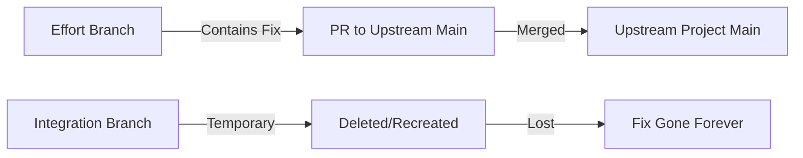

# 🔴🔴🔴 SUPREME RULE R300: Comprehensive Fix Management Protocol

## Criticality: SUPREME LAW
**Any violation of fix management protocol = -100% AUTOMATIC FAILURE**

## Description
This rule consolidates and supersedes R299, R240, R292, and R298. It establishes the ABSOLUTE requirements for where fixes go, who applies them, and how they are verified. The fundamental principle: **Effort branches are the SOURCE OF TRUTH that become PRs to upstream main - ALL fixes MUST go there.**

## 🔴🔴🔴 THE PRIME DIRECTIVE 🔴🔴🔴

**INTEGRATION BRANCHES ARE TEMPORARY. EFFORT BRANCHES ARE PERMANENT.**
- Integration branches are recreated fresh from main each time (R271)
- Fixes in integration branches are LOST on recreation
- Effort branches become PRs to the upstream project's main branch
- Therefore: ALL fixes MUST go to effort branches to persist

## Core Requirements

### 1. WHERE FIXES GO (ABSOLUTE - NO EXCEPTIONS)

#### ✅ CORRECT: Fixes Go To Effort Branches
```bash
# ALL fixes, regardless of when discovered, go to effort branches:
cd /efforts/phase${PHASE}/wave${WAVE}/${EFFORT_NAME}
git checkout effort-${EFFORT_NAME}-phase-${PHASE}-wave-${WAVE}

# Apply fix
vim src/broken_file.go
git add -A
git commit -m "fix: [description of fix]"
git push origin HEAD

# This fix will:
# - Persist in the effort branch
# - Be included in the PR to upstream main
# - Be available for all future integration attempts
```

#### ❌ FORBIDDEN: Fixes in Integration Branches
```bash
# NEVER DO THIS - AUTOMATIC FAILURE:
cd /efforts/phase${PHASE}/wave${WAVE}/integration
git checkout integration-phase-${PHASE}-wave-${WAVE}
vim src/broken_file.go  # ❌ WRONG!
git commit -m "fix: patch integration"  # ❌ LOSES FIX!
# This fix disappears when integration branch is recreated!
```

### 2. WHO APPLIES FIXES (DELEGATION REQUIREMENT)

#### Orchestrator Role (COORDINATION ONLY)
```bash
# Orchestrator MUST:
spawn_sw_engineer_for_fixes() {
    echo "🔍 Detected fixes needed in ${EFFORT_NAME}"
    echo "@agent-software-engineer Fix issues in effort branch ${EFFORT_NAME}"
    # Create fix instructions
    # Monitor progress
    # Verify completion
}

# Orchestrator MUST NOT:
# - Write any code
# - Modify any files
# - Apply any fixes directly
# VIOLATION = -100% AUTOMATIC FAILURE
```

#### SW Engineer Role (EXECUTION)
```bash
# SW Engineer in FIX_ISSUES state MUST:
apply_fixes_to_effort_branch() {
    # 1. Verify location
    pwd  # Must be /efforts/phase*/wave*/effort-*
    git branch --show-current  # Must be effort-* branch
    
    # 2. Apply fixes
    # Read fix requirements
    # Implement changes
    # Test locally
    
    # 3. Commit to effort branch
    git add -A
    git commit -m "fix: [specific description]"
    git push origin HEAD
    
    # 4. Mark completion
    echo "Fixed in $(git branch --show-current)" > FIX_COMPLETE.flag
}
```

### 3. VERIFICATION PROTOCOL (MANDATORY BEFORE RE-INTEGRATION)

#### Pre-Integration Verification
```bash
# MUST run before ANY re-integration attempt:
verify_all_fixes_in_effort_branches() {
    local PHASE=$1
    local WAVE=$2
    local ALL_FIXES_VERIFIED=true
    
    echo "🔍 R300 VERIFICATION: Checking all fixes are in effort branches"
    
    # Check each effort that needed fixes
    for effort in $(jq '.efforts_with_fixes[]' orchestrator-state.json); do
        EFFORT_BRANCH="effort-${effort}-phase-${PHASE}-wave-${WAVE}"
        
        # Verify fix commits exist
        git fetch origin ${EFFORT_BRANCH}
        FIX_COMMITS=$(git log origin/${EFFORT_BRANCH} --oneline --grep="^fix:" --since="4 hours ago")
        
        if [ -z "$FIX_COMMITS" ]; then
            echo "❌ CRITICAL: No fixes in ${EFFORT_BRANCH}!"
            ALL_FIXES_VERIFIED=false
        else
            echo "✅ Fixes found in ${EFFORT_BRANCH}:"
            echo "$FIX_COMMITS"
        fi
        
        # Verify pushed to remote
        LOCAL=$(git rev-parse ${EFFORT_BRANCH} 2>/dev/null || echo "none")
        REMOTE=$(git rev-parse origin/${EFFORT_BRANCH} 2>/dev/null || echo "none")
        
        if [ "$LOCAL" != "$REMOTE" ]; then
            echo "❌ Fixes not pushed to remote!"
            ALL_FIXES_VERIFIED=false
        fi
    done
    
    # Check integration branch has NO direct fixes
    if git log integration-* --oneline --grep="^fix:" 2>/dev/null | grep -q "fix:"; then
        echo "🔴 VIOLATION: Fixes found in integration branch!"
        echo "🔴 This violates R300 - fixes must be in effort branches!"
        ALL_FIXES_VERIFIED=false
    fi
    
    if [ "$ALL_FIXES_VERIFIED" = false ]; then
        echo "🔴🔴🔴 R300 VERIFICATION FAILED 🔴🔴🔴"
        echo "Cannot proceed with integration until all fixes are in effort branches"
        exit 1
    fi
    
    echo "✅ R300 VERIFICATION PASSED: All fixes in effort branches"
    return 0
}
```

### 4. INTEGRATION RETRY WORKFLOW

#### The ONLY Correct Workflow
```
1. Integration attempt fails (build/test/demo)
   ↓
2. Identify which effort(s) need fixes
   ↓
3. Orchestrator spawns SW Engineer(s) for each effort
   ↓
4. SW Engineers fix in effort branches
   ↓
5. SW Engineers push fixes to remote effort branches
   ↓
6. Orchestrator verifies fixes in effort branches (R300)
   ↓
7. Create NEW integration branch from main (R271)
   ↓
8. Merge ALL effort branches (now containing fixes)
   ↓
9. Test integration again
```

## Why This Matters

### Effort Branches → Upstream PRs


### The Disaster of Integration Branch Fixes
```
Day 1: Fix in integration branch → Works temporarily
Day 2: New integration branch created → Fix lost
Day 3: Same bug reappears → Fix again in integration
Day 4: New integration branch created → Fix lost again
... Infinite loop of rework ...
```

### The Success of Effort Branch Fixes
```
Day 1: Fix in effort branch → Persists
Day 2: New integration includes fix → Works
Day 3: PR created with fix → Ready for upstream
Day 4: Merged to upstream main → Fix permanent
```

## State-Specific Requirements

### ERROR_RECOVERY State (Orchestrator)
```bash
# Parse error reports to identify affected efforts
# Spawn SW Engineers with explicit effort branch instructions
# Monitor fix progress in effort branches
# Verify R300 compliance before retry
```

### FIX_ISSUES State (SW Engineer)
```bash
# IMMEDIATELY verify in effort directory
# IMMEDIATELY verify on effort branch
# Apply ALL fixes to effort branch
# Push to remote effort branch
# Create completion marker in effort directory
```

### FIX_INTEGRATION_ISSUES State (SW Engineer)
```bash
# Same as FIX_ISSUES but with integration context
# Still MUST fix in effort branch
# Never touch integration branch directly
```

### MONITORING_FIX_PROGRESS State (Orchestrator)
```bash
# Check for FIX_COMPLETE.flag in effort directories
# Verify fixes pushed to remote effort branches
# Run R300 verification before proceeding
```

## Enforcement Checkpoints

### 1. At Fix Assignment
- Orchestrator MUST specify effort branch in instructions
- SW Engineer MUST verify correct branch before starting

### 2. During Fix Application
- All changes MUST be in effort directory
- All commits MUST be to effort branch
- All pushes MUST be to effort remote

### 3. Before Re-Integration
- Run full R300 verification
- Block if ANY fixes missing from effort branches
- Block if ANY fixes found in integration branch

### 4. During Code Review
- Reviewer MUST verify fixes are in effort branches
- Reviewer MUST flag any integration branch fixes

## Common Scenarios

### Scenario 1: Build Failure During Integration
```bash
# ✅ CORRECT:
orchestrator: "Build failed in api module from effort-api"
orchestrator: "@agent-software-engineer Fix build in effort-api branch"
sw-engineer: cd /efforts/phase1/wave1/effort-api
sw-engineer: git checkout effort-api-phase-1-wave-1
sw-engineer: [applies fix]
sw-engineer: git push origin HEAD
orchestrator: verify_all_fixes_in_effort_branches 1 1
orchestrator: "Creating new integration with fixed efforts"

# ❌ WRONG:
orchestrator: cd integration
orchestrator: vim api.go  # VIOLATION!
```

### Scenario 2: Test Failure After Merge
```bash
# ✅ CORRECT:
code-reviewer: "Tests fail due to effort-auth changes"
orchestrator: "@agent-software-engineer Fix tests in effort-auth branch"
sw-engineer: [fixes in effort-auth branch]
orchestrator: [verifies and re-integrates]

# ❌ WRONG:
sw-engineer: cd integration
sw-engineer: [patches tests]  # VIOLATION!
```

### Scenario 3: Emergency Hotfix
```bash
# ✅ CORRECT (even for emergencies):
orchestrator: "Critical bug found during demo"
orchestrator: "@agent-software-engineer URGENT fix in effort-core branch"
sw-engineer: [fixes in effort-core branch with urgency]
orchestrator: [verifies and re-integrates]

# ❌ WRONG (no exceptions for emergencies):
orchestrator: "Let me quickly patch integration"  # VIOLATION!
```

## Grading Impact

### AUTOMATIC FAILURE (-100%)
- Any fix applied directly to integration branch
- Orchestrator writing code or applying fixes
- Proceeding without R300 verification
- Claiming fixes complete but effort branches unchanged

### MAJOR VIOLATIONS (-50%)
- Fixes not pushed to remote effort branches
- Incomplete verification before re-integration
- Unclear instructions about fix location
- Missing completion markers

### COMPLIANCE BONUS (+25%)
- All fixes properly in effort branches
- Full R300 verification before each integration
- Clear delegation to SW Engineers
- Perfect fix tracking and verification

## Quick Reference Checklist

Before ANY fix:
- [ ] Identify which effort branch needs the fix
- [ ] Spawn SW Engineer for that effort (never fix as orchestrator)
- [ ] SW Engineer verifies in effort directory
- [ ] SW Engineer verifies on effort branch

During fix:
- [ ] All changes in effort directory only
- [ ] All commits to effort branch only
- [ ] Push to remote effort branch

After fix:
- [ ] FIX_COMPLETE.flag in effort directory
- [ ] Fix commits visible in effort branch history
- [ ] Remote effort branch updated

Before re-integration:
- [ ] Run verify_all_fixes_in_effort_branches()
- [ ] Confirm NO fixes in integration branch
- [ ] Confirm ALL fixes in effort branches
- [ ] Create fresh integration branch from main

## Related Rules
- R271: Integration Testing Branch Creation (fresh from main)
- R209: Effort Directory Isolation Protocol
- R197: One Agent Per Effort
- R006: Orchestrator Never Writes Code

## Critical Reminders

**"Fix at the source (effort), not the symptom (integration)"**
**"Integration branches die and are reborn - effort branches live forever"**
**"Today's integration fix is tomorrow's lost work"**
**"Effort branches become PRs - make them production-ready"**

## This Rule Supersedes
- R299: Fix Application to Effort Branches (consolidated here)
- R240: Integration Fix Execution Protocol (consolidated here)
- R292: Integration Fixes in Effort Branches (consolidated here)
- R298: Fix Backporting Verification Protocol (consolidated here)

Remember: The goal is for effort branches to be 100% ready to become PRs against the upstream project's main branch. Every fix must be there, not in temporary integration branches.