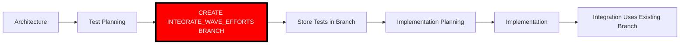

# 🔴🔴🔴 RULE R342: Early Integration Branch Creation Protocol

## Classification
- **Category**: Test Management
- **Criticality Level**: 🔴🔴🔴 SUPREME
- **Enforcement**: MANDATORY for all test levels
- **Penalty**: -50% to -100% for violations
- **Related Rules**: R341 (TDD), R308 (Incremental Branching), R336 (Wave Integration)

## The Rule

**INTEGRATE_WAVE_EFFORTS BRANCHES MUST BE CREATED IMMEDIATELY AFTER TEST PLANNING TO STORE TESTS!**

Tests require immediate git tracking and must be available in their final location before implementation begins. Creating integration branches early solves test storage and ensures tests are versioned from creation.

## 🔴🔴🔴 SUPREME LAW: TESTS NEED HOMES IMMEDIATELY 🔴🔴🔴

**THE EARLY BRANCH CREATION FLOW IS MANDATORY:**



**CRITICAL REQUIREMENTS:**
1. **After Test Planning** → MUST create integration branch IMMEDIATELY
2. **Tests Stored** → MUST commit tests to integration branch
3. **Branch Pushed** → MUST push to remote for tracking
4. **Tests Available** → Implementation MUST reference tests from branch
5. **No Duplication** → Tests exist in ONE location only

**VIOLATION = LOST TESTS = -100% GRADE**

## Required Branch Creation Points

### 1. Project Integration Branch

**WHEN**: Immediately after PROJECT_TEST_PLANNING completes

```bash
# State: CREATE_PROJECT_INTEGRATION_BRANCH_EARLY
create_project_integration_branch() {
    echo "🔴 R342: Creating project integration branch for test storage"
    
    # Create in proper workspace (R104/R250/R271 - direct cloning)
    PROJECT_DIR="/efforts/project/integration-workspace"
    rm -rf "$PROJECT_DIR"

    # Clone target repository DIRECTLY (R250 - NO subdirectories!)
    git clone --single-branch --branch "main" "$TARGET_REPO" "$PROJECT_DIR"
    cd "$PROJECT_DIR"  # Now IN the git repository

    # Create branch from main
    git checkout -b project-integration
    
    # Store project tests
    mkdir -p tests/project
    cp -r "$CLAUDE_PROJECT_DIR/project-tests/"* tests/project/
    
    # Commit and push
    git add tests/
    git commit -m "test: project-level tests (R341 TDD, R342 early branch)"
    git push -u origin project-integration
    
    echo "✅ R342 COMPLIANT: Branch created with tests"
}
```

### 2. Phase Integration Branch

**WHEN**: Immediately after PHASE_TEST_PLANNING completes

```bash
# State: CREATE_INTEGRATE_PHASE_WAVES_BRANCH_EARLY
create_phase_integration_branch() {
    local PHASE=$1
    echo "🔴 R342: Creating phase $PHASE integration branch"
    
    # R308: Determine base branch
    if [ $PHASE -eq 1 ]; then
        BASE="project-integration"  # Build on project tests
    else
        BASE="phase-$((PHASE-1))-integration"  # Previous phase
    fi
    
    # Create in proper workspace (R250/R271 - direct cloning)
    PHASE_DIR="/efforts/phase${PHASE}/integration-workspace"
    rm -rf "$PHASE_DIR"

    # Clone DIRECTLY into integration-workspace (R250 - NO subdirectories!)
    git clone --single-branch --branch "$BASE" "$TARGET_REPO" "$PHASE_DIR"
    cd "$PHASE_DIR"  # Now IN the git repository
    git checkout -b "phase-${PHASE}-integration" "$BASE"
    
    # Store phase tests
    mkdir -p "tests/phase${PHASE}"
    cp -r "$CLAUDE_PROJECT_DIR/phase-tests/phase-${PHASE}/"* \
          "tests/phase${PHASE}/"
    
    # Commit and push
    git add tests/
    git commit -m "test: phase ${PHASE} tests (R341 TDD, R342 early branch)"
    git push -u origin "phase-${PHASE}-integration"
}
```

### 3. Wave Integration Branch

**WHEN**: Immediately after WAVE_TEST_PLANNING completes

```bash
# State: CREATE_WAVE_INTEGRATION_BRANCH_EARLY
create_wave_integration_branch() {
    local PHASE=$1
    local WAVE=$2
    echo "🔴 R342: Creating wave $WAVE integration branch"
    
    # R336: Determine base branch
    if [ $WAVE -eq 1 ]; then
        BASE="phase-${PHASE}-integration"  # Phase base
    else
        BASE="phase-${PHASE}-wave-$((WAVE-1))-integration"  # Previous wave
    fi
    
    # Create in proper workspace (R250/R271 - direct cloning)
    WAVE_DIR="/efforts/phase${PHASE}/wave${WAVE}/integration-workspace"
    rm -rf "$WAVE_DIR"

    # Clone DIRECTLY into integration-workspace (R250 - NO subdirectories!)
    git clone --single-branch --branch "$BASE" "$TARGET_REPO" "$WAVE_DIR"
    cd "$WAVE_DIR"  # Now IN the git repository
    git checkout -b "phase-${PHASE}-wave-${WAVE}-integration" "$BASE"
    
    # Store wave tests
    mkdir -p "tests/phase${PHASE}/wave${WAVE}"
    cp -r "$CLAUDE_PROJECT_DIR/wave-tests/phase-${PHASE}/wave-${WAVE}/"* \
          "tests/phase${PHASE}/wave${WAVE}/"
    
    # Commit and push
    git add tests/
    git commit -m "test: wave ${WAVE} tests (R341 TDD, R342 early branch)"
    git push -u origin "phase-${PHASE}-wave-${WAVE}-integration"
}
```

## Test Storage Requirements

### Directory Structure in Integration Branches

```
integration-branch/
├── tests/
│   ├── project/              # Project-level tests (if project branch)
│   │   ├── *.test.*
│   │   └── PROJECT-TEST-HARNESS.sh
│   │
│   ├── phase1/               # Phase 1 tests (if phase 1+ branch)
│   │   ├── *.test.*
│   │   ├── PHASE-1-TEST-HARNESS.sh
│   │   │
│   │   └── wave1/            # Wave 1 tests (if wave 1+ branch)
│   │       ├── *.test.*
│   │       └── WAVE-1-TEST-HARNESS.sh
│   │
│   └── [accumulated tests from base branches per R308]
```

### Test Accumulation Pattern (R308 Compliant)

```
project-integration branch contains:
  → tests/project/*

phase-1-integration branch contains:
  → tests/project/* (inherited)
  → tests/phase1/*

phase-1-wave-1-integration branch contains:
  → tests/project/* (inherited)
  → tests/phase1/* (inherited)
  → tests/phase1/wave1/*

phase-1-wave-2-integration branch contains:
  → tests/project/* (inherited)
  → tests/phase1/* (inherited)
  → tests/phase1/wave1/* (inherited)
  → tests/phase1/wave2/*
```

## Enforcement Protocol

### Orchestrator Enforcement

```bash
# In test planning completion states
enforce_r342_early_branch_creation() {
    local test_type=$1  # project|phase|wave
    
    echo "🔴 R342 ENFORCEMENT: Creating integration branch for $test_type tests"
    
    # Check tests exist
    case "$test_type" in
        project)
            [ ! -f "PROJECT-TEST-PLAN.md" ] && {
                echo "❌ R342 VIOLATION: No tests to store!"
                exit 342
            }
            transition_to "CREATE_PROJECT_INTEGRATION_BRANCH_EARLY"
            ;;
        phase)
            [ ! -f "PHASE-TEST-PLAN.md" ] && {
                echo "❌ R342 VIOLATION: No tests to store!"
                exit 342
            }
            transition_to "CREATE_INTEGRATE_PHASE_WAVES_BRANCH_EARLY"
            ;;
        wave)
            [ ! -f "WAVE-TEST-PLAN.md" ] && {
                echo "❌ R342 VIOLATION: No tests to store!"
                exit 342
            }
            transition_to "CREATE_WAVE_INTEGRATION_BRANCH_EARLY"
            ;;
    esac
}
```

### Integration Agent Validation

```bash
# When starting integration work
validate_r342_tests_exist() {
    local branch_type=$1
    
    echo "🔴 R342 VALIDATION: Checking tests exist in branch"
    
    # Tests MUST already be in the branch
    if [ ! -d "tests/" ]; then
        echo "❌ R342 VIOLATION: Integration branch has no tests!"
        echo "Tests should have been added when branch was created"
        exit 342
    fi
    
    # Verify test harness exists
    local harness=$(find tests/ -name "*TEST-HARNESS.sh" | head -1)
    if [ -z "$harness" ]; then
        echo "❌ R342 VIOLATION: No test harness found!"
        exit 342
    fi
    
    echo "✅ R342 COMPLIANT: Tests found in integration branch"
}
```

## Benefits of Early Branch Creation

### 1. Immediate Git Tracking
- Tests committed as soon as created
- Full version history from inception
- No orphaned test files

### 2. Single Source of Truth
- Tests live in one place only
- No synchronization needed
- Clear ownership and location

### 3. Simplified Integration
- Integration branch already exists
- Tests already present
- No copying or moving needed

### 4. TDD Compliance
- Tests committed before implementation
- Clear audit trail
- Enforces test-first approach

### 5. Reduced Complexity
- No temporary storage
- No deferred operations
- Clean, linear flow

## Failure Conditions

### Critical Violations (-100% IMMEDIATE FAILURE)
- 🚨 Not creating integration branch after test planning
- 🚨 Tests not committed to integration branch
- 🚨 Integration branch created without tests
- 🚨 Tests stored in multiple locations
- 🚨 Tests lost due to no branch creation

### Major Violations (-50%)
- ⚠️ Branch created but not pushed
- ⚠️ Tests incomplete when branch created
- ⚠️ Wrong base branch used (violates R308/R336)
- ⚠️ Branch naming convention violated

## Interaction with Other Rules

### Dependencies
- **R341**: Tests must be created first (TDD)
- **R308**: Incremental branching strategy
- **R336**: Wave integration before next wave
- **R104**: Target repository isolation

### Enables
- **R265**: Integration testing (tests already in branch)
- **R035**: Phase completion testing (tests available)
- **R272**: Integration testing branch (builds on early branches)

## State Machine Integration

### Required State Sequence

```yaml
# Project Level
WAITING_FOR_MASTER_ARCHITECTURE →
SPAWN_CODE_REVIEWER_PROJECT_TEST_PLANNING →
WAITING_FOR_PROJECT_TEST_PLAN →
CREATE_PROJECT_INTEGRATION_BRANCH_EARLY → # R342 ENFORCEMENT
INIT

# Phase Level
WAITING_FOR_ARCHITECTURE_PLAN →
SPAWN_CODE_REVIEWER_PHASE_TEST_PLANNING →
WAITING_FOR_PHASE_TEST_PLAN →
CREATE_INTEGRATE_PHASE_WAVES_BRANCH_EARLY → # R342 ENFORCEMENT
SPAWN_CODE_REVIEWER_PHASE_IMPL

# Wave Level
WAITING_FOR_ARCHITECTURE_PLAN →
SPAWN_CODE_REVIEWER_WAVE_TEST_PLANNING →
WAITING_FOR_WAVE_TEST_PLAN →
CREATE_WAVE_INTEGRATION_BRANCH_EARLY → # R342 ENFORCEMENT
SPAWN_CODE_REVIEWER_WAVE_IMPL
```

## Migration Guide

### For Existing Projects

```bash
# If tests exist but no integration branch
migrate_to_r342() {
    # Find existing tests
    local test_locations=(
        "project-tests/"
        "phase-tests/"
        "wave-tests/"
        "tests/"
    )
    
    # Create integration branches retroactively
    for location in "${test_locations[@]}"; do
        if [ -d "$location" ]; then
            echo "📦 Migrating tests from $location"
            # Create appropriate integration branch
            # Move tests to branch
            # Commit and push
        fi
    done
}
```

### For New Projects

- Follow new state flow from start
- Integration branches created automatically
- Tests stored immediately

## Success Criteria

### Project Level
- ✅ Project integration branch exists after project test planning
- ✅ Project tests committed to branch
- ✅ Branch pushed to remote
- ✅ Tests accessible for implementation

### Phase Level
- ✅ Phase integration branch exists after phase test planning
- ✅ Inherits from correct base (R308)
- ✅ Phase tests added to existing project tests
- ✅ Branch ready for wave additions

### Wave Level
- ✅ Wave integration branch exists after wave test planning
- ✅ Inherits from previous wave or phase (R336)
- ✅ Wave tests added to accumulated tests
- ✅ Branch ready for effort integration

## Examples

### ✅ CORRECT: Early Branch Creation

```bash
# 1. Architecture complete
echo "Architecture defines structure"

# 2. Test planning
/spawn-agent code-reviewer --state PROJECT_TEST_PLANNING
# Creates tests

# 3. CREATE BRANCH IMMEDIATELY (R342)
create_project_integration_branch_early
# Branch: project-integration
# Contains: tests/project/*

# 4. Implementation planning
/spawn-agent code-reviewer --state IMPLEMENTATION_PLANNING
# References tests from branch

# 5. Later integration uses existing branch
cd /efforts/project/integration-workspace/target-repo
git checkout project-integration  # Already has tests!
```

### ❌ WRONG: Deferred Branch Creation

```bash
# 1. Architecture complete
# 2. Test planning
# 3. NO BRANCH CREATED (VIOLATION!)
# 4. Tests sitting in temp directory
# 5. Implementation starts
# 6. Integration creates branch (TOO LATE!)
# Tests not tracked, possibly lost
```

## Remember

**"Tests need homes immediately"**
**"Branch early, test early, integrate smoothly"**
**"No branch, no tests, no grade"**

EARLY INTEGRATE_WAVE_EFFORTS BRANCH CREATION IS NOT OPTIONAL - IT IS THE LAW!