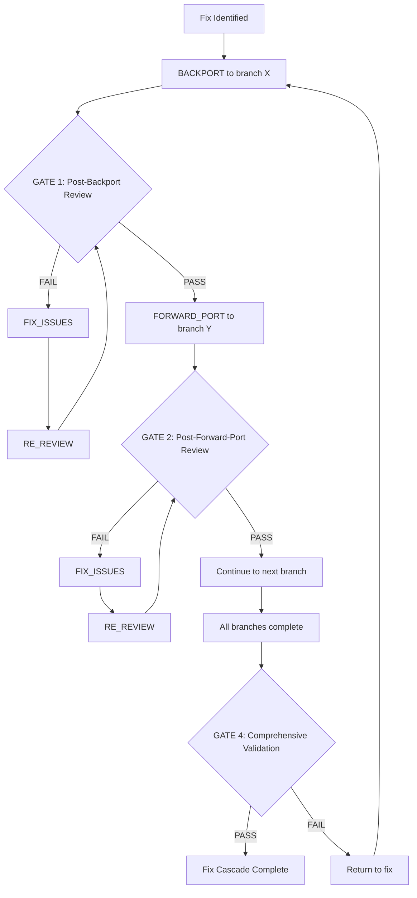

# 🔴🔴🔴 RULE R376: FIX CASCADE QUALITY GATES 🔴🔴🔴

## SUPREME LAW - EVERY FIX CASCADE REQUIRES COMPREHENSIVE QUALITY CONTROL

**CRITICALITY:** SUPREME LAW - Violation = -100% AUTOMATIC FAILURE
**PRIORITY:** P0 - HIGHEST
**ENFORCEMENT:** MANDATORY - NO EXCEPTIONS

## 🚨🚨🚨 THE FIX CASCADE QUALITY MANDATE 🚨🚨🚨

**FIX CASCADE OPERATIONS MUST PASS THROUGH QUALITY GATES AT EVERY STEP!**

A single bad fix can corrupt multiple branches and cause cascading failures across the entire codebase. Therefore, fix cascade operations require MULTIPLE quality gates to ensure fixes are correct, complete, and don't introduce new problems.

## 🔴 CORE PRINCIPLE: BAD FIXES CASCADE BAD CODE

### Why Fix Cascade Quality Gates Are MANDATORY:
1. **Error Propagation** - Bad fixes spread to ALL branches
2. **Compound Failures** - Each bad merge makes things worse
3. **Hidden Regressions** - Issues may only appear in certain branches
4. **Integration Complexity** - Fixes interact with different code in each branch
5. **Build Breakage** - One bad fix can break multiple builds
6. **Test Cascade** - Failed tests multiply across branches

## 🚨🚨🚨 MANDATORY QUALITY GATES 🚨🚨🚨

### GATE 1: POST-BACKPORT REVIEW
**After EVERY backport operation:**
```bash
# MANDATORY after backporting fix to ANY branch
post_backport_gate() {
    local branch="$1"
    local fix_commits="$2"

    echo "🔴 GATE 1: Post-Backport Review (R376)"

    # 1. Verify fix applied correctly
    cd /efforts/fix-cascade/$branch
    git log --oneline -5

    # 2. Build verification
    make build || {
        echo "❌ BUILD FAILED after backport to $branch"
        return 1
    }

    # 3. Test verification
    make test || {
        echo "❌ TESTS FAILED after backport to $branch"
        return 1
    }

    # 4. Code review requirement
    /spawn-code-reviewer \
        --fix-cascade-mode=true \
        --review-type=post-backport \
        --branch=$branch \
        --focus="fix-correctness,build-success,test-pass"

    # 5. Cannot proceed until review passes
    wait_for_review "post-backport-$branch" || {
        echo "❌ Review failed - must fix issues before continuing"
        return 1
    }

    echo "✅ Gate 1 PASSED for $branch"
}
```

### GATE 2: POST-FORWARD-PORT REVIEW
**After EVERY forward-port operation:**
```bash
# MANDATORY after forward-porting fix to ANY branch
post_forward_port_gate() {
    local branch="$1"
    local fix_commits="$2"

    echo "🔴 GATE 2: Post-Forward-Port Review (R376)"

    # Similar checks as Gate 1, plus:
    # - Verify no new conflicts introduced
    # - Check fix still works in new context
    # - Validate integration with newer code

    /spawn-code-reviewer \
        --fix-cascade-mode=true \
        --review-type=post-forward-port \
        --branch=$branch \
        --focus="integration-correctness,no-regressions"

    wait_for_review "post-forward-port-$branch" || {
        echo "❌ Forward-port review failed"
        return 1
    }

    echo "✅ Gate 2 PASSED for $branch"
}
```

### GATE 3: CONFLICT RESOLUTION REVIEW
**After ANY conflict resolution:**
```bash
# MANDATORY after resolving merge conflicts
conflict_resolution_gate() {
    local branch="$1"
    local conflicts_file="$2"

    echo "🔴 GATE 3: Conflict Resolution Review (R376)"

    # 1. Verify no conflict markers remain
    grep -r "<<<<<<\|======\|>>>>>>" . && {
        echo "❌ Conflict markers still present!"
        return 1
    }

    # 2. Verify both sides properly merged
    # 3. Check no code was lost
    # 4. Validate resolution logic

    /spawn-code-reviewer \
        --fix-cascade-mode=true \
        --review-type=conflict-resolution \
        --branch=$branch \
        --conflicts=$conflicts_file

    wait_for_review "conflict-resolution-$branch" || {
        echo "❌ Conflict resolution review failed"
        return 1
    }

    echo "✅ Gate 3 PASSED for $branch"
}
```

### GATE 4: COMPREHENSIVE FINAL VALIDATION
**Before completing fix cascade:**
```bash
# MANDATORY comprehensive review of ALL changes
comprehensive_validation_gate() {
    echo "🔴 GATE 4: Comprehensive Fix Validation (R376)"

    # 1. Build ALL modified branches
    echo "📊 Building all branches..."
    for branch in $(jq -r '.fix_cascade.branches_modified[]' orchestrator-state.json); do
        cd /efforts/fix-cascade/$branch
        make build || {
            echo "❌ Build failed on branch: $branch"
            return 1
        }
    done

    # 2. Run ALL test suites
    echo "🧪 Running all test suites..."
    for branch in $(jq -r '.fix_cascade.branches_modified[]' orchestrator-state.json); do
        cd /efforts/fix-cascade/$branch
        make test || {
            echo "❌ Tests failed on branch: $branch"
            return 1
        }
    done

    # 3. Run functional tests (if present)
    echo "🔧 Running functional tests..."
    if [[ -f "Makefile" ]] && grep -q "functional-test" Makefile; then
        make functional-test || {
            echo "❌ Functional tests failed"
            return 1
        }
    fi

    # 4. Verify fix resolves original issue
    echo "🎯 Verifying fix resolution..."
    # Run specific test or check that demonstrates fix works
    verify_fix_resolves_issue || {
        echo "❌ Fix does not resolve original issue!"
        return 1
    }

    # 5. Comprehensive code review
    /spawn-code-reviewer \
        --fix-cascade-mode=true \
        --review-type=comprehensive-validation \
        --all-branches=true \
        --checklist="build,test,functional,fix-verification,no-regressions"

    wait_for_review "comprehensive-validation" || {
        echo "❌ Comprehensive validation failed"
        return 1
    }

    echo "✅ Gate 4 PASSED - Fix cascade validated"
}
```

## 🚨 ENFORCEMENT FLOW



## 🔴 FIX CASCADE STATE TRACKING

### Required State Machine Extensions:

```json
{
  "fix_cascade": {
    "quality_gates": {
      "gate_1_backport": {
        "status": "pending|in_progress|passed|failed",
        "branches_reviewed": ["branch1", "branch2"],
        "failures": []
      },
      "gate_2_forward_port": {
        "status": "pending|in_progress|passed|failed",
        "branches_reviewed": ["branch3", "branch4"],
        "failures": []
      },
      "gate_3_conflict_resolution": {
        "status": "pending|in_progress|passed|failed",
        "conflicts_reviewed": ["branch2", "branch4"],
        "failures": []
      },
      "gate_4_comprehensive": {
        "status": "pending|in_progress|passed|failed",
        "build_status": {},
        "test_status": {},
        "functional_status": {},
        "fix_verification": {},
        "review_status": {}
      }
    },
    "current_gate": "gate_1_backport",
    "gates_passed": ["gate_1_backport"],
    "gates_failed": [],
    "retry_count": 0,
    "max_retries": 3
  }
}
```

## 🚨 ORCHESTRATOR ERROR_RECOVERY ENFORCEMENT

### In ERROR_RECOVERY States:

```bash
# New sub-states for fix cascade quality control
FIX_CASCADE_SUBSTATES="
    BACKPORT_IN_PROGRESS
    BACKPORT_REVIEW_PENDING
    BACKPORT_FIX_ISSUES
    FORWARD_PORT_IN_PROGRESS
    FORWARD_PORT_REVIEW_PENDING
    FORWARD_PORT_FIX_ISSUES
    COMPREHENSIVE_REVIEW_PENDING
    FIX_CASCADE_COMPLETE
"

# State transition enforcement
fix_cascade_state_transition() {
    local current_state="$1"
    local gate_result="$2"

    case "$current_state" in
        BACKPORT_IN_PROGRESS)
            if [[ "$gate_result" == "complete" ]]; then
                NEXT_STATE="BACKPORT_REVIEW_PENDING"
                echo "🔴 R376: Transitioning to mandatory review"
            fi
            ;;
        BACKPORT_REVIEW_PENDING)
            if [[ "$gate_result" == "passed" ]]; then
                NEXT_STATE="FORWARD_PORT_IN_PROGRESS"
            elif [[ "$gate_result" == "failed" ]]; then
                NEXT_STATE="BACKPORT_FIX_ISSUES"
                echo "❌ Review failed - must fix issues"
            fi
            ;;
        *)
            echo "State transition logic for $current_state"
            ;;
    esac

    # Update state file
    jq --arg state "$NEXT_STATE" '.current_state = $state' orchestrator-state.json > tmp.json
    mv tmp.json orchestrator-state.json
}
```

## 🔴 FIX VALIDATION CHECKLIST

### Mandatory Verification Points:

```markdown
# FIX CASCADE VALIDATION CHECKLIST

## Per-Branch Checks
For each modified branch:
- [ ] Fix commits applied successfully
- [ ] Build succeeds with `make build`
- [ ] Unit tests pass with `make test`
- [ ] No merge conflict markers present
- [ ] Code review completed and passed
- [ ] No regressions introduced

## Integration Checks
- [ ] Fix works correctly in oldest branch
- [ ] Fix works correctly in newest branch
- [ ] Fix works correctly in production branch
- [ ] No version-specific issues
- [ ] Dependencies resolved properly

## Comprehensive Validation
- [ ] Original issue is resolved
- [ ] Functional tests pass (if present)
- [ ] Performance not degraded
- [ ] Security not compromised
- [ ] Documentation updated if needed
- [ ] All quality gates passed

## Sign-off Requirements
- [ ] SW Engineer confirms fix complete
- [ ] Code Reviewer approves changes
- [ ] Orchestrator validates process
- [ ] All automated checks green
```

## 🚨 GRADING CRITERIA

### PASS Conditions (+100%):
- ✅ ALL quality gates enforced
- ✅ Every code change reviewed
- ✅ All builds successful
- ✅ All tests passing
- ✅ Fix verified to work
- ✅ No regressions introduced

### FAIL Conditions (-100%):
- ❌ Skipping any quality gate
- ❌ Proceeding without review
- ❌ Ignoring build failures
- ❌ Ignoring test failures
- ❌ Fix doesn't resolve issue
- ❌ Introducing new bugs

## 🔴 THE FIX CASCADE MANTRA

```
Quality gates protect the code,
From bad fixes taking hold.
Review each change, test each build,
Or watch your codebase get killed.

Gate by gate, we verify,
That our fixes truly fly.
Skip a gate, and you will see,
Cascading failures, guarantee!

R376 stands watch at every door,
Quality control forevermore!
```

## 🚨 CRITICAL IMPLEMENTATION NOTES

1. **NO SHORTCUTS** - Every gate is mandatory
2. **NO BATCHING** - Review each change immediately
3. **NO ASSUMPTIONS** - Verify everything explicitly
4. **NO RUSHING** - Quality over speed
5. **NO EXCEPTIONS** - Rules apply to emergency fixes too

## RELATED RULES

- **R354**: Post-Rebase and Fix Cascade Review Requirement
- **R327**: Mandatory Re-Integration After Fixes
- **R290**: Comprehensive Unit Test Protocol
- **R296**: Build Validation Enforcement
- **R352**: Overlapping Cascade Protocol

---

**REMEMBER:** A bad fix is worse than no fix. It corrupts multiple branches, wastes time on debugging, and erodes confidence in the codebase. Quality gates are your protection against cascade corruption.

**Violation of R376 = -100% AUTOMATIC FAILURE**