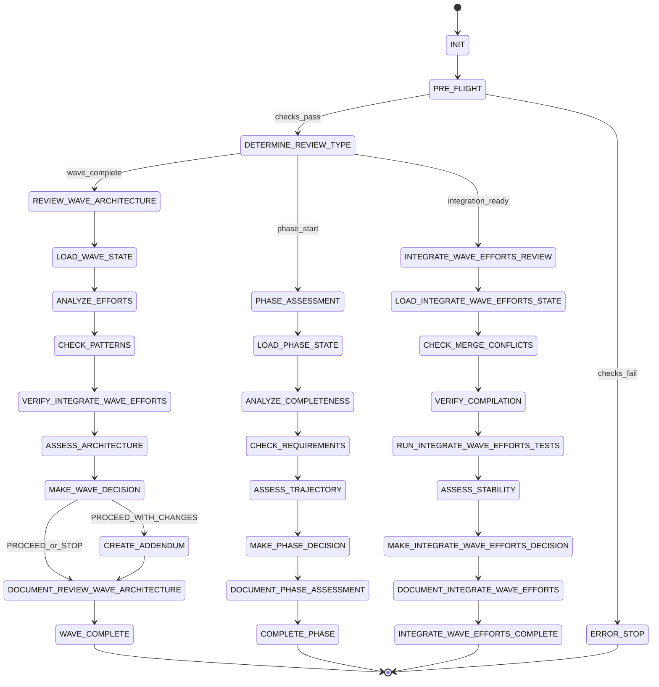

# ⚠️ DEPRECATION WARNING ⚠️

**IMPORTANT**: This file is part of the LEGACY state machine system.

Per **Rule R206**, the authoritative state machine is:
- **software-factory-3.0-state-machine.json** (SINGLE SOURCE OF TRUTH)

This file is retained for reference but should NOT be used for state validation.
All agents MUST validate states against software-factory-3.0-state-machine.json.

---

# Architect State Machine

## State Diagram

## State Rules Mapping

| State | Rules to Load | Checkpoint Required | Next States |
|-------|--------------|---------------------|-------------|
| INIT | R001, R002, R011 | Initial setup | PRE_FLIGHT |
| PRE_FLIGHT | R001, R010 | Environment verified | DETERMINE_REVIEW_TYPE, ERROR_STOP |
| DETERMINE_REVIEW_TYPE | R020 | Review type identified | REVIEW_WAVE_ARCHITECTURE, PHASE_ASSESSMENT, INTEGRATE_WAVE_EFFORTS_REVIEW |
| **Wave Review States** |
| REVIEW_WAVE_ARCHITECTURE | R110, R057 | Wave review started | LOAD_WAVE_STATE |
| LOAD_WAVE_STATE | R009 | State loaded | ANALYZE_EFFORTS |
| ANALYZE_EFFORTS | R057, R059 | Efforts analyzed | CHECK_PATTERNS |
| CHECK_PATTERNS | R037, R059 | Patterns checked | VERIFY_INTEGRATE_WAVE_EFFORTS |
| VERIFY_INTEGRATE_WAVE_EFFORTS | R034 | Integration verified | ASSESS_ARCHITECTURE |
| ASSESS_ARCHITECTURE | R057, R059 | Architecture assessed | MAKE_WAVE_DECISION |
| MAKE_WAVE_DECISION | R057 | Decision made | CREATE_ADDENDUM, DOCUMENT_REVIEW_WAVE_ARCHITECTURE |
| CREATE_ADDENDUM | R057 | Addendum created | DOCUMENT_REVIEW_WAVE_ARCHITECTURE |
| DOCUMENT_REVIEW_WAVE_ARCHITECTURE | R040 | Review documented | WAVE_COMPLETE |
| **Phase Assessment States** |
| PHASE_ASSESSMENT | R058 | Assessment started | LOAD_PHASE_STATE |
| LOAD_PHASE_STATE | R009 | State loaded | ANALYZE_COMPLETENESS |
| ANALYZE_COMPLETENESS | R058 | Completeness analyzed | CHECK_REQUIREMENTS |
| CHECK_REQUIREMENTS | R058 | Requirements checked | ASSESS_TRAJECTORY |
| ASSESS_TRAJECTORY | R058 | Trajectory assessed | MAKE_PHASE_DECISION |
| MAKE_PHASE_DECISION | R058 | Decision made | DOCUMENT_PHASE_ASSESSMENT |
| DOCUMENT_PHASE_ASSESSMENT | R040 | Assessment documented | COMPLETE_PHASE |
| **Integration Review States** |
| INTEGRATE_WAVE_EFFORTS_REVIEW | R034 | Review started | LOAD_INTEGRATE_WAVE_EFFORTS_STATE |
| LOAD_INTEGRATE_WAVE_EFFORTS_STATE | R009 | State loaded | CHECK_MERGE_CONFLICTS |
| CHECK_MERGE_CONFLICTS | R013 | Conflicts checked | VERIFY_COMPILATION |
| VERIFY_COMPILATION | R034 | Compilation verified | RUN_INTEGRATE_WAVE_EFFORTS_TESTS |
| RUN_INTEGRATE_WAVE_EFFORTS_TESTS | R035 | Tests run | ASSESS_STABILITY |
| ASSESS_STABILITY | R034 | Stability assessed | MAKE_INTEGRATE_WAVE_EFFORTS_DECISION |
| MAKE_INTEGRATE_WAVE_EFFORTS_DECISION | R057 | Decision made | DOCUMENT_INTEGRATE_WAVE_EFFORTS |
| DOCUMENT_INTEGRATE_WAVE_EFFORTS | R040 | Integration documented | INTEGRATE_WAVE_EFFORTS_COMPLETE |

## Wave Review Authority

---
### 🚨 RULE R057.0.0 - Wave Review Authority
**Source:** rule-library/RULE-REGISTRY.md#R057
**Criticality:** CRITICAL - Major impact on grading

WAVE DECISIONS:
- PROCEED: Architecture sound, continue to next wave
- PROCEED_WITH_CHANGES: Minor issues, create addendum
- STOP: Critical violations found, cannot continue

STOP CRITERIA:
- Multi-tenancy boundary violations
- Critical pattern breaks
- Security vulnerabilities
- Integration impossibilities
- Race conditions
---

## Phase Assessment Authority

---
### ℹ️ RULE R058.0.0 - Phase Assessment Responsibility
**Source:** rule-library/RULE-REGISTRY.md#R058
**Criticality:** INFO - Best practice

PHASE DECISIONS:
- ON_TRACK: Can achieve all planned features
- NEEDS_CORRECTION: Adjustments required but recoverable
- OFF_TRACK: Cannot achieve goals, must STOP

ASSESSMENT CRITERIA:
- Feature completeness vs plan
- Technical debt accumulation
- Integration stability
- Performance metrics
- Timeline feasibility
---

## Pattern Validation

---
### ℹ️ RULE R059.0.0 - Pattern Validation
**Source:** rule-library/RULE-REGISTRY.md#R059
**Criticality:** INFO - Best practice

PATTERNS TO CHECK:
- Controller architecture
- API design consistency
- Multi-tenancy isolation
- Error handling patterns
- Testing strategies
- Resource management

VALIDATION:
✅ Pattern followed correctly
⚠️ Pattern deviation with justification
❌ Pattern violation without justification
---

## Addendum Creation

---
### ℹ️ RULE R057.1.0 - Addendum Creation
**Source:** rule-library/RULE-REGISTRY.md#R057
**Criticality:** INFO - Best practice

WHEN: Decision is PROCEED_WITH_CHANGES

ADDENDUM MUST CONTAIN:
1. Required changes for next wave
2. Pattern adjustments needed
3. Integration approach modifications
4. Validation checklist for compliance
5. Testing requirements updates

FILE: PHASE{X}-ADDENDUM-WAVE{Y+1}-{timestamp}.md
---

## Grading Per State

| State | Primary Metric | Target | Grade Impact |
|-------|---------------|--------|--------------|
| MAKE_WAVE_DECISION | Decision accuracy | No false STOPs | CRITICAL |
| ASSESS_TRAJECTORY | Trajectory accuracy | Correct assessment | HIGH |
| CHECK_PATTERNS | Pattern detection | All violations caught | HIGH |
| CREATE_ADDENDUM | Addendum clarity | Next wave succeeds | MEDIUM |

## Review Documentation

---
### ⚠️ RULE R040.0.0 - Documentation Requirements
**Source:** rule-library/RULE-REGISTRY.md#R040
**Criticality:** IMPORTANT - Affects workflow

REVIEW OUTPUT FILES:

Wave Review:
PHASE{X}-WAVE{Y}-ARCHITECT-REVIEW-{timestamp}.md

Phase Assessment:
PHASE{X}-START-ASSESSMENT-{timestamp}.md

Integration Review:
PHASE{X}-INTEGRATE_WAVE_EFFORTS-REVIEW-{timestamp}.md

ALL MUST INCLUDE:
- Executive Summary
- Decision with rationale
- Issues found (by severity)
- Recommendations
- Risk assessment
---

## Critical Violations

Automatic STOP triggers:
- Multi-tenancy boundary breach
- Security vulnerability
- Data corruption risk
- Race condition detected
- Fundamental pattern break
