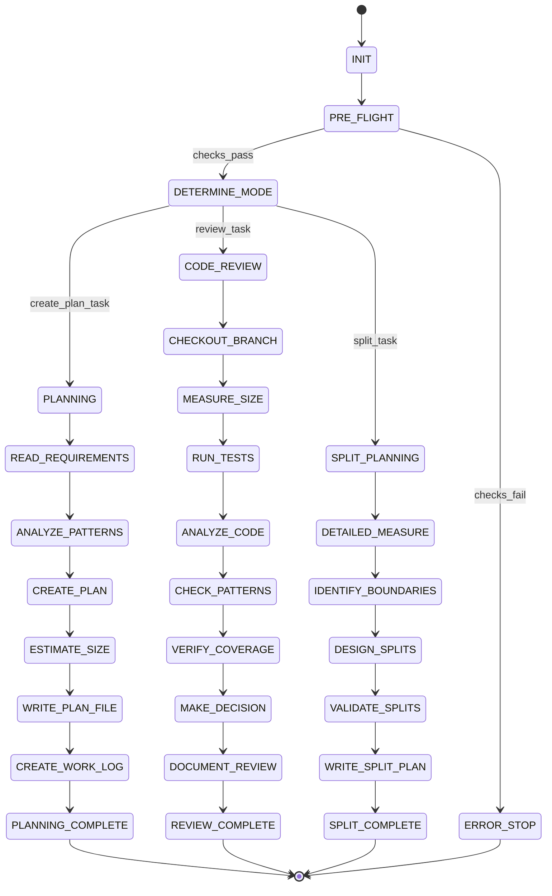

# ⚠️ DEPRECATION WARNING ⚠️

**IMPORTANT**: This file is part of the LEGACY state machine system.

Per **Rule R206**, the authoritative state machine is:
- **software-factory-3.0-state-machine.json** (SINGLE SOURCE OF TRUTH)

This file is retained for reference but should NOT be used for state validation.
All agents MUST validate states against software-factory-3.0-state-machine.json.

---

# Code Reviewer State Machine

## State Diagram

## State Rules Mapping

| State | Rules to Load | Checkpoint Required | Next States |
|-------|--------------|---------------------|-------------|
| INIT | R001, R002, R011 | Initial setup | PRE_FLIGHT |
| PRE_FLIGHT | R001, R010 | Environment verified | DETERMINE_MODE, ERROR_STOP |
| DETERMINE_MODE | R020 | Mode identified | PLANNING, CODE_REVIEW, SPLIT_PLANNING |
| **Planning States** |
| PLANNING | R109, R054 | Planning started | READ_REQUIREMENTS |
| READ_REQUIREMENTS | R054 | Requirements loaded | ANALYZE_PATTERNS |
| ANALYZE_PATTERNS | R037, R059 | Patterns identified | CREATE_PLAN |
| CREATE_PLAN | R054 | Plan created | ESTIMATE_SIZE |
| ESTIMATE_SIZE | R007 | Size estimated | WRITE_PLAN_FILE |
| WRITE_PLAN_FILE | R054 | Plan written | CREATE_WORK_LOG |
| CREATE_WORK_LOG | R017 | Template created | PLANNING_COMPLETE |
| **Review States** |
| CODE_REVIEW | R108, R055 | Review started | CHECKOUT_BRANCH |
| CHECKOUT_BRANCH | R013 | Branch ready | MEASURE_SIZE |
| MEASURE_SIZE | R007, R107 | Size measured | RUN_TESTS |
| RUN_TESTS | R032 | Tests complete | ANALYZE_CODE |
| ANALYZE_CODE | R055, R059 | Code analyzed | CHECK_PATTERNS |
| CHECK_PATTERNS | R037, R059 | Patterns checked | VERIFY_COVERAGE |
| VERIFY_COVERAGE | R032, R154 | Coverage verified | MAKE_DECISION |
| MAKE_DECISION | R055 | Decision made | DOCUMENT_REVIEW |
| DOCUMENT_REVIEW | R040 | Review documented | REVIEW_COMPLETE |
| **Split States** |
| SPLIT_PLANNING | R056 | Split planning started | DETAILED_MEASURE |
| DETAILED_MEASURE | R007 | Detailed size data | IDENTIFY_BOUNDARIES |
| IDENTIFY_BOUNDARIES | R056 | Boundaries found | DESIGN_SPLITS |
| DESIGN_SPLITS | R056 | Splits designed | VALIDATE_SPLITS |
| VALIDATE_SPLITS | R007 | Splits validated | WRITE_SPLIT_PLAN |
| WRITE_SPLIT_PLAN | R056 | Plan written | SPLIT_COMPLETE |

## Planning Mode Details

---
### ℹ️ RULE R109.0.0 - Planning State Rules
**Source:** rule-library/RULE-REGISTRY.md#R109
**Criticality:** INFO - Best practice

PLAN CREATION:
1. Read phase requirements thoroughly
2. Analyze existing codebase patterns
3. Design implementation approach
4. Create step-by-step instructions
5. Include test requirements
6. Estimate size accurately

PLAN SECTIONS:
- Context Analysis
- Requirements (primary & derived)
- Implementation Strategy
- Step-by-Step Instructions
- File Structure
- Testing Requirements
- Size Management
- Success Criteria
---

## Review Mode Details

---
### 🚨 RULE R108.0.0 - Code Review State Rules
**Source:** rule-library/RULE-REGISTRY.md#R108
**Criticality:** CRITICAL - Major impact on grading

REVIEW PROCESS:
1. Checkout branch locally
2. Measure with line-counter.sh
3. Run full test suite
4. Analyze code quality
5. Check pattern compliance
6. Verify test coverage
7. Make clear decision

DECISIONS:
- ACCEPTED: All criteria met
- NEEDS_FIXES: Specific issues listed
- NEEDS_SPLIT: Size limit exceeded
---

## Split Planning Details

---
### ℹ️ RULE R056.0.0 - Split Plan Creation
**Source:** rule-library/RULE-REGISTRY.md#R056
**Criticality:** INFO - Best practice

SPLIT DESIGN:
1. Run line-counter.sh -d for detailed breakdown
2. Identify logical boundaries
3. Group related functionality
4. Each split < (limit - buffer)
5. Maintain compilation per split
6. Order splits by dependency

SPLIT PLAN OUTPUT:
- Split 1: {files}, {estimated_lines}
- Split 2: {files}, {estimated_lines}
- Integration strategy
---

## PR Readiness Assessment

---
### 🚨 RULE R036.0.0 - PR Readiness Assessment
**Source:** rule-library/RULE-REGISTRY.md#R036
**Criticality:** CRITICAL - Major impact on grading

PR READINESS CHECKLIST:
- [ ] Size: {actual} lines (limit: {limit})
- [ ] Git History: Linear, clear commits
- [ ] Tests: {coverage}% (required: {min}%)
- [ ] Documentation: Updated
- [ ] Patterns: Followed
- [ ] No generated code in count

PR Score: {score}/100
---

## Grading Per State

| State | Primary Metric | Target | Grade Impact |
|-------|---------------|--------|--------------|
| CREATE_PLAN | Plan quality | First-try success | HIGH |
| MEASURE_SIZE | Tool usage | Correct tool only | CRITICAL |
| MAKE_DECISION | Decision accuracy | No reversals | HIGH |
| DESIGN_SPLITS | Split effectiveness | All under limit | CRITICAL |

## Review Documentation

