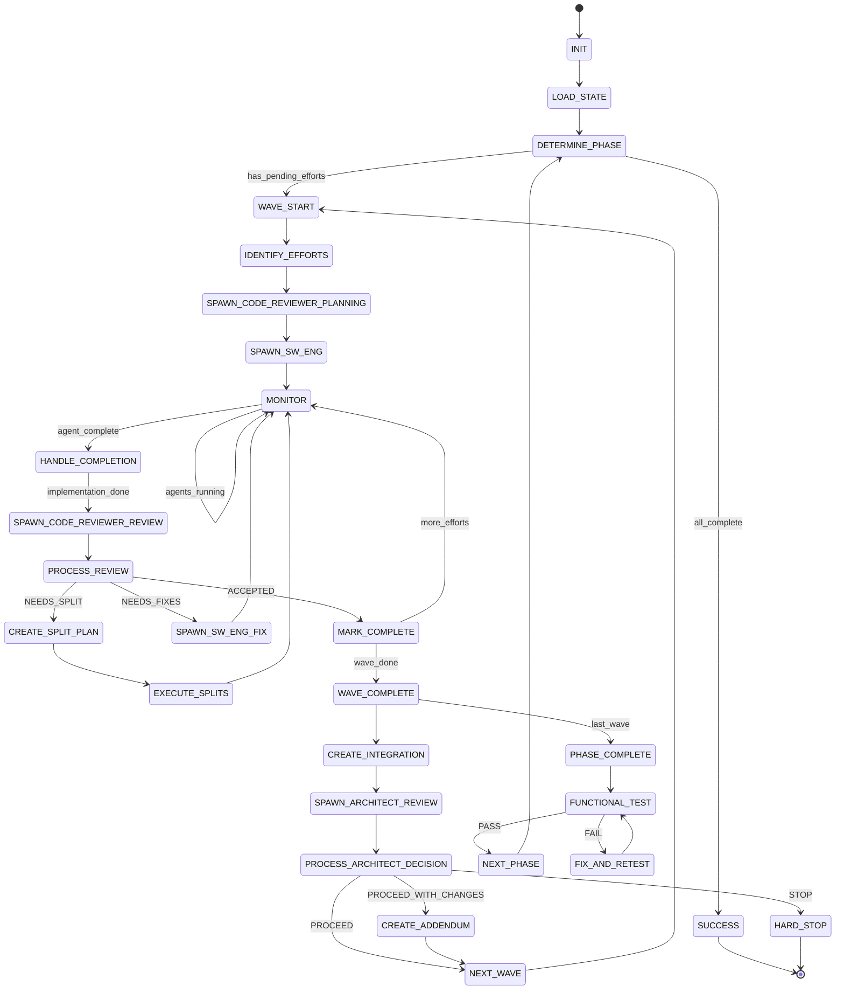

# ⚠️ DEPRECATION WARNING ⚠️

**IMPORTANT**: This file is part of the LEGACY state machine system.

Per **Rule R206**, the authoritative state machine is:
- **SOFTWARE-FACTORY-STATE-MACHINE.md** (SINGLE SOURCE OF TRUTH)

This file is retained for reference but should NOT be used for state validation.
All agents MUST validate states against SOFTWARE-FACTORY-STATE-MACHINE.md.

---

# Orchestrator State Machine

## State Diagram



## State Rules Mapping

| State | Rules to Load | Checkpoint Required | Next States |
|-------|--------------|---------------------|-------------|
| INIT | R001, R002, R011 | Initial setup | LOAD_STATE |
| LOAD_STATE | R009, R016 | State loaded | DETERMINE_PHASE |
| DETERMINE_PHASE | R020 | Phase identified | WAVE_START, SUCCESS |
| WAVE_START | R102, R053 | Effort list | IDENTIFY_EFFORTS |
| IDENTIFY_EFFORTS | R053 | Parallelization matrix | SPAWN_CODE_REVIEWER_PLANNING |
| SPAWN_CODE_REVIEWER_PLANNING | R052, R054 | Plans created | SPAWN_SW_ENG |
| SPAWN_SW_ENG | R052, R151 | Timestamps recorded | MONITOR |
| MONITOR | R104, R018 | Progress tracked | HANDLE_COMPLETION, WAVE_COMPLETE |
| HANDLE_COMPLETION | R020 | Completion recorded | Various based on result |
| SPAWN_CODE_REVIEWER_REVIEW | R052, R055 | Review requested | PROCESS_REVIEW |
| PROCESS_REVIEW | R055 | Decision recorded | MARK_COMPLETE, SPAWN_SW_ENG_FIX, CREATE_SPLIT_PLAN |
| CREATE_SPLIT_PLAN | R056 | Split plan created | EXECUTE_SPLITS |
| EXECUTE_SPLITS | R056 | Splits tracked | MONITOR |
| WAVE_COMPLETE | R105, R034 | Integration ready | CREATE_INTEGRATION, PHASE_COMPLETE |
| CREATE_INTEGRATION | R034 | Branch created | SPAWN_ARCHITECT_REVIEW |
| SPAWN_ARCHITECT_REVIEW | R052, R057 | Review requested | PROCESS_ARCHITECT_DECISION |
| PROCESS_ARCHITECT_DECISION | R057, R058 | Decision recorded | NEXT_WAVE, CREATE_ADDENDUM, HARD_STOP |
| PHASE_COMPLETE | R035 | Phase integrated | FUNCTIONAL_TEST |
| FUNCTIONAL_TEST | R035 | Test results | NEXT_PHASE, FIX_AND_RETEST |
| SUCCESS | Terminal | Final state saved | END |
| HARD_STOP | Terminal | Failure recorded | END |

## Grading Per State

| State | Primary Metric | Target | Grade Impact |
|-------|---------------|--------|--------------|
| SPAWN_SW_ENG | Parallel spawn delta | <5s avg | CRITICAL |
| MONITOR | Check frequency | Every 5 msgs | HIGH |
| WAVE_COMPLETE | Integration created | 100% | HIGH |
| PROCESS_REVIEW | Decision accuracy | 100% | MEDIUM |
| PROCESS_ARCHITECT_DECISION | Response time | <10min | MEDIUM |

## State Transition Rules

---
### 🚨🚨 RULE R020.0.0 - State Transitions
**Source:** rule-library/RULE-REGISTRY.md#R020
**Criticality:** MANDATORY - Required for approval

TRANSITION REQUIREMENTS:
1. Current state work must be complete
2. Checkpoint must be saved
3. State file must be updated
4. Next state rules must be loaded
5. No skipping allowed
---

## Continuous Execution Rules

---
### ℹ️ RULE R008.0.0 - Continuous Execution
**Source:** rule-library/RULE-REGISTRY.md#R008
**Criticality:** INFO - Best practice

while state not in ["SUCCESS", "HARD_STOP"]:
execute_current_state()
save_checkpoint()
update_state_file()
transition_to_next_state()
# Only stop at terminal states
---

## State File Updates

Each transition must update:
```yaml
orchestrator_state:
  current_state: "{STATE}"
  previous_state: "{PREV_STATE}"
  transition_time: "{ISO-8601}"
  transition_reason: "{reason}"
  current_phase: X
  current_wave: Y
  efforts_in_progress: [...]
  efforts_completed: [...]
  parallel_spawn_grades:
    latest: "{grade}"
