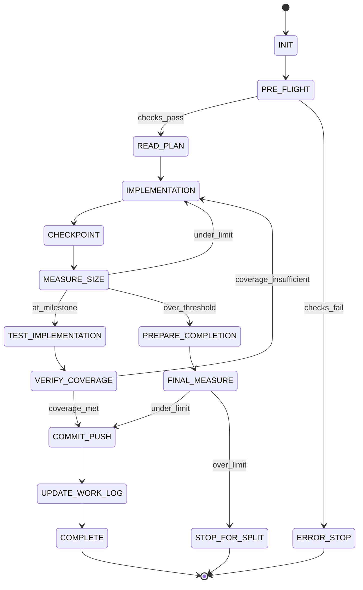

# ⚠️ DEPRECATION WARNING ⚠️

**IMPORTANT**: This file is part of the LEGACY state machine system.

Per **Rule R206**, the authoritative state machine is:
- **software-factory-3.0-state-machine.json** (SINGLE SOURCE OF TRUTH)

This file is retained for reference but should NOT be used for state validation.
All agents MUST validate states against software-factory-3.0-state-machine.json.

---

# SW Engineer State Machine

## State Diagram

## State Rules Mapping

| State | Rules to Load | Checkpoint Required | Next States |
|-------|--------------|---------------------|-------------|
| INIT | R001, R002, R011 | Initial setup | PRE_FLIGHT |
| PRE_FLIGHT | R001, R010 | Environment verified | READ_PLAN, ERROR_STOP |
| READ_PLAN | R054, R060 | Plan understood | IMPLEMENTATION |
| IMPLEMENTATION | R106, R060, R152 | Work progress | CHECKPOINT |
| CHECKPOINT | R017, R016 | Progress saved | MEASURE_SIZE |
| MEASURE_SIZE | R007, R107 | Size recorded | IMPLEMENTATION, TEST_IMPLEMENTATION, PREPARE_COMPLETION |
| TEST_IMPLEMENTATION | R032, R060 | Tests written | VERIFY_COVERAGE |
| VERIFY_COVERAGE | R032, R154 | Coverage measured | IMPLEMENTATION, COMMIT_PUSH |
| PREPARE_COMPLETION | R017 | Final checkpoint | FINAL_MEASURE |
| FINAL_MEASURE | R007 | Final size | COMMIT_PUSH, STOP_FOR_SPLIT |
| COMMIT_PUSH | R013, R015 | Code committed | UPDATE_WORK_LOG |
| UPDATE_WORK_LOG | R017 | Log updated | COMPLETE |
| COMPLETE | Terminal | Work done | END |
| ERROR_STOP | Terminal | Error logged | END |
| STOP_FOR_SPLIT | Terminal | Split needed | END |

## Implementation State Details

---
### ℹ️ RULE R106.0.0 - Implementation State Rules
**Source:** rule-library/RULE-REGISTRY.md#R106
**Criticality:** INFO - Best practice

DURING IMPLEMENTATION:
1. Follow plan exactly
2. Write tests first when possible
3. Checkpoint every 200 lines
4. Update work log frequently
5. Commit logical units
---

## Size Measurement Protocol

---
### ℹ️ RULE R107.0.0 - Measure Size State Rules
**Source:** rule-library/RULE-REGISTRY.md#R107
**Criticality:** INFO - Best practice

MEASUREMENT PROTOCOL:
/workspaces/[project]/tools/line-counter.sh -c {branch}

THRESHOLDS:
- Continue: < limit - 200
- Prepare completion: >= limit - 200
- Stop for split: >= limit

NEVER use any other counting method
---

## Test Coverage Requirements

---
### ℹ️ RULE R032.0.0 - Test Coverage Requirements
**Source:** rule-library/RULE-REGISTRY.md#R032
**Criticality:** INFO - Best practice

PHASE MINIMUMS:
- Phase 1: 60%
- Phase 2: 70%
- Phase 3: 80%
- Phase 4: 85%
- Phase 5: 90%

MEASUREMENT:
go test ./... -cover | grep coverage
---

## Grading Per State

| State | Primary Metric | Target | Grade Impact |
|-------|---------------|--------|--------------|
| IMPLEMENTATION | Lines per hour | >50 | HIGH |
| CHECKPOINT | Frequency | Every 200 lines | MEDIUM |
| MEASURE_SIZE | Tool usage | Correct tool only | CRITICAL |
| VERIFY_COVERAGE | Coverage achieved | Phase minimum | HIGH |
| COMMIT_PUSH | Commit quality | Logical units | MEDIUM |

## Work Log Updates

---
### ℹ️ RULE R017.0.0 - Checkpoint Creation
**Source:** rule-library/RULE-REGISTRY.md#R017
**Criticality:** INFO - Best practice

WORK LOG FORMAT:
## Session {N} - {timestamp}
- Lines at start: {count}
- Lines added: {count}
- Tests written: {count}
- Coverage: {percent}%
- Issues: {description}
- Next: {action}
---

## Error Handling

